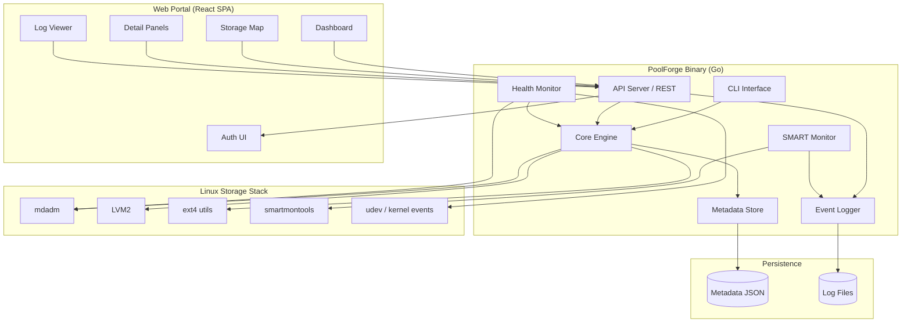
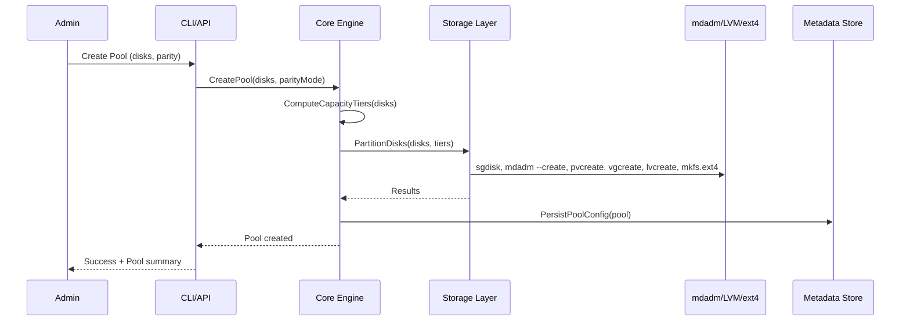
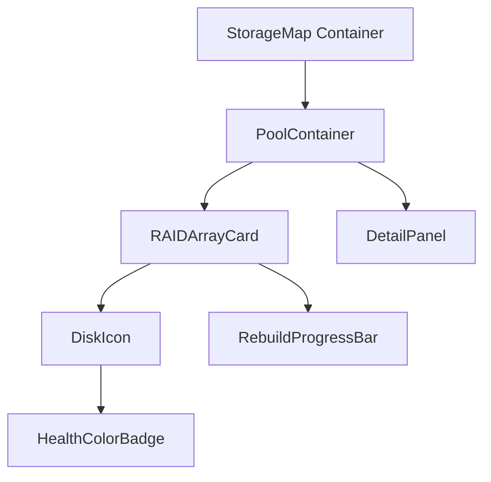
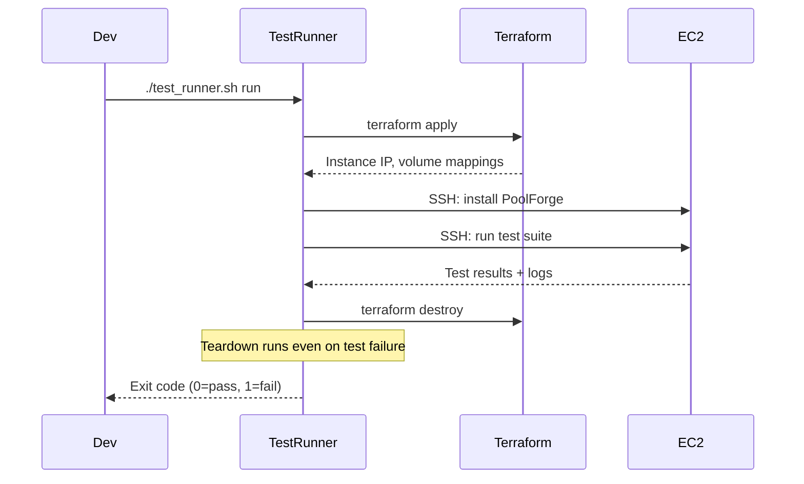

# Design Document: PoolForge Hybrid RAID Manager

## Overview

PoolForge is a storage management system for Ubuntu LTS 24.04+ that replicates Synology Hybrid RAID (SHR) functionality using standard Linux storage tools (mdadm, LVM, ext4). The system accepts mixed-size disks, computes capacity tiers, partitions disks into slices, assembles mdadm RAID arrays per tier, stitches them into an LVM volume group, and presents a single ext4 logical volume. It supports single-parity (SHR-1) and double-parity (SHR-2) modes, self-healing rebuilds, hot-add disk expansion, and multi-pool isolation.

The system is delivered as a Go single binary (backend + CLI) with a React SPA frontend served by the same binary. An automated AWS-based test infrastructure (Terraform + Test_Runner) enables integration and end-to-end testing against real block devices (EBS volumes).

### Design Goals

- Maximize usable capacity from mixed-size disk sets while maintaining parity redundancy
- Provide self-healing with automatic rebuild on disk failure
- Support non-destructive pool expansion via hot-add disk
- Isolate multiple pools on the same host
- Deliver a visual web portal with real-time health monitoring
- Enable fully automated cloud-based integration testing

### Implementation Phases

| Phase | Scope |
|-------|-------|
| Phase 1 | Core engine (tier computation, partitioning, mdadm, LVM, ext4, CLI, metadata store) + Test infrastructure (Terraform, Test_Runner) |
| Phase 2 | Lifecycle operations (add disk, replace disk, remove disk, self-healing/rebuild) |
| Phase 3 | Web portal (React), API server (Go REST), Storage_Map visualization, Log_Viewer, authentication |
| Phase 4 | Safety hardening (atomic operations, rollback, multi-interface support, SMART monitoring) |

## Architecture

### High-Level Architecture



### Layered Architecture

The system follows a layered architecture with clear separation of concerns:

1. **Presentation Layer**: CLI commands and React Web Portal communicate exclusively through the API/Core interface
2. **API Layer**: Go HTTP server exposing REST endpoints, session-based auth, WebSocket for live tail
3. **Core Engine Layer**: Business logic for tier computation, pool operations, health assessment
4. **Storage Abstraction Layer**: Wrappers around mdadm, LVM, ext4, smartctl system commands
5. **Persistence Layer**: Metadata store (JSON file) and structured event log

### Request Flow



## Components and Interfaces

### 1. Core Engine (`internal/engine`)

The central orchestrator for all pool operations.

```go
// Pool represents a managed storage pool
type Pool struct {
    ID            string
    Name          string
    ParityMode    ParityMode       // SHR1 or SHR2
    State         PoolState        // Healthy, Degraded, Failed
    Disks         []DiskInfo
    CapacityTiers []CapacityTier
    RAIDArrays    []RAIDArray
    VolumeGroup   string           // VG name
    LogicalVolume string           // LV name
    MountPoint    string
    CreatedAt     time.Time
    UpdatedAt     time.Time
}

type ParityMode int
const (
    SHR1 ParityMode = iota  // Single parity (RAID5/RAID1)
    SHR2                     // Double parity (RAID6/RAID5/RAID1)
)

type PoolState string
const (
    PoolHealthy  PoolState = "healthy"
    PoolDegraded PoolState = "degraded"
    PoolFailed   PoolState = "failed"
)

// EngineService defines the core operations interface
type EngineService interface {
    // Pool lifecycle
    CreatePool(ctx context.Context, req CreatePoolRequest) (*Pool, error)
    DeletePool(ctx context.Context, poolID string) error
    GetPool(ctx context.Context, poolID string) (*Pool, error)
    ListPools(ctx context.Context) ([]PoolSummary, error)

    // Disk operations
    AddDisk(ctx context.Context, poolID string, disk string) error
    ReplaceDisk(ctx context.Context, poolID string, oldDisk string, newDisk string) error

    // Status
    GetPoolStatus(ctx context.Context, poolID string) (*PoolStatus, error)
    GetArrayStatus(ctx context.Context, poolID string, arrayID string) (*ArrayStatus, error)
    GetDiskStatus(ctx context.Context, poolID string, disk string) (*DiskStatus, error)

    // Healing
    HandleDiskFailure(ctx context.Context, poolID string, disk string) error
    GetRebuildProgress(ctx context.Context, poolID string, arrayID string) (*RebuildProgress, error)
}
```

#### Capacity Tier Computation Algorithm

The tier computation is the core algorithm that differentiates SHR from standard RAID:

```
Input: sorted unique disk capacities [C1, C2, ..., Cn] where C1 < C2 < ... < Cn
       disk list with their capacities

Algorithm:
1. Sort all disk capacities ascending
2. Extract unique capacity values: [C1, C2, ..., Cn]
3. Compute tier slice sizes:
   - Tier 1 size = C1 (smallest capacity)
   - Tier k size = Ck - C(k-1) for k > 1
4. For each tier k:
   - Eligible disks = disks with capacity >= Ck
   - Create one slice of size (tier k size) on each eligible disk
   - Eligible disk count determines RAID level (see RAID Level Selection)
5. Create one RAID array per tier from the slices
6. Add all RAID arrays as PVs to a single VG
7. Create one LV spanning the entire VG
8. Format LV with ext4
```

#### RAID Level Selection

| Parity Mode | Eligible Disk Count | RAID Level |
|-------------|-------------------|------------|
| SHR-1       | ≥ 3               | RAID 5     |
| SHR-1       | 2                 | RAID 1     |
| SHR-2       | ≥ 4               | RAID 6     |
| SHR-2       | 3                 | RAID 5     |
| SHR-2       | 2                 | RAID 1     |

### 2. Storage Abstraction Layer (`internal/storage`)

Wraps system commands (mdadm, LVM, ext4, sgdisk) behind testable interfaces.

```go
// DiskManager handles disk partitioning
type DiskManager interface {
    GetDiskInfo(device string) (*DiskInfo, error)
    CreateGPTPartitionTable(device string) error
    CreatePartition(device string, start, size uint64) (*Partition, error)
    WipePartitionTable(device string) error
    ListPartitions(device string) ([]Partition, error)
}

// RAIDManager handles mdadm operations
type RAIDManager interface {
    CreateArray(opts RAIDCreateOpts) (*RAIDArrayInfo, error)
    StopArray(device string) error
    AssembleArray(device string, members []string) error
    AddMember(arrayDevice string, member string) error
    RemoveMember(arrayDevice string, member string) error
    ReshapeArray(arrayDevice string, newMemberCount int, raidLevel int) error
    GetArrayDetail(device string) (*RAIDArrayDetail, error)
    MonitorEvents(ctx context.Context) (<-chan RAIDEvent, error)
}

// LVMManager handles LVM operations
type LVMManager interface {
    CreatePhysicalVolume(device string) error
    RemovePhysicalVolume(device string) error
    CreateVolumeGroup(name string, pvDevices []string) error
    ExtendVolumeGroup(name string, pvDevice string) error
    RemoveVolumeGroup(name string) error
    CreateLogicalVolume(vgName string, lvName string, sizePercent int) error
    ExtendLogicalVolume(lvPath string) error
    RemoveLogicalVolume(lvPath string) error
}

// FilesystemManager handles ext4 operations
type FilesystemManager interface {
    CreateFilesystem(device string) error
    ResizeFilesystem(device string) error
    MountFilesystem(device string, mountPoint string) error
    UnmountFilesystem(mountPoint string) error
    CheckFilesystem(device string) (*FSCheckResult, error)
}
```

### 3. Metadata Store (`internal/metadata`)

Persists pool configuration as a JSON file on disk. Provides atomic writes (write-to-temp + rename) to prevent corruption.

```go
type MetadataStore interface {
    SavePool(pool *Pool) error
    LoadPool(poolID string) (*Pool, error)
    DeletePool(poolID string) error
    ListPools() ([]PoolSummary, error)
    SaveSMARTData(disk string, data *SMARTData) error
    LoadSMARTData(disk string) (*SMARTData, error)
    // Atomic write: write to temp file, fsync, rename
}
```

Storage path: `/var/lib/poolforge/metadata.json`

### 4. Health Monitor (`internal/monitor`)

Listens for mdadm events and udev disk events. Triggers self-healing workflows.

```go
type HealthMonitor interface {
    Start(ctx context.Context) error
    Stop() error
    OnDiskFailure(handler func(event DiskFailureEvent))
    OnRebuildComplete(handler func(event RebuildCompleteEvent))
    OnDiskHotPlug(handler func(event HotPlugEvent))
}
```

### 5. SMART Monitor (`internal/smart`)

Periodic SMART data collection from all managed disks.

```go
type SMARTMonitor interface {
    Start(ctx context.Context) error
    Stop() error
    SetCheckInterval(interval time.Duration)
    GetSMARTData(disk string) (*SMARTData, error)
    GetSMARTHistory(disk string) ([]SMARTEvent, error)
    SetThresholds(thresholds SMARTThresholds) error
}

type SMARTData struct {
    Disk              string
    OverallHealth     string  // "PASSED" or "FAILED"
    Temperature       int
    ReallocatedSectors int
    PendingSectors    int
    UncorrectableErrors int
    PowerOnHours      int
    CollectedAt       time.Time
}
```

### 6. Event Logger (`internal/logger`)

Structured logging with component tagging, severity levels, and streaming support.

```go
type EventLogger interface {
    Log(entry LogEntry)
    Query(filter LogFilter) ([]LogEntry, error)
    Stream(ctx context.Context, filter LogFilter) (<-chan LogEntry, error)
    Export(filter LogFilter, format ExportFormat) (io.Reader, error)
}

type LogEntry struct {
    Timestamp time.Time
    Level     LogLevel    // Debug, Info, Warning, Error
    Source    string      // e.g., "pool:mypool", "array:md0", "disk:/dev/sdb"
    Message   string
}

type LogFilter struct {
    Levels    []LogLevel
    StartTime *time.Time
    EndTime   *time.Time
    Source    *string
    Keyword  *string
}
```

### 7. API Server (`internal/api`)

Go HTTP server serving REST endpoints and the React SPA static assets.

```go
// Key REST endpoints
// POST   /api/auth/login          - Authenticate, return session token
// POST   /api/auth/logout         - Invalidate session
// POST   /api/auth/users          - Create user account
// GET    /api/pools               - List all pools
// POST   /api/pools               - Create pool
// GET    /api/pools/:id           - Get pool status
// DELETE /api/pools/:id           - Delete pool
// POST   /api/pools/:id/disks     - Add disk to pool
// GET    /api/pools/:id/arrays    - List RAID arrays
// GET    /api/pools/:id/arrays/:aid - Get array detail
// GET    /api/pools/:id/disks/:dev - Get disk detail
// GET    /api/logs                - Query logs (with filter params)
// GET    /api/logs/stream         - WebSocket for live tail
// GET    /api/smart/:disk         - Get SMART data for disk
// PUT    /api/smart/thresholds    - Update SMART thresholds
// GET    /api/smart/:disk/history - Get SMART event history
```

Session middleware validates auth token on all `/api/*` endpoints except `/api/auth/login`.

### 8. CLI (`cmd/poolforge`)

```
poolforge pool create --disks /dev/sdb,/dev/sdc,/dev/sdd --parity shr1 --name mypool
poolforge pool status <pool-name>
poolforge pool status <pool-name> --array <array-id>
poolforge pool list
poolforge pool delete <pool-name>
poolforge pool add-disk <pool-name> --disk /dev/sde
poolforge pool replace-disk <pool-name> --old /dev/sdb --new /dev/sde
poolforge smart status <disk>
poolforge smart history <disk>
poolforge smart thresholds set --reallocated-sectors 100
poolforge user create --username admin --password <password>
poolforge user list
poolforge serve --port 8080
```

### 9. Web Portal (`web/`)

React SPA with the following page structure:

| Page | Route | Description |
|------|-------|-------------|
| Login | `/login` | Username/password authentication |
| Dashboard | `/` | Pool list with summary cards |
| Pool Detail | `/pools/:id` | Storage_Map visualization + Detail_Panels |
| Log Viewer | `/logs` | Filterable log table with live tail |

#### Storage_Map Component Hierarchy



Each element applies Health_Color:
- **Green**: healthy
- **Amber**: degraded / rebuilding / SMART warning
- **Red**: failed / SMART failed

### 10. Test Infrastructure (`test/infra/`)

#### Terraform IaC Template

```
test/infra/
├── main.tf              # EC2 instance, EBS volumes, security group
├── variables.tf         # Configurable: instance type, volume sizes, region
├── outputs.tf           # Instance IP, SSH key path, volume device mappings
├── scripts/
│   └── setup.sh         # Install PoolForge + dependencies on EC2
└── test_runner.sh       # Orchestrates: provision → test → collect → teardown
```

Key Terraform resources:
- 1x `aws_instance` (t3.medium, Ubuntu 24.04 AMI)
- 6x `aws_ebs_volume` (gp3, sizes: 1GB, 2GB, 3GB, 4GB, 5GB, 10GB)
- `aws_volume_attachment` for each EBS volume
- All resources tagged with `poolforge-test-{run-id}` for orphan identification

#### Test_Runner Lifecycle



## Data Models

### Metadata Store Schema

```json
{
  "version": 1,
  "pools": {
    "<pool-id>": {
      "id": "<uuid>",
      "name": "<pool-name>",
      "parity_mode": "shr1|shr2",
      "state": "healthy|degraded|failed",
      "disks": [
        {
          "device": "/dev/sdb",
          "capacity_bytes": 1000000000000,
          "state": "healthy|failed",
          "slices": [
            {
              "tier_index": 0,
              "partition_number": 1,
              "partition_device": "/dev/sdb1",
              "size_bytes": 500000000000
            }
          ]
        }
      ],
      "capacity_tiers": [
        {
          "index": 0,
          "slice_size_bytes": 500000000000,
          "eligible_disk_count": 4,
          "raid_array": "md0"
        }
      ],
      "raid_arrays": [
        {
          "device": "/dev/md0",
          "raid_level": 5,
          "tier_index": 0,
          "state": "healthy|degraded|rebuilding|failed",
          "members": ["/dev/sdb1", "/dev/sdc1", "/dev/sdd1", "/dev/sde1"],
          "capacity_bytes": 1500000000000
        }
      ],
      "volume_group": "vg_poolforge_<pool-id>",
      "logical_volume": "lv_poolforge_<pool-id>",
      "mount_point": "/mnt/poolforge/<pool-name>",
      "created_at": "2025-01-01T00:00:00Z",
      "updated_at": "2025-01-01T00:00:00Z"
    }
  },
  "smart_data": {
    "/dev/sdb": {
      "overall_health": "PASSED",
      "temperature_celsius": 35,
      "reallocated_sectors": 0,
      "pending_sectors": 0,
      "uncorrectable_errors": 0,
      "power_on_hours": 12500,
      "collected_at": "2025-01-01T12:00:00Z"
    }
  },
  "smart_thresholds": {
    "reallocated_sectors": 100,
    "pending_sectors": 50,
    "uncorrectable_errors": 10
  },
  "users": {
    "<username>": {
      "password_hash": "<bcrypt-hash>",
      "salt": "<per-user-salt>",
      "created_at": "2025-01-01T00:00:00Z"
    }
  }
}
```

### Log Entry Format

Logs are stored as newline-delimited JSON (NDJSON) at `/var/log/poolforge/events.log`:

```json
{"timestamp":"2025-01-01T12:00:00Z","level":"info","source":"pool:mypool","message":"Pool created with 4 disks, SHR-1 parity"}
{"timestamp":"2025-01-01T12:05:00Z","level":"warning","source":"disk:/dev/sdb","message":"SMART warning: reallocated sectors count 105 exceeds threshold 100"}
{"timestamp":"2025-01-01T12:10:00Z","level":"error","source":"array:md0","message":"Disk /dev/sdb1 failed in RAID array md0"}
```

### REST API Response Models

#### Pool Summary (GET /api/pools)

```json
{
  "pools": [
    {
      "id": "<uuid>",
      "name": "mypool",
      "state": "healthy",
      "total_capacity_bytes": 3000000000000,
      "used_capacity_bytes": 1200000000000,
      "disk_count": 4
    }
  ]
}
```

#### Pool Detail (GET /api/pools/:id)

```json
{
  "id": "<uuid>",
  "name": "mypool",
  "state": "healthy",
  "parity_mode": "shr1",
  "total_capacity_bytes": 3000000000000,
  "used_capacity_bytes": 1200000000000,
  "mount_point": "/mnt/poolforge/mypool",
  "raid_arrays": [
    {
      "device": "/dev/md0",
      "raid_level": 5,
      "tier_index": 0,
      "state": "healthy",
      "capacity_bytes": 1500000000000,
      "members": [
        {"device": "/dev/sdb1", "state": "healthy"},
        {"device": "/dev/sdc1", "state": "healthy"},
        {"device": "/dev/sdd1", "state": "healthy"}
      ]
    }
  ],
  "disks": [
    {
      "device": "/dev/sdb",
      "state": "healthy",
      "capacity_bytes": 1000000000000,
      "interface_type": "SATA",
      "smart_summary": {"overall_health": "PASSED", "temperature_celsius": 35},
      "arrays": ["/dev/md0", "/dev/md1"]
    }
  ]
}
```

#### Auth (POST /api/auth/login)

Request:
```json
{"username": "admin", "password": "secret"}
```

Response:
```json
{"token": "<session-token>", "expires_at": "2025-01-01T14:00:00Z"}
```

#### Log Query (GET /api/logs?level=error&source=pool:mypool&start=...&end=...&keyword=...)

```json
{
  "entries": [
    {
      "timestamp": "2025-01-01T12:10:00Z",
      "level": "error",
      "source": "array:md0",
      "message": "Disk /dev/sdb1 failed in RAID array md0"
    }
  ],
  "total": 1
}
```


## Correctness Properties

*A property is a characteristic or behavior that should hold true across all valid executions of a system — essentially, a formal statement about what the system should do. Properties serve as the bridge between human-readable specifications and machine-verifiable correctness guarantees.*

### Property 1: Capacity tier computation produces correct slice sizes

*For any* set of disk capacities (with at least 2 disks), the computed capacity tiers should have slice sizes equal to the differences between consecutive sorted unique capacities, with the first tier equal to the smallest capacity. The sum of all tier slice sizes should equal the largest disk capacity, and the number of tiers should equal the number of unique capacity values.

**Validates: Requirements 1.2**

### Property 2: Disk slicing matches eligible tiers

*For any* disk with a given capacity and any set of computed capacity tiers, the disk should receive exactly one slice per tier for which the disk has sufficient cumulative capacity. A disk of capacity C should have slices for all tiers whose cumulative boundary does not exceed C.

**Validates: Requirements 1.1, 1.3**

### Property 3: One RAID array per capacity tier

*For any* pool created from a valid set of disks, the number of RAID arrays should equal the number of capacity tiers, and each array should contain exactly the slices from all eligible disks for that tier.

**Validates: Requirements 1.4**

### Property 4: RAID level selection follows parity mode and disk count rules

*For any* parity mode (SHR-1 or SHR-2) and any eligible disk count for a capacity tier, the selected RAID level should match the selection table: SHR-1 with ≥3 disks → RAID 5, SHR-1 with 2 disks → RAID 1, SHR-2 with ≥4 disks → RAID 6, SHR-2 with 3 disks → RAID 5, SHR-2 with 2 disks → RAID 1.

**Validates: Requirements 1.5, 1.6, 1.7, 1.8, 1.9**

### Property 5: Pool creation produces exactly one VG, one LV, and one ext4 filesystem

*For any* successfully created pool, there should be exactly one Volume Group containing all RAID arrays as physical volumes, exactly one Logical Volume spanning the entire VG, and an ext4 filesystem on that LV.

**Validates: Requirements 1.10, 1.11**

### Property 6: Disk membership exclusivity across pools

*For any* disk that is a member of an existing pool, any operation attempting to use that disk in another pool (create, add-disk) should be rejected with an error identifying the conflicting disk and owning pool.

**Validates: Requirements 1.13, 2.3, 5.7**

### Property 7: Pool isolation — disjoint resources

*For any* two pools on the same system, their Volume Groups, Logical Volumes, RAID arrays, and member disks should be completely disjoint sets with no shared components.

**Validates: Requirements 2.2, 1.14**

### Property 8: Pool deletion preserves other pools

*For any* multi-pool system, deleting one pool should leave all other pools' RAID arrays, Volume Groups, Logical Volumes, and data completely intact and unchanged.

**Validates: Requirements 2.6**

### Property 9: Disk failure isolation across pools

*For any* multi-pool system, a disk failure in one pool should not change the state, capacity, or health of any other pool on the system.

**Validates: Requirements 2.5**

### Property 10: Pool status contains complete hierarchy information

*For any* pool, the status response should contain: the pool state (from {healthy, degraded, failed}), total and used capacity; for each RAID array: RAID level, capacity tier, state (from {healthy, degraded, rebuilding, failed}), capacity, and member disks; for each disk: descriptor, health state (from {healthy, failed}), and contributing arrays.

**Validates: Requirements 3.1, 3.2, 3.3, 3.7, 3.8**

### Property 11: Degraded array status identifies failed disk and affected tier

*For any* RAID array in a degraded state, the status output should identify the specific failed or missing disk descriptor and the affected capacity tier.

**Validates: Requirements 3.4**

### Property 12: Failed disk status lists all affected arrays

*For any* failed disk in a pool, the status output should list every RAID array that contained a slice from that disk.

**Validates: Requirements 3.6**

### Property 13: Metadata store round-trip persistence

*For any* valid pool configuration, saving it to the metadata store and then loading it back should produce an equivalent pool configuration with all fields preserved.

**Validates: Requirements 3.9**

### Property 14: Disk failure updates metadata and creates log entry

*For any* disk failure event reported by mdadm, the metadata store should be updated to mark the disk as failed, and a log entry should be created with the disk identifier and a timestamp.

**Validates: Requirements 4.1**

### Property 15: Auto-rebuild on spare availability

*For any* pool with a degraded RAID array and an available hot spare disk, the system should automatically initiate a rebuild of all degraded arrays using the spare.

**Validates: Requirements 4.2, 4.4**

### Property 16: Rebuild completion restores metadata and logs

*For any* completed RAID array rebuild, the metadata store should reflect the restored (healthy) state, and a completion log entry should be created.

**Validates: Requirements 4.3**

### Property 17: Add-disk slicing matches existing tiers

*For any* existing pool and any new disk added to it, the new disk should be partitioned into slices matching the existing capacity tiers for which the disk has sufficient capacity, and each slice should be added to the corresponding RAID array.

**Validates: Requirements 5.1, 5.2**

### Property 18: Add-disk with larger disk creates new tiers

*For any* existing pool and any new disk with capacity exceeding all existing tiers, new capacity tiers should be computed from the leftover space, new RAID arrays created, and the Volume Group extended.

**Validates: Requirements 5.3**

### Property 19: Add-disk expands LV and resizes filesystem

*For any* successful add-disk operation, the Logical Volume should be extended to use all newly available space, and the ext4 filesystem should be resized to fill the expanded LV.

**Validates: Requirements 5.4**

### Property 20: Reshape preserves parity mode

*For any* RAID array reshape triggered by add-disk, the RAID level after reshape should be consistent with the pool's parity mode and the new eligible disk count per the RAID level selection table.

**Validates: Requirements 5.5**

### Property 21: Health color mapping is deterministic

*For any* element (pool, RAID array, or disk) with a given state, the health color should be deterministically mapped: healthy → green, degraded/rebuilding → amber, failed → red. For SMART status: warning → amber, failed → red.

**Validates: Requirements 6.3, 6.4, 6.5, 9.5**

### Property 22: Detail panel contains all required fields

*For any* pool, RAID array, or disk element, the detail panel should contain all fields specified in the requirements: pool panels show name/state/parity/capacity/arrays; array panels show sync state/RAID level/tier/capacity/members; disk panels show descriptor/health/interface/capacity/SMART summary/arrays.

**Validates: Requirements 6.6, 6.7, 6.8, 9.6**

### Property 23: Failed disk cascading visual state

*For any* failed disk in the Storage Map, the disk icon should be highlighted red, and all RAID array cards that contain a slice from that disk should be highlighted amber.

**Validates: Requirements 6.11**

### Property 24: Unauthenticated requests are rejected

*For any* API request to a protected endpoint (all endpoints except login) without a valid session token, the server should reject the request with an authentication error.

**Validates: Requirements 6.14, 7.4**

### Property 25: Valid credentials produce session token

*For any* valid username/password pair, the login endpoint should return a session token with an expiration time.

**Validates: Requirements 7.2**

### Property 26: Invalid credentials are rejected

*For any* invalid username/password pair (wrong password, nonexistent user), the login endpoint should reject the attempt and a failed login log entry should be created.

**Validates: Requirements 7.3**

### Property 27: Passwords are stored as salted hashes

*For any* user account, the stored password should be a one-way hash with a per-user salt. The stored value should not equal the plaintext password, and two users with the same password should have different stored hashes.

**Validates: Requirements 7.6**

### Property 28: Log entries are returned in reverse chronological order

*For any* set of log entries returned by the log query API or displayed in the Log Viewer, the entries should be sorted by timestamp in descending order.

**Validates: Requirements 8.1**

### Property 29: Log filter composition is logical AND

*For any* combination of active log filters (level, time range, source, keyword), the returned entries should satisfy ALL active filters simultaneously. The result set should equal the intersection of applying each filter individually.

**Validates: Requirements 8.2, 8.3, 8.4, 8.5, 8.6, 8.8**

### Property 30: Log export matches displayed entries

*For any* set of active filters, the exported log file should contain exactly the same entries as the filtered display, in the same order.

**Validates: Requirements 8.10**

### Property 31: SMART data persistence round-trip

*For any* SMART check result, storing it in the metadata store and loading it back should produce equivalent SMART data with all attributes preserved.

**Validates: Requirements 9.2**

### Property 32: SMART threshold breach generates warning log

*For any* SMART check where a disk attribute exceeds a configured warning threshold, a warning-level log entry should be generated identifying the disk, the attribute, and the threshold breached.

**Validates: Requirements 9.3**

### Property 33: SMART failure generates error log

*For any* SMART check where a disk reports overall-health status of "FAILED", an error-level log entry should be generated identifying the disk.

**Validates: Requirements 9.4**

### Property 34: SMART threshold configuration round-trip

*For any* SMART threshold configuration set via CLI or API, the thresholds should be persisted and subsequent SMART checks should use the updated thresholds.

**Validates: Requirements 9.8**

### Property 35: Test_Runner teardown executes regardless of test outcome

*For any* test run (whether tests pass or fail), the Test_Runner should execute teardown of all AWS resources.

**Validates: Requirements 12.10**

### Property 36: Test_Runner exit code reflects test results

*For any* test run where at least one test scenario fails, the Test_Runner should return a non-zero exit code.

**Validates: Requirements 12.9**

### Property 37: Pool list contains required fields

*For any* set of pools on the system, the list response should contain each pool's name, state, total capacity, used capacity, and member disk count.

**Validates: Requirements 2.4**

## Error Handling

### Input Validation Errors

| Error Condition | Response | Requirement |
|----------------|----------|-------------|
| Fewer than 2 disks provided | Reject with minimum disk count message | 1.12 |
| Disk already in another pool | Reject with conflicting disk + owning pool | 1.13, 2.3 |
| Disk already in same pool (add-disk) | Reject with duplicate disk error | 5.7 |
| Invalid disk descriptor (not a block device) | Reject with invalid device error | — |
| Invalid parity mode | Reject with supported modes list | — |
| Pool name already exists | Reject with duplicate name error | 1.14 |
| Pool not found | 404 with pool identifier | — |

### Authentication Errors

| Error Condition | Response | Requirement |
|----------------|----------|-------------|
| Invalid credentials | 401 with generic error message, log failed attempt | 7.3 |
| Missing session token | 401 with redirect to login | 7.4 |
| Expired session token | 401 with redirect to login | 7.5 |
| Invalid session token | 401 with redirect to login | 7.5 |

### Storage Operation Errors

| Error Condition | Response | Requirement |
|----------------|----------|-------------|
| mdadm command failure | Log error, roll back partial operations, report to caller | — |
| LVM command failure | Log error, roll back partial operations, report to caller | — |
| ext4 creation failure | Log error, clean up VG/LV/arrays, report to caller | — |
| Disk failure during rebuild (SHR-1) | Mark affected arrays as failed, log critical alert | 4.5 |
| Disk failure during rebuild (SHR-2) | Continue degraded, log warning alert | 4.6 |
| SMART query failure | Log info, mark SMART status "unavailable" | 9.9 |

### Rollback Strategy

For Phase 4 (Safety Hardening), all destructive operations follow an atomic pattern:

1. **Pre-operation check**: Validate all preconditions
2. **Checkpoint**: Record current state in metadata
3. **Execute**: Perform storage operations in sequence
4. **On failure**: Roll back to checkpoint state (reverse operations)
5. **On success**: Update metadata to new state

### Test Infrastructure Errors

| Error Condition | Response | Requirement |
|----------------|----------|-------------|
| Terraform apply failure | Log error, attempt teardown, exit non-zero | 12.10 |
| Test failure | Collect logs, execute teardown, exit non-zero | 12.9, 12.10 |
| Teardown failure | Log orphaned resource IDs for manual cleanup | 12.11 |

## Testing Strategy

### Dual Testing Approach

PoolForge uses both unit tests and property-based tests as complementary strategies:

- **Unit tests**: Verify specific examples, edge cases, error conditions, and integration points
- **Property-based tests**: Verify universal properties across randomly generated inputs

### Property-Based Testing Configuration

- **Library**: [rapid](https://github.com/flyingmutant/rapid) for Go property-based testing
- **Minimum iterations**: 100 per property test
- **Tag format**: Each property test includes a comment: `// Feature: hybrid-raid-manager, Property {N}: {title}`
- **Each correctness property is implemented by a single property-based test**

### Unit Test Scope

Unit tests focus on:
- Specific examples demonstrating correct behavior (e.g., 3 disks of 1TB/2TB/4TB → expected tiers)
- Edge cases: minimum disk count rejection (Req 1.12), duplicate disk rejection, SHR-2 with exactly 2 disks
- Error conditions: invalid disk descriptors, failed mdadm commands, authentication failures
- Integration points: metadata store read/write, API endpoint request/response

### Property Test Scope

Property tests cover all 37 correctness properties defined above. Key property test categories:

1. **Core Algorithm Properties (P1-P5)**: Tier computation, slicing, RAID level selection, pool structure invariants
2. **Isolation Properties (P6-P9)**: Disk exclusivity, pool resource disjointness, deletion/failure isolation
3. **Status Properties (P10-P12)**: Response completeness, degraded state identification
4. **Persistence Properties (P13, P31, P34)**: Metadata and SMART data round-trips
5. **Self-Healing Properties (P14-P16)**: Failure detection, auto-rebuild, completion logging
6. **Expansion Properties (P17-P20)**: Add-disk slicing, new tier creation, LV expansion, reshape parity
7. **UI Properties (P21-P23)**: Health color mapping, detail panel completeness, cascading visual state
8. **Auth Properties (P24-P27)**: Token validation, credential handling, password storage
9. **Log Properties (P28-P30)**: Ordering, filter composition, export consistency
10. **SMART Properties (P31-P34)**: Data persistence, threshold breach detection, configuration
11. **Test Infra Properties (P35-P36)**: Teardown guarantee, exit code correctness
12. **API Properties (P37)**: Response field completeness

### Test Phases

| Phase | Unit Tests | Property Tests | Integration Tests | E2E Tests |
|-------|-----------|---------------|-------------------|-----------|
| Phase 1 | Tier computation, RAID selection, metadata CRUD | P1-P6, P13 | Disk partitioning, mdadm, LVM, ext4 on EBS | Pool create + status via CLI |
| Phase 2 | Add-disk slicing, failure handling logic | P7-P9, P14-P20 | Reshape, rebuild, expansion on EBS | Full lifecycle (create → fail → rebuild → expand) |
| Phase 3 | API routing, auth, log filtering | P21-P30, P37 | API endpoints, WebSocket live tail | Web portal workflows |
| Phase 4 | Rollback logic, SMART parsing | P31-P36 | Atomic operations, SMART monitoring | Failure injection + recovery |

### Test Infrastructure

- **Unit/Property tests**: Run locally with `go test ./...`
- **Integration/E2E tests**: Run against cloud Test_Environment (Terraform + EC2 + EBS)
- **SMART tests**: Use mock SMART data provider (EBS doesn't support SMART)
- **Test_Runner**: Single script orchestrating provision → test → collect → teardown
- **CI/CD**: Test_Runner returns non-zero on failure for pipeline integration
