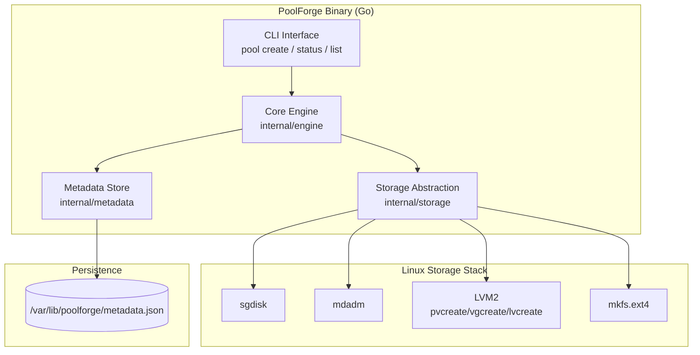
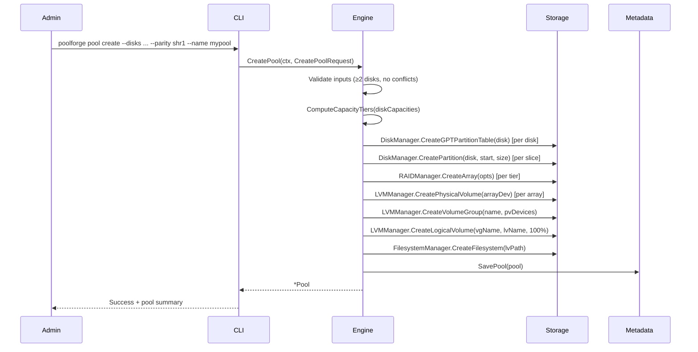
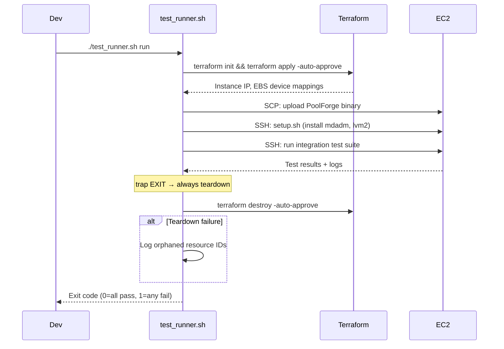

# Design Document — Phase 1: Core Engine and Test Infrastructure

## Overview

Phase 1 of PoolForge delivers the foundational storage management engine: capacity-tier computation from mixed-size disks, GPT disk partitioning, mdadm RAID array creation per tier, LVM stitching (PV → VG → LV), ext4 filesystem creation, a CLI for pool management (`pool create`, `pool status`, `pool list`), a JSON-based metadata store with atomic writes, and an automated AWS-based test infrastructure (Terraform + EC2 + EBS + Test_Runner).

PoolForge replicates Synology Hybrid RAID (SHR) functionality using standard Linux storage tools. The key insight is the capacity-tier algorithm: given mixed-size disks, it computes tiers based on differences between sorted unique capacities, partitions each disk into slices matching eligible tiers, creates one mdadm RAID array per tier, and stitches all arrays into a single LVM volume group presented as one ext4 logical volume.

Phase 1 establishes the interfaces (`EngineService`, storage abstraction, `MetadataStore`) that subsequent phases extend without breaking changes.

### Phase 1 Scope

| Included | Excluded (later phases) |
|----------|------------------------|
| Core engine: tier computation, partitioning, mdadm, LVM, ext4 | Health Monitor (Phase 2) |
| CLI: `pool create`, `pool status`, `pool list` | SMART Monitor (Phase 4) |
| Metadata store: SavePool, LoadPool, ListPools | API Server / REST (Phase 3) |
| Test infrastructure: Terraform IaC, Test_Runner | Web Portal (Phase 3) |
| | Authentication (Phase 3) |
| | Lifecycle ops: AddDisk, ReplaceDisk, RemoveDisk, DeletePool (Phase 2) |
| | Atomic operations / rollback (Phase 4) |

### Design Goals

- Maximize usable capacity from mixed-size disk sets while maintaining parity redundancy
- Isolate multiple pools on the same host with no shared resources
- Persist pool configuration for reboot survival
- Provide clear status hierarchy (pool → array → disk)
- Enable fully automated cloud-based integration testing from day one
- Design interfaces for forward-compatible extension in Phases 2–4

## Architecture

### High-Level Architecture (Phase 1)



### Layered Architecture

1. **Presentation Layer**: CLI commands parse flags and delegate to the Core Engine
2. **Core Engine Layer**: Business logic for tier computation, pool creation orchestration, status aggregation
3. **Storage Abstraction Layer**: Interfaces wrapping sgdisk, mdadm, LVM, ext4 system commands
4. **Persistence Layer**: Metadata store with atomic JSON writes (write-to-temp + fsync + rename)

### Pool Creation Request Flow



## Components and Interfaces

### 1. Core Engine (`internal/engine`)

The central orchestrator for pool operations in Phase 1.

```go
// ParityMode represents the redundancy level
type ParityMode int

const (
    SHR1 ParityMode = iota // Single parity (RAID5 / RAID1)
    SHR2                    // Double parity (RAID6 / RAID5 / RAID1)
)

// State types for the three-level hierarchy
type PoolState string

const (
    PoolHealthy  PoolState = "healthy"
    PoolDegraded PoolState = "degraded"
    PoolFailed   PoolState = "failed"
)

type ArrayState string

const (
    ArrayHealthy    ArrayState = "healthy"
    ArrayDegraded   ArrayState = "degraded"
    ArrayRebuilding ArrayState = "rebuilding"
    ArrayFailed     ArrayState = "failed"
)

type DiskState string

const (
    DiskHealthy DiskState = "healthy"
    DiskFailed  DiskState = "failed"
)

// Pool represents a managed storage pool
type Pool struct {
    ID            string
    Name          string
    ParityMode    ParityMode
    State         PoolState
    Disks         []DiskInfo
    CapacityTiers []CapacityTier
    RAIDArrays    []RAIDArray
    VolumeGroup   string    // e.g., "vg_poolforge_<pool-id>"
    LogicalVolume string    // e.g., "lv_poolforge_<pool-id>"
    MountPoint    string    // e.g., "/mnt/poolforge/<pool-name>"
    CreatedAt     time.Time
    UpdatedAt     time.Time
}

type DiskInfo struct {
    Device       string    // e.g., "/dev/sdb"
    CapacityBytes uint64
    State        DiskState
    Slices       []SliceInfo
}

type SliceInfo struct {
    TierIndex       int
    PartitionNumber int
    PartitionDevice string // e.g., "/dev/sdb1"
    SizeBytes       uint64
}

type CapacityTier struct {
    Index             int
    SliceSizeBytes    uint64
    EligibleDiskCount int
    RAIDArray         string // e.g., "/dev/md0"
}

type RAIDArray struct {
    Device       string     // e.g., "/dev/md0"
    RAIDLevel    int        // 1, 5, or 6
    TierIndex    int
    State        ArrayState
    Members      []string   // partition devices
    CapacityBytes uint64
}

// CreatePoolRequest is the input for pool creation
type CreatePoolRequest struct {
    Name       string
    Disks      []string    // disk device paths
    ParityMode ParityMode
}

// PoolSummary is the abbreviated form for list operations
type PoolSummary struct {
    ID              string
    Name            string
    State           PoolState
    TotalCapacityBytes uint64
    UsedCapacityBytes  uint64
    DiskCount       int
}

// PoolStatus is the full hierarchical status response
type PoolStatus struct {
    Pool       Pool
    ArrayStatuses []ArrayStatus
    DiskStatuses  []DiskStatusInfo
}

type ArrayStatus struct {
    Device       string
    RAIDLevel    int
    TierIndex    int
    State        ArrayState
    CapacityBytes uint64
    Members      []string
}

type DiskStatusInfo struct {
    Device          string
    State           DiskState
    ContributingArrays []string
}

// EngineService defines the Phase 1 core operations interface.
//
// Extensibility: Phase 2 adds AddDisk, ReplaceDisk, RemoveDisk, DeletePool,
// HandleDiskFailure, GetRebuildProgress. Phase 3 exposes this interface via
// REST API. Phase 4 wraps operations with atomic/rollback semantics.
type EngineService interface {
    CreatePool(ctx context.Context, req CreatePoolRequest) (*Pool, error)
    GetPool(ctx context.Context, poolID string) (*Pool, error)
    ListPools(ctx context.Context) ([]PoolSummary, error)
    GetPoolStatus(ctx context.Context, poolID string) (*PoolStatus, error)
}
```

#### Capacity Tier Computation Algorithm

The tier computation is the core algorithm that differentiates SHR from standard RAID. It maximizes usable capacity by grouping equal-sized slices across disks into separate RAID arrays.

```
Input:  disks[]  — list of disks with their capacities in bytes
Output: tiers[]  — list of CapacityTier with slice sizes and eligible disk counts

Algorithm:
1. Collect all disk capacities
2. Sort capacities ascending
3. Extract unique capacity values: [C1, C2, ..., Cn] where C1 < C2 < ... < Cn
4. Compute tier slice sizes:
     Tier 0: sliceSize = C1                    (smallest capacity)
     Tier k: sliceSize = C(k+1) - Ck           for k ≥ 1
5. For each tier k (0-indexed):
     Eligible disks = disks with capacity ≥ C(k+1)
       (i.e., disks whose capacity meets or exceeds the cumulative boundary)
     Eligible disk count determines RAID level (see table below)
6. Create one RAID array per tier from the eligible slices
7. Register all RAID arrays as PVs in a single VG
8. Create one LV spanning 100% of the VG
9. Format LV with ext4
```

**Worked Example**: 4 disks of sizes 1 TB, 2 TB, 2 TB, 4 TB

| Step | Sorted unique capacities | [1 TB, 2 TB, 4 TB] |
|------|--------------------------|---------------------|
| Tier 0 | sliceSize = 1 TB | Eligible: all 4 disks (capacity ≥ 1 TB) |
| Tier 1 | sliceSize = 2 TB − 1 TB = 1 TB | Eligible: 3 disks (capacity ≥ 2 TB) |
| Tier 2 | sliceSize = 4 TB − 2 TB = 2 TB | Eligible: 1 disk (capacity ≥ 4 TB) |

Tier 2 has only 1 eligible disk — insufficient for any RAID level. This tier is skipped (no redundancy possible with a single disk). The pool uses Tier 0 (4-disk RAID 5) + Tier 1 (3-disk RAID 5) under SHR-1.

**Note on minimum eligible disks**: A tier requires at least 2 eligible disks to form any RAID array. Tiers with fewer than 2 eligible disks are skipped.

#### RAID Level Selection Table

| Parity Mode | Eligible Disk Count | RAID Level |
|-------------|-------------------|------------|
| SHR-1       | ≥ 3               | RAID 5     |
| SHR-1       | 2                 | RAID 1     |
| SHR-2       | ≥ 4               | RAID 6     |
| SHR-2       | 3                 | RAID 5     |
| SHR-2       | 2                 | RAID 1     |

### 2. Storage Abstraction Layer (`internal/storage`)

Wraps system commands behind testable interfaces. Phase 1 includes only create and query operations.

```go
// DiskManager handles disk partitioning via sgdisk.
//
// Extensibility: Phase 2 adds WipePartitionTable for disk removal/replacement.
type DiskManager interface {
    GetDiskInfo(device string) (*DiskInfo, error)
    CreateGPTPartitionTable(device string) error
    CreatePartition(device string, start, size uint64) (*Partition, error)
    ListPartitions(device string) ([]Partition, error)
}

type Partition struct {
    Number int
    Device string
    Start  uint64
    Size   uint64
}

// RAIDManager handles mdadm operations.
//
// Extensibility: Phase 2 adds AddMember, RemoveMember, ReshapeArray for
// disk lifecycle operations. Phase 4 wraps with atomic semantics.
type RAIDManager interface {
    CreateArray(opts RAIDCreateOpts) (*RAIDArrayInfo, error)
    GetArrayDetail(device string) (*RAIDArrayDetail, error)
    AssembleArray(device string, members []string) error
    StopArray(device string) error
}

type RAIDCreateOpts struct {
    Name      string   // e.g., "md0"
    Level     int      // 1, 5, or 6
    Members   []string // partition devices
    MetadataVersion string // "1.2"
}

type RAIDArrayInfo struct {
    Device  string
    Level   int
    Members []string
    State   string
}

type RAIDArrayDetail struct {
    Device       string
    Level        int
    State        string
    Members      []MemberInfo
    CapacityBytes uint64
}

type MemberInfo struct {
    Device string
    State  string
}

// LVMManager handles LVM operations.
//
// Extensibility: Phase 2 adds ExtendVolumeGroup, ExtendLogicalVolume for
// disk addition. RemovePhysicalVolume, RemoveVolumeGroup, RemoveLogicalVolume
// for pool deletion.
type LVMManager interface {
    CreatePhysicalVolume(device string) error
    CreateVolumeGroup(name string, pvDevices []string) error
    CreateLogicalVolume(vgName string, lvName string, sizePercent int) error
    GetVolumeGroupInfo(name string) (*VGInfo, error)
}

type VGInfo struct {
    Name          string
    SizeBytes     uint64
    FreeBytes     uint64
    PVCount       int
    LVCount       int
}

// FilesystemManager handles ext4 operations.
//
// Extensibility: Phase 2 adds ResizeFilesystem for pool expansion.
// MountFilesystem and UnmountFilesystem are included in Phase 1 for
// pool creation and boot reassembly.
type FilesystemManager interface {
    CreateFilesystem(device string) error
    MountFilesystem(device string, mountPoint string) error
    UnmountFilesystem(mountPoint string) error
    GetUsage(mountPoint string) (*FSUsage, error)
}

type FSUsage struct {
    TotalBytes uint64
    UsedBytes  uint64
    FreeBytes  uint64
}
```

### 3. Metadata Store (`internal/metadata`)

Persists pool configuration as JSON. Uses atomic writes (write-to-temp + fsync + rename) to prevent corruption on crash.

```go
// MetadataStore defines the Phase 1 persistence interface.
//
// Extensibility: Phase 2 adds DeletePool and disk state tracking.
// Phase 4 adds SaveSMARTData, LoadSMARTData, threshold persistence.
// The schema version field enables forward-compatible migrations.
type MetadataStore interface {
    SavePool(pool *Pool) error
    LoadPool(poolID string) (*Pool, error)
    ListPools() ([]PoolSummary, error)
}
```

Storage path: `/var/lib/poolforge/metadata.json`

Atomic write sequence:
1. Marshal pool data to JSON
2. Write to temporary file in same directory (`metadata.json.tmp`)
3. `fsync` the temporary file
4. `rename` temporary file to `metadata.json` (atomic on same filesystem)

### 4. CLI (`cmd/poolforge`)

Phase 1 commands only:

```
poolforge pool create --disks /dev/sdb,/dev/sdc,/dev/sdd --parity shr1 --name mypool
poolforge pool status <pool-name>
poolforge pool list
```

| Command | Description | Output |
|---------|-------------|--------|
| `pool create` | Creates a pool from specified disks | Pool summary (name, parity, tier count, capacity) |
| `pool status` | Shows full hierarchical status | Pool state, arrays (level, tier, state, members), disks (state, arrays) |
| `pool list` | Lists all pools | Table: name, state, capacity, used, disk count |

### 5. Test Infrastructure (`test/infra/`)

```
test/infra/
├── main.tf              # EC2 instance, EBS volumes, security group
├── variables.tf         # Configurable: instance type, volume sizes, region
├── outputs.tf           # Instance IP, SSH key path, volume device mappings
├── scripts/
│   └── setup.sh         # Install PoolForge + dependencies on EC2
└── test_runner.sh       # Orchestrates: provision → test → collect → teardown
```

#### Terraform Resources

- 1× `aws_instance` (t3.medium, Ubuntu 24.04 AMI)
- 6× `aws_ebs_volume` (gp3, sizes: 1 GB, 2 GB, 3 GB, 4 GB, 5 GB, 10 GB)
- 6× `aws_volume_attachment` for each EBS volume
- 1× `aws_security_group` (SSH ingress only)
- 1× `aws_key_pair` for SSH access
- All resources tagged: `poolforge-test-{run-id}` for orphan identification

#### Test_Runner Lifecycle



Key guarantees:
- `trap` on EXIT ensures `terraform destroy` runs regardless of test outcome
- Non-zero exit code on any test failure (CI/CD compatible)
- Orphaned resource logging if teardown fails (includes AWS resource IDs)
- All resources tagged for manual cleanup fallback

#### Phase 1 Test Scenarios (on EBS)

1. **Pool creation with mixed-size EBS volumes**: Create a pool from 4+ EBS volumes of varying sizes, verify tier computation, RAID arrays, VG/LV/ext4
2. **Multi-pool isolation**: Create two pools on disjoint EBS volume sets, verify no shared resources
3. **Full lifecycle**: Create pool → write data → verify data integrity → verify status hierarchy
4. **Disk conflict rejection**: Attempt to create a second pool using a disk from the first pool, verify rejection

## Data Models

### Metadata Store Schema (Phase 1 — Version 1)

```json
{
  "version": 1,
  "pools": {
    "<pool-id>": {
      "id": "<uuid>",
      "name": "<pool-name>",
      "parity_mode": "shr1|shr2",
      "state": "healthy|degraded|failed",
      "disks": [
        {
          "device": "/dev/sdb",
          "capacity_bytes": 1000000000000,
          "state": "healthy|failed",
          "slices": [
            {
              "tier_index": 0,
              "partition_number": 1,
              "partition_device": "/dev/sdb1",
              "size_bytes": 500000000000
            }
          ]
        }
      ],
      "capacity_tiers": [
        {
          "index": 0,
          "slice_size_bytes": 500000000000,
          "eligible_disk_count": 4,
          "raid_array": "/dev/md0"
        }
      ],
      "raid_arrays": [
        {
          "device": "/dev/md0",
          "raid_level": 5,
          "tier_index": 0,
          "state": "healthy|degraded|rebuilding|failed",
          "members": ["/dev/sdb1", "/dev/sdc1", "/dev/sdd1", "/dev/sde1"],
          "capacity_bytes": 1500000000000
        }
      ],
      "volume_group": "vg_poolforge_<pool-id>",
      "logical_volume": "lv_poolforge_<pool-id>",
      "mount_point": "/mnt/poolforge/<pool-name>",
      "created_at": "2025-01-01T00:00:00Z",
      "updated_at": "2025-01-01T00:00:00Z"
    }
  }
}
```

**Phase 1 schema notes**:
- `version` field enables forward-compatible migrations. Phase 2+ will increment the version and add new top-level sections.
- Phase 1 includes only the `pools` section. `smart_data`, `smart_thresholds`, and `users` sections are added in Phase 4, Phase 4, and Phase 3 respectively.
- Array state includes `rebuilding` in the schema for forward compatibility, though Phase 1 does not implement rebuild operations.


## Correctness Properties

*A property is a characteristic or behavior that should hold true across all valid executions of a system — essentially, a formal statement about what the system should do. Properties serve as the bridge between human-readable specifications and machine-verifiable correctness guarantees.*

Property numbering follows the master design document (P1–P37) for traceability. Phase 1 implements P1–P7, P10, P13, P35–P37.

### Property 1: Capacity tier computation produces correct slice sizes

*For any* set of disk capacities (with at least 2 disks), the computed capacity tiers should have slice sizes equal to the differences between consecutive sorted unique capacities, with the first tier equal to the smallest capacity. The sum of all tier slice sizes should equal the largest disk capacity, and the number of tiers should equal the number of unique capacity values.

**Validates: Requirements 1.2**

### Property 2: Disk slicing matches eligible tiers

*For any* disk with a given capacity and any set of computed capacity tiers, the disk should receive exactly one slice per tier for which the disk has sufficient cumulative capacity. A disk of capacity C should have slices for all tiers whose cumulative boundary does not exceed C.

**Validates: Requirements 1.1, 1.3**

### Property 3: One RAID array per capacity tier

*For any* pool created from a valid set of disks, the number of RAID arrays should equal the number of capacity tiers (with ≥2 eligible disks), and each array should contain exactly the slices from all eligible disks for that tier.

**Validates: Requirements 1.4**

### Property 4: RAID level selection follows parity mode and disk count rules

*For any* parity mode (SHR-1 or SHR-2) and any eligible disk count for a capacity tier, the selected RAID level should match the selection table: SHR-1 with ≥3 disks → RAID 5, SHR-1 with 2 disks → RAID 1, SHR-2 with ≥4 disks → RAID 6, SHR-2 with 3 disks → RAID 5, SHR-2 with 2 disks → RAID 1.

**Validates: Requirements 1.5, 1.6, 1.7, 1.8, 1.9**

### Property 5: Pool creation produces exactly one VG, one LV, and one ext4 filesystem

*For any* successfully created pool, there should be exactly one Volume Group containing all RAID arrays as physical volumes, exactly one Logical Volume spanning the entire VG, and an ext4 filesystem on that LV.

**Validates: Requirements 1.10, 1.11**

### Property 6: Disk membership exclusivity across pools

*For any* disk that is a member of an existing pool, any attempt to use that disk in another pool should be rejected with an error identifying the conflicting disk and owning pool.

**Validates: Requirements 1.13, 2.3**

### Property 7: Pool isolation — disjoint resources

*For any* two pools on the same system, their Volume Groups, Logical Volumes, RAID arrays, and member disks should be completely disjoint sets with no shared components.

**Validates: Requirements 2.2, 1.14**

### Property 10: Pool status contains complete hierarchy information

*For any* pool, the status response should contain: the pool state (from {healthy, degraded, failed}), total and used capacity; for each RAID array: RAID level, capacity tier, state (from {healthy, degraded, rebuilding, failed}), capacity, and member disks; for each disk: descriptor, health state (from {healthy, failed}), and contributing arrays.

**Validates: Requirements 3.1, 3.2, 3.3, 3.4**

### Property 13: Metadata store round-trip persistence

*For any* valid pool configuration, saving it to the metadata store and then loading it back should produce an equivalent pool configuration with all fields preserved.

**Validates: Requirements 3.5, 1.14**

### Property 35: Test_Runner teardown executes regardless of test outcome

*For any* test run (whether tests pass or fail), the Test_Runner should execute teardown of all AWS resources.

**Validates: Requirements 6.9**

### Property 36: Test_Runner exit code reflects test results

*For any* test run where at least one test scenario fails, the Test_Runner should return a non-zero exit code.

**Validates: Requirements 6.8**

### Property 37: Pool list contains required fields

*For any* set of pools on the system, the list response should contain each pool's name, state, total capacity, used capacity, and member disk count.

**Validates: Requirements 2.4**

## Error Handling

### Input Validation Errors

| Error Condition | Response | Requirement |
|----------------|----------|-------------|
| Fewer than 2 disks provided | Reject with error: "minimum 2 disks required, got N" | 1.12 |
| Disk already in another pool | Reject with error: "disk /dev/sdX is already a member of pool 'Y'" | 1.13, 2.3 |
| Invalid disk descriptor (not a block device) | Reject with error: "device /dev/sdX is not a valid block device" | — |
| Invalid parity mode | Reject with error: "unsupported parity mode, use shr1 or shr2" | — |
| Pool name already exists | Reject with error: "pool name 'X' already exists" | 1.14 |
| Pool not found (status/get) | Reject with error: "pool 'X' not found" | — |

### Storage Operation Errors

| Error Condition | Response | Requirement |
|----------------|----------|-------------|
| sgdisk partition failure | Log error with device and exit code, report to caller | — |
| mdadm array creation failure | Log error with array name and exit code, report to caller | — |
| pvcreate/vgcreate/lvcreate failure | Log error with LVM operation details, report to caller | — |
| mkfs.ext4 failure | Log error with device path, report to caller | — |
| Metadata write failure (disk full, permissions) | Log error, report to caller | — |

**Phase 1 error handling note**: Phase 1 does not implement rollback of partial operations. If pool creation fails midway (e.g., mdadm succeeds but LVM fails), the system logs the error and reports failure. Manual cleanup may be required. Phase 4 adds atomic operation semantics with automatic rollback.

### Metadata Store Errors

| Error Condition | Response | Requirement |
|----------------|----------|-------------|
| Metadata file does not exist (first run) | Create new empty metadata structure | — |
| Metadata file corrupted (invalid JSON) | Log error, refuse to operate until manually resolved | — |
| Atomic write failure (temp file write) | Log error, original metadata file preserved | — |
| Atomic write failure (rename) | Log error, temp file preserved for recovery | — |

### Test Infrastructure Errors

| Error Condition | Response | Requirement |
|----------------|----------|-------------|
| Terraform apply failure | Log error, attempt teardown, exit non-zero | 6.9 |
| SSH connection failure to EC2 | Log error, attempt teardown, exit non-zero | 6.9 |
| Test failure | Collect logs, execute teardown, exit non-zero | 6.8, 6.9 |
| Teardown failure | Log orphaned resource IDs (AWS resource identifiers) for manual cleanup | 6.10 |

## Testing Strategy

### Dual Testing Approach

PoolForge Phase 1 uses both unit tests and property-based tests as complementary strategies:

- **Unit tests**: Verify specific examples, edge cases, error conditions, and integration points
- **Property-based tests**: Verify universal properties across randomly generated inputs
- Together they provide comprehensive coverage: unit tests catch concrete bugs, property tests verify general correctness

### Property-Based Testing Configuration

- **Library**: [rapid](https://github.com/flyingmutant/rapid) for Go property-based testing
- **Minimum iterations**: 100 per property test
- **Tag format**: Each property test includes a comment referencing the design property:
  `// Feature: poolforge-phase1-core-engine, Property {N}: {title}`
- **Each correctness property is implemented by a single property-based test**

### Unit Test Scope

Unit tests focus on:

- **Specific examples**: 3 disks of 1 TB/2 TB/4 TB → expected tiers, RAID levels, slice counts
- **Edge cases**: Minimum disk count rejection (Req 1.12), all-same-size disks (single tier), SHR-2 with exactly 2 disks → RAID 1
- **Error conditions**: Invalid disk descriptors, duplicate disk in pool, pool not found
- **Metadata operations**: Save/load specific pool configurations, handle missing metadata file

### Property Test Scope (Phase 1)

| Property | Category | What it tests |
|----------|----------|---------------|
| P1 | Core Algorithm | Tier slice sizes = differences between sorted unique capacities |
| P2 | Core Algorithm | Each disk gets slices for all tiers within its capacity |
| P3 | Core Algorithm | Array count = tier count, correct slice membership |
| P4 | Core Algorithm | RAID level matches selection table for all parity/count combos |
| P5 | Structural Invariant | Exactly one VG, one LV, one ext4 per pool |
| P6 | Isolation | Disk used in pool A rejected for pool B |
| P7 | Isolation | Two pools share no VGs, LVs, arrays, or disks |
| P10 | Status | Status response contains full hierarchy with all required fields |
| P13 | Persistence | SavePool then LoadPool produces equivalent configuration |
| P35 | Test Infra | Teardown runs on both pass and fail |
| P36 | Test Infra | Non-zero exit code on test failure |
| P37 | API | Pool list contains name, state, capacity, used, disk count |

### Integration Test Scope (Phase 1)

Integration tests run against the cloud Test_Environment (EC2 + EBS) and validate:

1. GPT partitioning of EBS volumes via sgdisk
2. mdadm RAID array creation from partitions
3. LVM PV/VG/LV creation from RAID arrays
4. ext4 filesystem creation on LV
5. Pool creation end-to-end with mixed-size EBS volumes
6. Multi-pool creation with isolation verification
7. Full lifecycle: create pool → write data → read data → verify status
8. Boot reassembly: persist metadata, stop arrays, reassemble from metadata

### Test File Organization

```
internal/engine/
    engine_test.go          # Unit tests for engine logic
    engine_prop_test.go     # Property tests P1-P7, P10
internal/metadata/
    metadata_test.go        # Unit tests for metadata store
    metadata_prop_test.go   # Property test P13
internal/storage/
    disk_test.go            # Unit tests for disk manager (mocked)
    raid_test.go            # Unit tests for RAID manager (mocked)
    lvm_test.go             # Unit tests for LVM manager (mocked)
    fs_test.go              # Unit tests for filesystem manager (mocked)
test/integration/
    pool_create_test.go     # Integration: pool creation on real disks
    pool_status_test.go     # Integration: status reporting
    multi_pool_test.go      # Integration: multi-pool isolation
    lifecycle_test.go       # Integration: create → write → read → status
test/infra/
    test_runner.sh          # Test_Runner script (P35, P36 validated here)
```

### Extensibility Notes

Phase 1 interfaces are designed for forward-compatible extension:

- **EngineService**: Phase 2 adds `AddDisk`, `ReplaceDisk`, `RemoveDisk`, `DeletePool`, `HandleDiskFailure`, `GetRebuildProgress`. The interface grows additively — no existing methods change signature.
- **Storage Abstraction**: Phase 2 adds `ReshapeArray`, `AddMember`, `RemoveMember` to RAIDManager; `ExtendVolumeGroup`, `ExtendLogicalVolume` to LVMManager; `ResizeFilesystem` to FilesystemManager. Phase 4 wraps with atomic semantics.
- **MetadataStore**: Phase 2 adds `DeletePool` and disk state tracking. Phase 4 adds `SaveSMARTData`, `LoadSMARTData`, threshold persistence. The schema `version` field enables forward-compatible migrations.
- **CLI**: Phase 2 adds `pool delete`, `pool add-disk`, `pool replace-disk`. Phase 3 adds `serve` command. Phase 4 adds `smart` subcommands.
