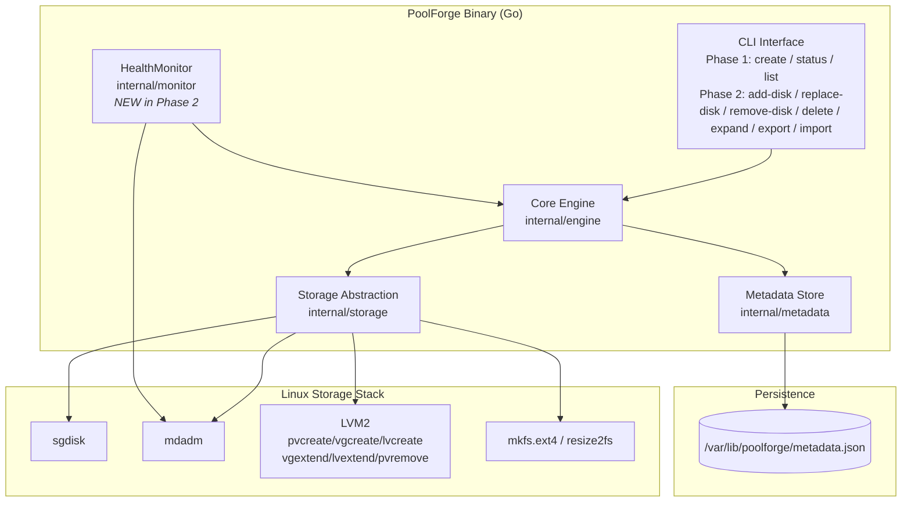
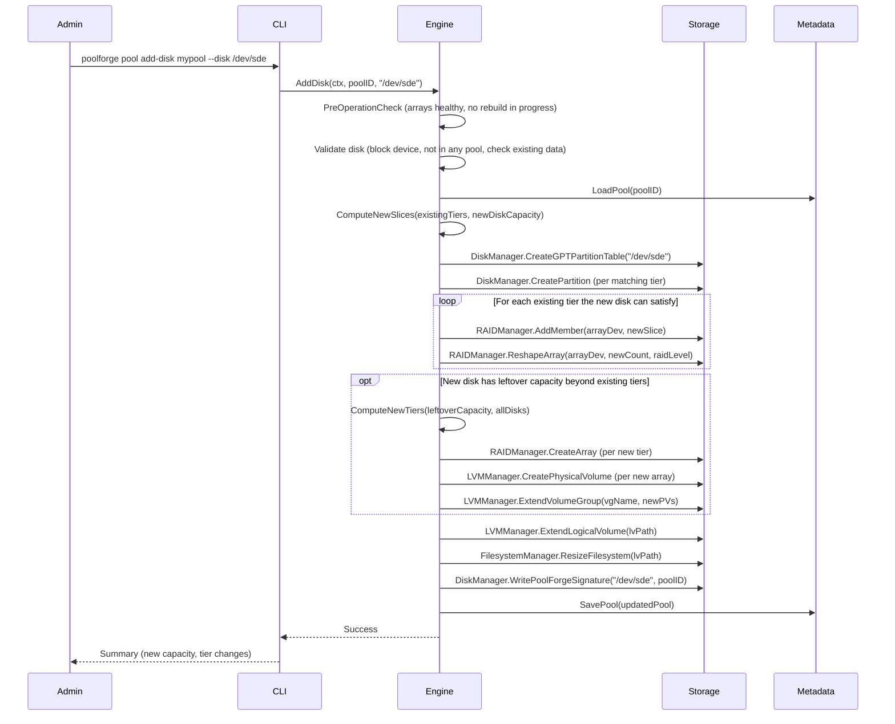
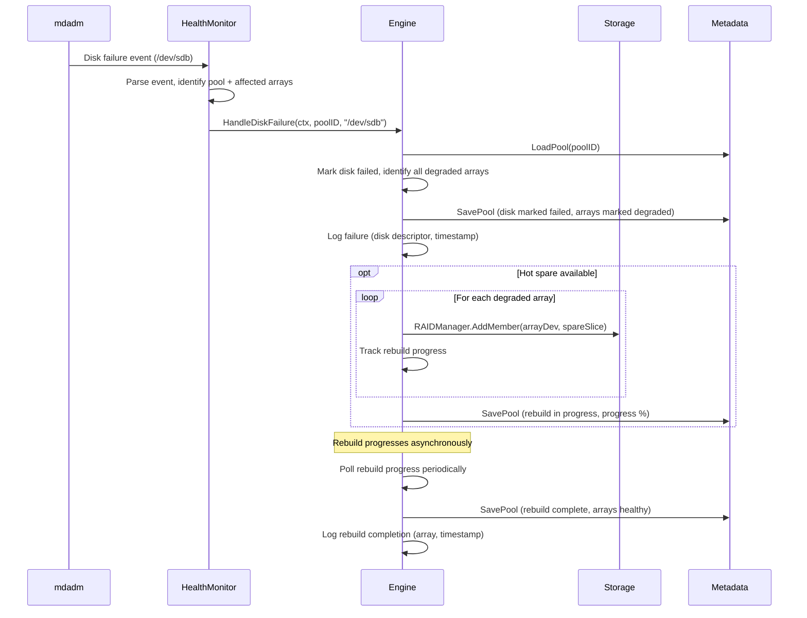
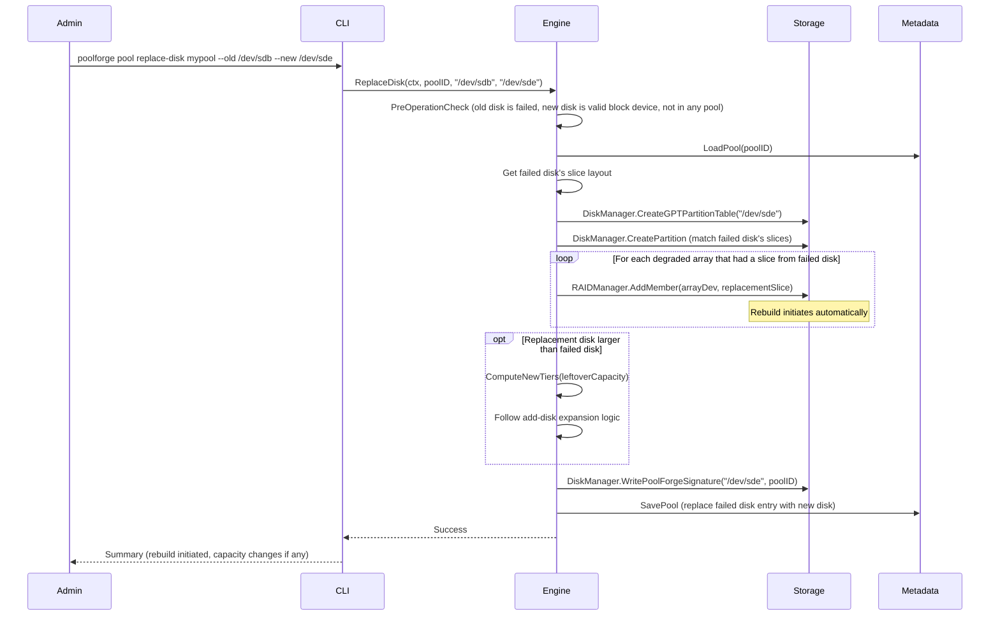
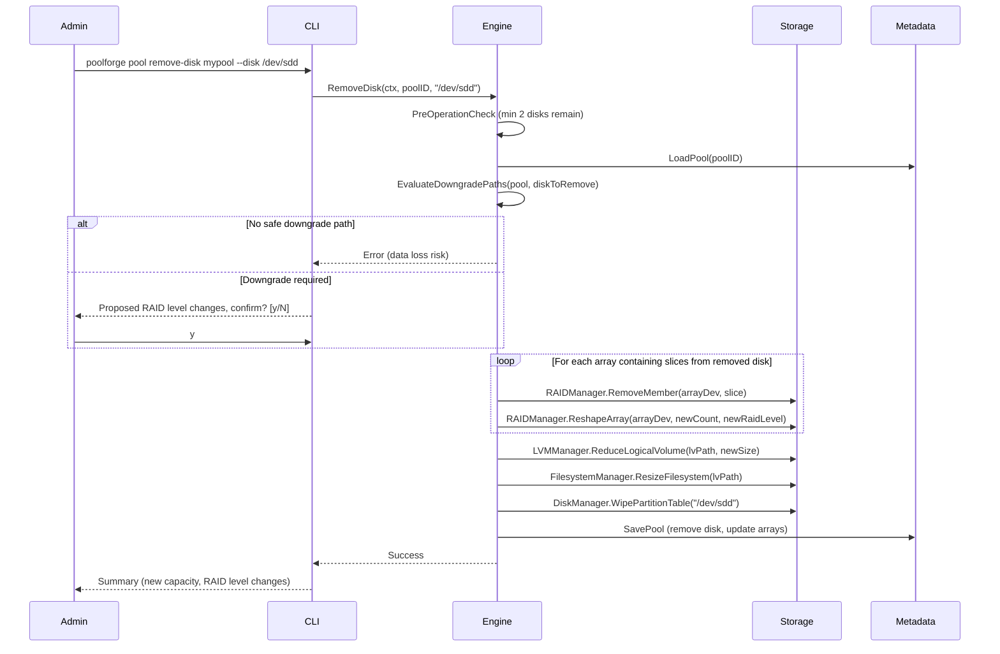
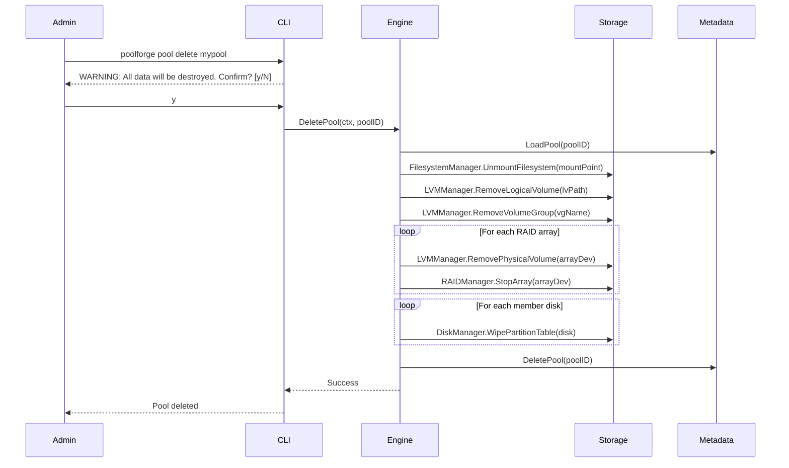
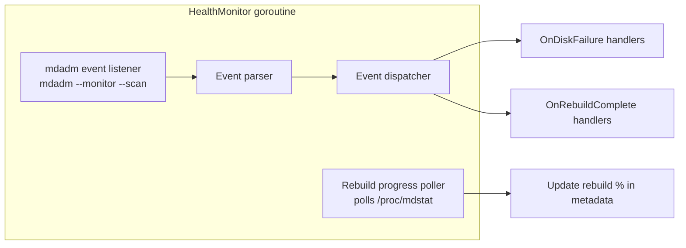

# Design Document — Phase 2: Lifecycle Operations

## Overview

Phase 2 of PoolForge delivers lifecycle operations that build on the Phase 1 foundation. Where Phase 1 established pool creation, status reporting, and metadata persistence, Phase 2 adds the ability to grow, shrink, heal, and destroy pools — the operations that make PoolForge usable in production.

The key additions are:

- **Disk failure detection and self-healing**: A new `HealthMonitor` component listens for mdadm events and automatically initiates RAID rebuilds using hot spares, with rebuild progress tracking persisted across restarts.
- **Add disk**: Partition a new disk to match existing tiers, reshape arrays to include the new member, compute new tiers from leftover capacity, and extend the LV/filesystem.
- **Replace disk**: Partition a replacement disk to match the failed disk's slice layout, initiate rebuilds on all degraded arrays, and optionally expand if the replacement is larger.
- **Remove disk**: Evaluate RAID level downgrade paths, reshape arrays to the reduced member count, and shrink the LV/filesystem.
- **Delete pool**: Tear down all pool resources (unmount, remove LV/VG, stop/destroy arrays, wipe signatures) and delete metadata.
- **Unallocated capacity detection**: Periodic scan for unused disk space with admin-approved expansion.
- **Pool configuration serialization**: Deterministic JSON export/import with round-trip guarantee and schema versioning.
- **Safety**: Block device validation, existing data detection, PoolForge_Signature on managed disks, pre-operation consistency checks.

Phase 2 extends (never replaces) Phase 1 interfaces. All Phase 1 CLI commands, metadata persistence, and test infrastructure continue unchanged.

### Phase 2 Scope

| Included | Excluded (later phases) |
|----------|------------------------|
| HealthMonitor (mdadm event listener, self-healing) | SMART Monitor (Phase 4) |
| AddDisk, ReplaceDisk, RemoveDisk, DeletePool | API Server / REST (Phase 3) |
| Unallocated capacity detection + admin-approved expansion | Web Portal (Phase 3) |
| Pool configuration export/import (JSON) | Authentication (Phase 3) |
| CLI: add-disk, replace-disk, remove-disk, delete, expand, export, import | Atomic operations / rollback (Phase 4) |
| PoolForge_Signature, pre-operation checks | |
| Phase 2 status enhancements (degraded details, rebuild progress) | |

### Design Goals

- Enable non-destructive pool expansion via hot-add disk with automatic tier computation
- Provide self-healing with automatic rebuild on disk failure within 10 seconds of detection
- Support safe disk removal with RAID level downgrade evaluation
- Maintain complete multi-pool isolation across all lifecycle operations
- Ensure pool configuration round-trip fidelity for backup and migration
- Preserve all Phase 1 functionality without breaking changes


## Architecture

### High-Level Architecture (Phase 1 + Phase 2)



### Phase 2 Component Additions

Phase 2 introduces one new component (`HealthMonitor`) and extends three existing components:

| Component | Phase 1 | Phase 2 Additions |
|-----------|---------|-------------------|
| EngineService | CreatePool, GetPool, ListPools, GetPoolStatus | AddDisk, ReplaceDisk, RemoveDisk, DeletePool, HandleDiskFailure, GetRebuildProgress, ExportPool, ImportPool, DetectUnallocated, ExpandPool |
| DiskManager | GetDiskInfo, CreateGPTPartitionTable, CreatePartition, ListPartitions | WipePartitionTable |
| RAIDManager | CreateArray, GetArrayDetail, AssembleArray, StopArray | AddMember, RemoveMember, ReshapeArray |
| LVMManager | CreatePhysicalVolume, CreateVolumeGroup, CreateLogicalVolume, GetVolumeGroupInfo | ExtendVolumeGroup, ReduceVolumeGroup, ExtendLogicalVolume, ReduceLogicalVolume, RemovePhysicalVolume, RemoveVolumeGroup, RemoveLogicalVolume |
| FilesystemManager | CreateFilesystem, MountFilesystem, UnmountFilesystem, GetUsage | ResizeFilesystem |
| MetadataStore | SavePool, LoadPool, ListPools | DeletePool |
| HealthMonitor | — | Start, Stop, OnDiskFailure, OnRebuildComplete (NEW) |


### Key Sequence Diagrams

#### Add Disk Flow



#### Self-Healing Flow (Disk Failure → Rebuild)



#### Replace Disk Flow



#### Remove Disk Flow



#### Delete Pool Flow




## Components and Interfaces

### 1. Core Engine Extensions (`internal/engine`)

Phase 2 extends the `EngineService` interface additively. All Phase 1 methods retain their signatures.

```go
// EngineService defines the complete Phase 1 + Phase 2 operations interface.
//
// Phase 1 methods: CreatePool, GetPool, ListPools, GetPoolStatus
// Phase 2 additions below.
// Phase 3 will expose this interface via REST API.
// Phase 4 wraps operations with atomic/rollback semantics.
type EngineService interface {
    // --- Phase 1 (unchanged) ---
    CreatePool(ctx context.Context, req CreatePoolRequest) (*Pool, error)
    GetPool(ctx context.Context, poolID string) (*Pool, error)
    ListPools(ctx context.Context) ([]PoolSummary, error)
    GetPoolStatus(ctx context.Context, poolID string) (*PoolStatus, error)

    // --- Phase 2: Disk Lifecycle ---
    AddDisk(ctx context.Context, poolID string, disk string) error
    ReplaceDisk(ctx context.Context, poolID string, oldDisk string, newDisk string) error
    RemoveDisk(ctx context.Context, poolID string, disk string) error

    // --- Phase 2: Pool Lifecycle ---
    DeletePool(ctx context.Context, poolID string) error

    // --- Phase 2: Self-Healing ---
    HandleDiskFailure(ctx context.Context, poolID string, disk string) error
    GetRebuildProgress(ctx context.Context, poolID string, arrayID string) (*RebuildProgress, error)

    // --- Phase 2: Configuration Serialization ---
    ExportPool(ctx context.Context, poolID string) (*PoolConfiguration, error)
    ImportPool(ctx context.Context, config *PoolConfiguration) error

    // --- Phase 2: Unallocated Capacity ---
    DetectUnallocated(ctx context.Context, poolID string) (*UnallocatedReport, error)
    ExpandPool(ctx context.Context, poolID string) error
}
```

#### New Data Types (Phase 2)

```go
// RebuildProgress tracks the state of a RAID array rebuild.
type RebuildProgress struct {
    ArrayDevice     string        // e.g., "/dev/md0"
    TierIndex       int
    State           RebuildState  // rebuilding, complete, failed
    PercentComplete float64       // 0.0 to 100.0
    EstimatedETA    time.Duration // estimated time remaining
    TargetDisk      string        // disk being rebuilt onto
    StartedAt       time.Time
    UpdatedAt       time.Time
}

type RebuildState string

const (
    RebuildInProgress RebuildState = "rebuilding"
    RebuildComplete   RebuildState = "complete"
    RebuildFailed     RebuildState = "failed"
)

// DiskFailureEvent is emitted by the HealthMonitor when mdadm reports a failure.
type DiskFailureEvent struct {
    Disk        string    // failed disk descriptor, e.g., "/dev/sdb"
    ArrayDevice string    // array that reported the failure, e.g., "/dev/md0"
    PoolID      string    // owning pool (resolved by monitor)
    Timestamp   time.Time
}

// RebuildCompleteEvent is emitted when a RAID array rebuild finishes.
type RebuildCompleteEvent struct {
    ArrayDevice string    // e.g., "/dev/md0"
    PoolID      string
    TargetDisk  string    // disk that was rebuilt onto
    Timestamp   time.Time
}

// UnallocatedReport describes unallocated capacity on pool member disks.
type UnallocatedReport struct {
    PoolID              string
    TotalUnallocatedBytes uint64
    DiskDetails         []UnallocatedDiskDetail
}

type UnallocatedDiskDetail struct {
    Device           string
    UnallocatedBytes uint64
}

// PoolConfiguration is the serializable form for export/import.
type PoolConfiguration struct {
    SchemaVersion int              `json:"schema_version"`
    Pool          PoolConfigData   `json:"pool"`
}

type PoolConfigData struct {
    ID            string                `json:"id"`
    Name          string                `json:"name"`
    ParityMode    string                `json:"parity_mode"`
    State         string                `json:"state"`
    Disks         []DiskConfigData      `json:"disks"`
    CapacityTiers []TierConfigData      `json:"capacity_tiers"`
    RAIDArrays    []ArrayConfigData     `json:"raid_arrays"`
    VolumeGroup   string                `json:"volume_group"`
    LogicalVolume string                `json:"logical_volume"`
    MountPoint    string                `json:"mount_point"`
    CreatedAt     string                `json:"created_at"`
    UpdatedAt     string                `json:"updated_at"`
}

type DiskConfigData struct {
    Device        string              `json:"device"`
    CapacityBytes uint64              `json:"capacity_bytes"`
    State         string              `json:"state"`
    Signature     string              `json:"poolforge_signature"`
    Slices        []SliceConfigData   `json:"slices"`
}

type SliceConfigData struct {
    TierIndex       int    `json:"tier_index"`
    PartitionNumber int    `json:"partition_number"`
    PartitionDevice string `json:"partition_device"`
    SizeBytes       uint64 `json:"size_bytes"`
}

type TierConfigData struct {
    Index             int    `json:"index"`
    SliceSizeBytes    uint64 `json:"slice_size_bytes"`
    EligibleDiskCount int    `json:"eligible_disk_count"`
    RAIDArray         string `json:"raid_array"`
}

type ArrayConfigData struct {
    Device        string   `json:"device"`
    RAIDLevel     int      `json:"raid_level"`
    TierIndex     int      `json:"tier_index"`
    State         string   `json:"state"`
    Members       []string `json:"members"`
    CapacityBytes uint64   `json:"capacity_bytes"`
}
```


#### Add-Disk Algorithm (Detailed)

The add-disk algorithm handles three cases based on the relationship between the new disk's capacity and the existing tier structure.

```
Input:  pool       — existing pool with tiers T0..Tn and disks D0..Dm
        newDisk    — new disk with capacity Cnew
        
Output: updated pool with new disk integrated

Pre-conditions:
  - All arrays healthy, no rebuild in progress
  - newDisk is a valid block device, not in any pool
  - Pool has ≥ 2 disks (invariant maintained)

Algorithm:

1. Load existing sorted unique capacities: [C1, C2, ..., Cn]
   Load existing tier boundaries: B0=0, B1=C1, B2=C2, ..., Bn=Cn

2. CASE A: Cnew matches an existing capacity (Cnew == Ck for some k)
   - Partition newDisk into slices matching tiers T0..T(k-1)
     (all tiers whose cumulative boundary ≤ Cnew)
   - For each matching tier Ti:
       AddMember(Ti.array, newSlice_i)
       ReshapeArray(Ti.array, Ti.eligibleCount + 1, selectRAIDLevel(parityMode, Ti.eligibleCount + 1))
   - Update tier eligible counts

3. CASE B: Cnew > Cn (new disk larger than all existing disks)
   - Partition newDisk into slices matching ALL existing tiers T0..Tn
   - For each existing tier Ti:
       AddMember(Ti.array, newSlice_i)
       ReshapeArray(Ti.array, Ti.eligibleCount + 1, selectRAIDLevel(...))
   - Compute leftover: Cleftover = Cnew - Cn
   - Compute new tiers from leftover capacity:
       New tier Tn+1: sliceSize = Cleftover, eligibleCount = 1
       (Only 1 disk has this capacity → tier skipped, no RAID possible)
   - If other disks also have unallocated capacity at this boundary,
     new tiers may have ≥ 2 eligible disks → create new RAID arrays
   - For each new tier with ≥ 2 eligible disks:
       CreateArray(newTier)
       CreatePhysicalVolume(newArrayDev)
       ExtendVolumeGroup(vgName, newPV)

4. CASE C: Cnew < C1 (new disk smaller than smallest existing capacity)
   - This is the most complex case: requires repartitioning existing disks
   - New smallest tier: T_new with sliceSize = Cnew
   - Existing tier T0 shrinks: T0.sliceSize = C1 - Cnew
   - All existing disks must be repartitioned to include T_new
   - For each existing disk Di:
       Split Di's T0 partition into two: T_new slice (Cnew) + reduced T0 slice (C1 - Cnew)
   - Create new RAID array for T_new (all disks + newDisk eligible)
   - Reshape existing T0 array (member count unchanged, but slice size changed)
   - Partition newDisk with T_new slice only
   - AddMember to T_new array

5. CASE D: C1 < Cnew < Cn (new disk between existing capacities)
   - Partition newDisk into slices for all tiers where cumulative boundary ≤ Cnew
   - For each matching tier: AddMember + ReshapeArray
   - If Cnew doesn't match any existing boundary exactly:
       Compute new tier from the gap between Cnew and the next lower boundary
       This may require splitting an existing tier (similar to Case C logic)

6. Post-operations (all cases):
   - ExtendLogicalVolume(lvPath)
   - ResizeFilesystem(lvPath)
   - WritePoolForgeSignature(newDisk, poolID)
   - SavePool(updatedPool)
```

#### Remove-Disk Downgrade Evaluation Algorithm

```
Input:  pool       — existing pool
        diskToRemove — disk to be removed

Output: DowngradeReport with per-array impact assessment

Algorithm:

1. For each RAID array Ai that contains a slice from diskToRemove:
   a. newMemberCount = Ai.memberCount - 1
   b. If newMemberCount < 2:
      → Report: Array Ai cannot survive removal (data loss)
      → Overall result: REJECT removal
   c. Determine new RAID level:
      newRAIDLevel = selectRAIDLevel(pool.parityMode, newMemberCount)
   d. If newRAIDLevel < Ai.currentRAIDLevel:
      → Report: Array Ai downgrades from RAID-X to RAID-Y
      → Flag: requires confirmation
   e. If newRAIDLevel == Ai.currentRAIDLevel:
      → Report: Array Ai reduces member count, same RAID level

2. For tiers where diskToRemove is the ONLY disk with capacity for that tier:
   → The entire tier and its array must be removed
   → Report: Tier Tk and array Ak will be destroyed
   → Capacity reduction = Ak.capacityBytes

3. Aggregate report:
   - Total capacity reduction
   - Per-array RAID level changes
   - Whether any tier is destroyed
   - Whether removal is safe (no data loss path exists)

RAID Level Downgrade Paths:
  SHR-1:
    RAID 5 (≥3 disks) → RAID 1 (2 disks)    [safe: single parity maintained]
    RAID 1 (2 disks)  → cannot remove         [would leave 1 disk, no redundancy]
  SHR-2:
    RAID 6 (≥4 disks) → RAID 5 (3 disks)     [safe: loses double parity, keeps single]
    RAID 5 (3 disks)  → RAID 1 (2 disks)     [safe: single parity maintained]
    RAID 1 (2 disks)  → cannot remove         [would leave 1 disk, no redundancy]
```

### 2. HealthMonitor (`internal/monitor`) — NEW

The HealthMonitor is the only new component in Phase 2. It runs as a background goroutine, listening for mdadm events via `mdadm --monitor --scan` and dispatching failure/rebuild events to registered handlers.

```go
// HealthMonitor listens for mdadm events and triggers self-healing.
//
// Implementation: Spawns `mdadm --monitor --scan --oneshot` periodically
// or uses `mdadm --monitor` in follow mode, parsing stdout for events.
//
// Event processing guarantee: failure events are processed within 10 seconds.
//
// Phase 3 will expose rebuild progress via WebSocket.
// Phase 4 will integrate SMART monitoring into the same event pipeline.
type HealthMonitor interface {
    // Start begins listening for mdadm events. Blocks until ctx is cancelled.
    Start(ctx context.Context) error

    // Stop gracefully shuts down the monitor.
    Stop() error

    // OnDiskFailure registers a handler called when mdadm reports a disk failure.
    OnDiskFailure(handler func(DiskFailureEvent))

    // OnRebuildComplete registers a handler called when a rebuild finishes.
    OnRebuildComplete(handler func(RebuildCompleteEvent))
}
```

#### HealthMonitor Internal Design



The monitor operates in a loop:
1. **Listen**: Read mdadm monitor output for `Fail`, `SpareActive`, `RebuildFinished` events
2. **Parse**: Extract disk descriptor, array device, and event type
3. **Resolve**: Look up which pool owns the affected array (via metadata)
4. **Dispatch**: Call registered handlers (which invoke `Engine.HandleDiskFailure` or update rebuild state)
5. **Poll**: Separately, a progress poller reads `/proc/mdstat` every 5 seconds during active rebuilds to update percentage and ETA in metadata

#### SHR-1 vs SHR-2 Double-Failure Handling

| Scenario | SHR-1 Behavior | SHR-2 Behavior |
|----------|----------------|----------------|
| 1st disk fails | Arrays degrade, rebuild starts if spare available | Arrays degrade, rebuild starts if spare available |
| 2nd disk fails during rebuild (same array) | Array marked FAILED, critical alert logged | Array remains DEGRADED (double parity absorbs), warning logged |
| 2nd disk fails during rebuild (different array) | Each array independently degraded | Each array independently degraded |

### 3. Storage Abstraction Extensions (`internal/storage`)

Phase 2 adds methods to existing interfaces. Phase 1 methods are unchanged.

```go
// DiskManager — Phase 2 additions
type DiskManager interface {
    // --- Phase 1 (unchanged) ---
    GetDiskInfo(device string) (*DiskInfo, error)
    CreateGPTPartitionTable(device string) error
    CreatePartition(device string, start, size uint64) (*Partition, error)
    ListPartitions(device string) ([]Partition, error)

    // --- Phase 2 ---
    // WipePartitionTable removes all partitions and signatures from a disk.
    // Used by DeletePool and RemoveDisk.
    WipePartitionTable(device string) error

    // WritePoolForgeSignature writes a GPT partition attribute identifying
    // this disk as managed by PoolForge for a specific pool.
    WritePoolForgeSignature(device string, poolID string) error

    // ReadPoolForgeSignature reads the PoolForge signature from a disk.
    // Returns empty string if no signature present.
    ReadPoolForgeSignature(device string) (string, error)

    // HasExistingData checks if a disk has existing filesystems or partition tables.
    HasExistingData(device string) (bool, error)
}

// RAIDManager — Phase 2 additions
type RAIDManager interface {
    // --- Phase 1 (unchanged) ---
    CreateArray(opts RAIDCreateOpts) (*RAIDArrayInfo, error)
    GetArrayDetail(device string) (*RAIDArrayDetail, error)
    AssembleArray(device string, members []string) error
    StopArray(device string) error

    // --- Phase 2 ---
    // AddMember adds a partition to an existing array (triggers rebuild).
    // Wraps: mdadm --add <array> <member>
    AddMember(arrayDevice string, member string) error

    // RemoveMember marks a member as failed and removes it from the array.
    // Wraps: mdadm --fail <array> <member> && mdadm --remove <array> <member>
    RemoveMember(arrayDevice string, member string) error

    // ReshapeArray changes the geometry of an array (member count and/or RAID level).
    // Wraps: mdadm --grow <array> --raid-devices=N --level=L
    ReshapeArray(arrayDevice string, newMemberCount int, raidLevel int) error

    // GetSyncStatus reads /proc/mdstat for rebuild/reshape progress.
    GetSyncStatus(arrayDevice string) (*SyncStatus, error)
}

type SyncStatus struct {
    State           string  // "clean", "active", "resyncing", "recovering", "degraded"
    PercentComplete float64 // 0-100, only meaningful during resync/recovery
    EstimatedFinish time.Duration
}

// LVMManager — Phase 2 additions
type LVMManager interface {
    // --- Phase 1 (unchanged) ---
    CreatePhysicalVolume(device string) error
    CreateVolumeGroup(name string, pvDevices []string) error
    CreateLogicalVolume(vgName string, lvName string, sizePercent int) error
    GetVolumeGroupInfo(name string) (*VGInfo, error)

    // --- Phase 2 ---
    // ExtendVolumeGroup adds a PV to an existing VG.
    // Wraps: vgextend <vg> <pv>
    ExtendVolumeGroup(name string, pvDevice string) error

    // ReduceVolumeGroup removes a PV from a VG.
    // Wraps: vgreduce <vg> <pv>
    ReduceVolumeGroup(name string, pvDevice string) error

    // ExtendLogicalVolume extends an LV to use all free space in its VG.
    // Wraps: lvextend -l +100%FREE <lv>
    ExtendLogicalVolume(lvPath string) error

    // ReduceLogicalVolume shrinks an LV to the specified size.
    // Wraps: lvreduce -L <size> <lv>
    ReduceLogicalVolume(lvPath string, sizeBytes uint64) error

    // RemovePhysicalVolume removes a PV.
    // Wraps: pvremove <device>
    RemovePhysicalVolume(device string) error

    // RemoveVolumeGroup removes a VG.
    // Wraps: vgremove <vg>
    RemoveVolumeGroup(name string) error

    // RemoveLogicalVolume removes an LV.
    // Wraps: lvremove -f <lv>
    RemoveLogicalVolume(lvPath string) error
}

// FilesystemManager — Phase 2 additions
type FilesystemManager interface {
    // --- Phase 1 (unchanged) ---
    CreateFilesystem(device string) error
    MountFilesystem(device string, mountPoint string) error
    UnmountFilesystem(mountPoint string) error
    GetUsage(mountPoint string) (*FSUsage, error)

    // --- Phase 2 ---
    // ResizeFilesystem grows or shrinks the ext4 filesystem to fill its device.
    // Wraps: resize2fs <device>
    ResizeFilesystem(device string) error
}
```

### 4. MetadataStore Extensions (`internal/metadata`)

```go
// MetadataStore — Phase 2 additions
type MetadataStore interface {
    // --- Phase 1 (unchanged) ---
    SavePool(pool *Pool) error
    LoadPool(poolID string) (*Pool, error)
    ListPools() ([]PoolSummary, error)

    // --- Phase 2 ---
    // DeletePool removes a pool entry from the metadata store.
    DeletePool(poolID string) error
}
```

The `Pool` struct is extended with Phase 2 fields (backward-compatible additions):

```go
// Phase 2 additions to DiskInfo
type DiskInfo struct {
    Device          string    // Phase 1
    CapacityBytes   uint64    // Phase 1
    State           DiskState // Phase 1
    Slices          []SliceInfo // Phase 1
    Signature       string    // Phase 2: PoolForge_Signature (pool ID)
    FailedAt        *time.Time // Phase 2: timestamp of failure, nil if healthy
}

// Phase 2 additions to RAIDArray
type RAIDArray struct {
    Device        string     // Phase 1
    RAIDLevel     int        // Phase 1
    TierIndex     int        // Phase 1
    State         ArrayState // Phase 1
    Members       []string   // Phase 1
    CapacityBytes uint64     // Phase 1
    RebuildProgress *RebuildProgress // Phase 2: nil if not rebuilding
}
```

### 5. PoolForge_Signature Design

The PoolForge_Signature is a GPT partition attribute that identifies a disk as managed by PoolForge. It uses a reserved GPT partition entry (partition 128, the last GPT slot) with a specific type GUID.

```
Signature Format:
  GPT Partition Entry #128:
    Type GUID:  "504F4F4C-464F-5247-4500-000000000000" (ASCII: "POOLFORGE\0...")
    Name:       "PoolForge:<pool-id>"
    Size:       1 MiB (minimal, just a marker)

Verification:
  - Before any modify operation: read partition 128, verify type GUID matches
  - Before add-disk/create: verify partition 128 does NOT exist (disk is unmanaged)
  - On delete/remove: wipe partition 128 along with all other partitions
```

This approach uses standard GPT tooling (sgdisk) and survives reboots. The signature is checked by `DiskManager.ReadPoolForgeSignature` and written by `DiskManager.WritePoolForgeSignature`.

### 6. CLI Extensions (`cmd/poolforge`)

Phase 2 adds 7 new commands to the existing CLI:

```
# Phase 1 (unchanged)
poolforge pool create --disks /dev/sdb,/dev/sdc,/dev/sdd --parity shr1 --name mypool
poolforge pool status <pool-name>
poolforge pool list

# Phase 2 additions
poolforge pool add-disk <pool-name> --disk <device>
poolforge pool replace-disk <pool-name> --old <device> --new <device>
poolforge pool remove-disk <pool-name> --disk <device>
poolforge pool delete <pool-name>
poolforge pool expand <pool-name>
poolforge pool export <pool-name> --output <file>
poolforge pool import --input <file>
```

| Command | Description | Confirmation Required |
|---------|-------------|----------------------|
| `pool add-disk` | Add a new disk, reshape arrays, expand LV/fs | No (unless existing data detected on disk) |
| `pool replace-disk` | Replace a failed disk, initiate rebuild | No |
| `pool remove-disk` | Remove a disk, downgrade arrays if needed | Yes (if downgrade required) |
| `pool delete` | Destroy pool, wipe all disks | Yes (always) |
| `pool expand` | Expand pool using unallocated capacity | No |
| `pool export` | Export pool config to JSON file | No |
| `pool import` | Import pool config from JSON file | No |

All commands exit 0 on success, non-zero on error, with descriptive error messages.


## Data Models

### Metadata Store Schema (Phase 2 — Version 1, Extended)

Phase 2 adds fields to the existing Version 1 schema. The additions are backward-compatible — Phase 1 metadata files can be read by Phase 2 code (missing fields default to zero values).

```json
{
  "version": 1,
  "pools": {
    "<pool-id>": {
      "id": "<uuid>",
      "name": "<pool-name>",
      "parity_mode": "shr1|shr2",
      "state": "healthy|degraded|failed",
      "disks": [
        {
          "device": "/dev/sdb",
          "capacity_bytes": 1000000000000,
          "state": "healthy|failed",
          "poolforge_signature": "<pool-id>",
          "failed_at": null,
          "slices": [
            {
              "tier_index": 0,
              "partition_number": 1,
              "partition_device": "/dev/sdb1",
              "size_bytes": 500000000000
            }
          ]
        }
      ],
      "capacity_tiers": [
        {
          "index": 0,
          "slice_size_bytes": 500000000000,
          "eligible_disk_count": 4,
          "raid_array": "/dev/md0"
        }
      ],
      "raid_arrays": [
        {
          "device": "/dev/md0",
          "raid_level": 5,
          "tier_index": 0,
          "state": "healthy|degraded|rebuilding|failed",
          "members": ["/dev/sdb1", "/dev/sdc1", "/dev/sdd1", "/dev/sde1"],
          "capacity_bytes": 1500000000000,
          "rebuild_progress": null
        }
      ],
      "rebuild_progress": {
        "/dev/md0": {
          "state": "rebuilding|complete|failed",
          "percent_complete": 45.2,
          "estimated_eta_seconds": 3600,
          "target_disk": "/dev/sde",
          "started_at": "2025-01-01T12:00:00Z",
          "updated_at": "2025-01-01T12:30:00Z"
        }
      },
      "volume_group": "vg_poolforge_<pool-id>",
      "logical_volume": "lv_poolforge_<pool-id>",
      "mount_point": "/mnt/poolforge/<pool-name>",
      "created_at": "2025-01-01T00:00:00Z",
      "updated_at": "2025-01-01T00:00:00Z"
    }
  }
}
```

**Phase 2 schema additions** (fields marked with comments):
- `disks[].poolforge_signature` — PoolForge_Signature pool ID
- `disks[].failed_at` — timestamp of disk failure (null if healthy)
- `raid_arrays[].rebuild_progress` — inline rebuild state (null if not rebuilding)
- `pools[].rebuild_progress` — top-level rebuild progress map keyed by array device

### Pool Configuration Export Schema

The export format is a self-contained JSON document with a schema version for forward compatibility.

```json
{
  "schema_version": 1,
  "pool": {
    "id": "<uuid>",
    "name": "<pool-name>",
    "parity_mode": "shr1",
    "state": "healthy",
    "disks": [
      {
        "device": "/dev/sdb",
        "capacity_bytes": 1000000000000,
        "state": "healthy",
        "poolforge_signature": "<pool-id>",
        "slices": [
          {
            "tier_index": 0,
            "partition_number": 1,
            "partition_device": "/dev/sdb1",
            "size_bytes": 500000000000
          }
        ]
      }
    ],
    "capacity_tiers": [
      {
        "index": 0,
        "slice_size_bytes": 500000000000,
        "eligible_disk_count": 4,
        "raid_array": "/dev/md0"
      }
    ],
    "raid_arrays": [
      {
        "device": "/dev/md0",
        "raid_level": 5,
        "tier_index": 0,
        "state": "healthy",
        "members": ["/dev/sdb1", "/dev/sdc1", "/dev/sdd1", "/dev/sde1"],
        "capacity_bytes": 1500000000000
      }
    ],
    "volume_group": "vg_poolforge_<pool-id>",
    "logical_volume": "lv_poolforge_<pool-id>",
    "mount_point": "/mnt/poolforge/<pool-name>",
    "created_at": "2025-01-01T00:00:00Z",
    "updated_at": "2025-01-01T00:00:00Z"
  }
}
```

Export guarantees:
- **Deterministic field ordering**: JSON keys are sorted alphabetically at each level
- **Consistent indentation**: 2-space indent
- **Round-trip fidelity**: `export(import(export(pool))) == export(pool)`

### Phase 2 Status Extensions

The `PoolStatus` response is extended with degraded array details and rebuild progress:

```go
// Phase 2 extensions to ArrayStatus
type ArrayStatus struct {
    Device        string     // Phase 1
    RAIDLevel     int        // Phase 1
    TierIndex     int        // Phase 1
    State         ArrayState // Phase 1
    CapacityBytes uint64     // Phase 1
    Members       []string   // Phase 1
    // Phase 2 additions:
    SyncState       string           // "clean", "active", "resyncing", "recovering", "degraded"
    FailedMembers   []string         // disk descriptors of failed members
    RebuildProgress *RebuildProgress // nil if not rebuilding
}

// Phase 2 extensions to DiskStatusInfo
type DiskStatusInfo struct {
    Device             string   // Phase 1
    State              DiskState // Phase 1
    ContributingArrays []string // Phase 1
    // Phase 2 additions:
    FailedAt           *time.Time // nil if healthy
    AffectedArrays     []string   // arrays degraded due to this disk's failure
}
```


## Correctness Properties

*A property is a characteristic or behavior that should hold true across all valid executions of a system — essentially, a formal statement about what the system should do. Properties serve as the bridge between human-readable specifications and machine-verifiable correctness guarantees.*

Property numbering uses the master design document numbering (P8–P20) for properties that map to master properties, and Phase 2-specific properties use P38+ to avoid collision with Phase 1 (P1–P7, P10, P13, P35–P37) and future phases.

### Property 8: Pool deletion preserves other pools

*For any* multi-pool system with two or more pools, deleting one pool should leave all other pools' RAID arrays, Volume Groups, Logical Volumes, mount points, and metadata completely intact and unchanged. The deleted pool's entry should be removed from the metadata store while all other pool entries remain identical to their pre-deletion state.

**Validates: Requirements 5.4, 6.2**

### Property 9: Disk failure isolation across pools

*For any* multi-pool system, a disk failure event in one pool should not change the state, capacity, health, or metadata of any other pool on the system. Only the pool containing the failed disk should transition to a degraded state.

**Validates: Requirements 6.1**

### Property 11: Degraded array status identifies failed disk and affected tier

*For any* RAID array in a degraded state, the status output should identify the specific failed or missing disk descriptor, the affected capacity tier index, the sync state (from {clean, active, resyncing, recovering, degraded}), the RAID level, the member disk descriptors with per-disk state, and the array capacity.

**Validates: Requirements 7.1, 7.4**

### Property 12: Failed disk status lists all affected arrays

*For any* failed disk in a pool, the status output should list every RAID array that contained a slice from that disk. The count of affected arrays should equal the number of capacity tiers the failed disk participated in.

**Validates: Requirements 7.3**

### Property 14: Disk failure updates metadata and creates log entry

*For any* disk failure event reported by mdadm, the system should: (a) mark the disk as failed in the metadata store with a failure timestamp, (b) identify all RAID arrays containing slices from the failed disk and mark them as degraded, and (c) create a log entry with the disk descriptor and timestamp.

**Validates: Requirements 1.1, 1.8**

### Property 15: Auto-rebuild on spare availability

*For any* pool with one or more degraded RAID arrays and an available hot spare disk, the system should automatically initiate a rebuild on all degraded arrays that had slices from the failed disk, using corresponding slices from the spare disk.

**Validates: Requirements 1.2, 1.4**

### Property 16: Rebuild completion restores metadata and logs

*For any* completed RAID array rebuild, the metadata store should reflect the restored healthy state for the array, and a completion log entry should be created with the array identifier and timestamp.

**Validates: Requirements 1.3**

### Property 17: Add-disk slicing matches existing tiers

*For any* existing pool and any new disk added to it, the new disk should be partitioned into slices matching the existing capacity tiers for which the disk has sufficient cumulative capacity, and each slice should be added to the corresponding RAID array via reshape.

**Validates: Requirements 2.1, 2.2**

### Property 18: Add-disk with larger disk creates new tiers

*For any* existing pool and any new disk with capacity exceeding the cumulative boundary of all existing tiers, new capacity tiers should be computed from the leftover space. For each new tier with at least 2 eligible disks, a new RAID array should be created and added to the Volume Group.

**Validates: Requirements 2.3**

### Property 19: Add-disk expands LV and resizes filesystem

*For any* successful add-disk operation, the Logical Volume should be extended to use all newly available space in the Volume Group, and the ext4 filesystem should be resized to fill the expanded Logical Volume. The total usable capacity after add-disk should be greater than or equal to the capacity before.

**Validates: Requirements 2.4**

### Property 20: Reshape preserves parity mode

*For any* RAID array reshape triggered by add-disk or remove-disk, the RAID level after reshape should be consistent with the pool's parity mode and the new eligible disk count per the RAID level selection table (SHR-1: ≥3→RAID5, 2→RAID1; SHR-2: ≥4→RAID6, 3→RAID5, 2→RAID1).

**Validates: Requirements 2.5**

### Property 38: Double failure behavior depends on parity mode

*For any* pool experiencing a second disk failure while a rebuild is in progress on the same array, the resulting array state should depend on the parity mode: under SHR-1, the array should be marked as failed; under SHR-2 (with RAID 6), the array should remain in degraded state. In both cases, a log entry should identify both failed disk descriptors.

**Validates: Requirements 1.5, 1.6**

### Property 39: Rebuild progress persistence round-trip

*For any* active rebuild, the rebuild progress state (array device, percentage, ETA, target disk, timestamps) persisted to the metadata store should survive a save-then-load cycle, producing equivalent rebuild progress data.

**Validates: Requirements 1.9**

### Property 40: Replace-disk partitions replacement to match failed disk layout

*For any* pool with a failed disk and a valid replacement disk, the replacement disk should be partitioned with slices matching the failed disk's slice layout for all capacity tiers the failed disk participated in (and that the replacement disk can satisfy by capacity). Each replacement slice should be added to the corresponding degraded RAID array to initiate rebuild.

**Validates: Requirements 3.1, 3.2**

### Property 41: Larger replacement disk triggers expansion

*For any* replace-disk operation where the replacement disk has greater capacity than the failed disk, the additional capacity beyond the failed disk's tier coverage should be used to create new capacity tiers or extend existing tiers, following the same algorithm as add-disk expansion.

**Validates: Requirements 3.3**

### Property 42: Remove-disk downgrade evaluation correctness

*For any* pool and any disk proposed for removal, the downgrade evaluation should correctly determine: (a) whether removal is safe (no data loss), (b) the new RAID level for each affected array after removal, and (c) whether any tier must be destroyed. The evaluation should reject removal if any array would be left with fewer than 2 members.

**Validates: Requirements 4.1, 4.2**

### Property 43: Remove-disk reshapes arrays and resizes LV/filesystem

*For any* confirmed disk removal from a pool, each RAID array that contained slices from the removed disk should be reshaped to the new member count and RAID level (per the downgrade evaluation), the Logical Volume and ext4 filesystem should be resized to match the new Volume Group capacity, and the PoolForge_Signature should be wiped from the removed disk.

**Validates: Requirements 4.5, 4.6**

### Property 44: Pool deletion cleans up all resources and metadata

*For any* confirmed pool deletion, the system should: unmount the filesystem, remove the Logical Volume, remove the Volume Group, stop and destroy all RAID arrays, wipe the PoolForge_Signature from all member disks, and delete the pool entry from the metadata store. After deletion, no pool resources should remain on the system.

**Validates: Requirements 5.2, 5.3**

### Property 45: Rebuild progress status reporting

*For any* RAID array that is actively rebuilding, the status output should include the rebuild progress as a percentage (0–100), the estimated time remaining, and the disk descriptor of the disk being rebuilt onto.

**Validates: Requirements 7.2**

### Property 46: Expansion from unallocated capacity

*For any* pool with unallocated capacity on member disks, when the administrator approves expansion, the system should compute new capacity tiers from the unallocated space, create new RAID arrays (for tiers with ≥2 eligible disks), add them to the Volume Group, extend the Logical Volume, resize the ext4 filesystem, and update the metadata store.

**Validates: Requirements 8.4, 8.6**

### Property 47: Export produces complete deterministic JSON

*For any* pool, exporting the configuration should produce a JSON document containing all required fields (pool name, parity mode, disk membership with descriptors and capacities, capacity tiers with slice sizes, RAID array mappings with levels and members, volume group, logical volume, mount point, schema version). Exporting the same pool twice should produce byte-identical JSON output.

**Validates: Requirements 9.1, 9.4**

### Property 48: Import validates JSON structure

*For any* JSON input provided for import, the system should validate the structure against the expected schema. Invalid JSON, missing required fields, or references to non-existent disk descriptors should be rejected with a descriptive error. Valid JSON should be accepted.

**Validates: Requirements 9.2, 9.3**

### Property 49: Pool configuration serialization round-trip

*For any* valid pool configuration, exporting to JSON and then importing the JSON should produce a pool configuration equivalent to the original. Formally: `export(import(export(pool))) == export(pool)`.

**Validates: Requirements 9.5**

### Property 50: PoolForge_Signature invariant

*For any* disk that is a member of a pool, the disk should have a PoolForge_Signature identifying the owning pool. For any disk that is not a member of any pool, the disk should not have a PoolForge_Signature. All operations that add a disk to a pool must write the signature, and all operations that remove a disk from a pool must wipe the signature.

**Validates: Requirements 11.3, 11.4**


## Error Handling

### Pre-Operation Check Errors

All Phase 2 lifecycle operations perform pre-operation checks before modifying any state. If any check fails, the operation is aborted with a descriptive error.

| Operation | Check | Error Message | Requirement |
|-----------|-------|---------------|-------------|
| AddDisk | Arrays not all healthy | "cannot add disk: array /dev/mdX is in state Y, all arrays must be healthy" | 2.9 |
| AddDisk | Rebuild in progress | "cannot add disk: rebuild in progress on array /dev/mdX" | 2.9 |
| AddDisk | Disk already in this pool | "disk /dev/sdX is already a member of pool 'Y'" | 2.7 |
| AddDisk | Disk already in another pool | "disk /dev/sdX is a member of pool 'Y'" | 2.8 |
| AddDisk | Not a valid block device | "device /dev/sdX is not a valid block device" | 11.1 |
| AddDisk | Existing data detected | "WARNING: disk /dev/sdX contains existing data. Confirm to proceed." | 11.2 |
| ReplaceDisk | Old disk not in failed state | "disk /dev/sdX is not in a failed state (current: healthy)" | 3.5 |
| ReplaceDisk | New disk already in a pool | "replacement disk /dev/sdX is a member of pool 'Y'" | 3.6 |
| ReplaceDisk | New disk not a valid block device | "device /dev/sdX is not a valid block device" | 3.8 |
| RemoveDisk | Would cause data loss | "cannot remove disk: array /dev/mdX would have N members, minimum 2 required" | 4.4 |
| RemoveDisk | Pool has only 2 disks | "cannot remove disk: pool requires minimum 2 disks" | 4.8 |
| RemoveDisk | Downgrade required | "removing disk will downgrade array /dev/mdX from RAID-5 to RAID-1. Confirm? [y/N]" | 4.3 |
| DeletePool | Rebuild in progress | "WARNING: array /dev/mdX is actively rebuilding. Aborting rebuild. Confirm? [y/N]" | 5.5 |
| All modify ops | Signature mismatch | "disk /dev/sdX signature does not match pool 'Y'" | 11.4 |
| All modify ops | Array consistency check failed | "array /dev/mdX is not in a state compatible with the requested operation" | 11.5 |

### Storage Operation Errors

| Error Condition | Response | Requirement |
|----------------|----------|-------------|
| ReshapeArray failure | Log error with array device and exit code, report to caller. Array may be in intermediate state — log warning for manual inspection. | — |
| AddMember failure | Log error, report to caller. Array remains in previous state. | — |
| RemoveMember failure | Log error, report to caller. Array remains in previous state. | — |
| ExtendVolumeGroup failure | Log error, report to caller. VG remains in previous state. | — |
| ReduceLogicalVolume failure | Log error, report to caller. LV remains in previous state. | — |
| ResizeFilesystem failure | Log error, report to caller. Filesystem may need manual fsck. | — |
| WipePartitionTable failure | Log error, report to caller. Disk may retain stale signatures. | — |

**Phase 2 error handling note**: Phase 2 does not implement rollback of partial operations. If a multi-step operation (e.g., add-disk with reshape + LV extend) fails midway, the system logs the error and reports failure. The metadata store reflects the last successfully completed step. Phase 4 adds atomic operation semantics with automatic rollback.

### Self-Healing Errors

| Error Condition | Response | Requirement |
|----------------|----------|-------------|
| HealthMonitor cannot start mdadm monitor | Log error, retry with exponential backoff | 1.7 |
| Failure event for unknown pool | Log warning, ignore event | — |
| Rebuild initiation failure (no spare) | Log warning: "no spare available for rebuild of /dev/mdX" | 1.2 |
| Second disk failure during rebuild (SHR-1) | Mark arrays as failed, log critical alert | 1.5 |
| Second disk failure during rebuild (SHR-2) | Continue degraded, log warning alert | 1.6 |
| Rebuild progress poll failure | Log warning, retry next poll cycle | 1.9 |

### Serialization Errors

| Error Condition | Response | Requirement |
|----------------|----------|-------------|
| Export of non-existent pool | "pool 'X' not found" | — |
| Import: invalid JSON syntax | "import failed: invalid JSON at line N: <parse error>" | 9.3 |
| Import: missing required field | "import failed: missing required field 'X' in pool configuration" | 9.3 |
| Import: invalid schema version | "import failed: unsupported schema version N (supported: 1)" | 9.6 |
| Import: disk descriptor not found | "import failed: disk /dev/sdX referenced in configuration does not exist" | 9.3 |
| Import: disk already in use | "import failed: disk /dev/sdX is already a member of pool 'Y'" | — |


## Testing Strategy

### Dual Testing Approach

Phase 2 continues the Phase 1 testing strategy with both unit tests and property-based tests:

- **Unit tests**: Verify specific examples, edge cases, error conditions, and integration points for all Phase 2 operations
- **Property-based tests**: Verify universal properties across randomly generated inputs for all Phase 2 correctness properties
- Together they provide comprehensive coverage: unit tests catch concrete bugs, property tests verify general correctness

### Property-Based Testing Configuration

- **Library**: [rapid](https://github.com/flyingmutant/rapid) for Go property-based testing
- **Minimum iterations**: 100 per property test
- **Tag format**: Each property test includes a comment referencing the design property:
  `// Feature: poolforge-phase2-lifecycle, Property {N}: {title}`
- **Each correctness property is implemented by a single property-based test**

### Unit Test Scope (Phase 2)

Unit tests focus on:

- **Add-disk specific examples**: Add a 2 TB disk to a pool with [1 TB, 2 TB, 4 TB] disks → verify new slices, tier updates, array reshapes
- **Add-disk edge cases**: Add a disk smaller than the smallest tier (Case C), add a disk matching an existing capacity exactly (Case A)
- **Replace-disk examples**: Replace a 2 TB failed disk with a 3 TB disk → verify slice layout matches failed disk + expansion from leftover
- **Replace-disk edge cases**: Replacement smaller than failed disk → partial rebuild + warning
- **Remove-disk examples**: Remove a disk from a 4-disk RAID 5 pool → verify downgrade to 3-disk RAID 5
- **Remove-disk edge cases**: Remove from 3-disk RAID 5 → downgrade to RAID 1, remove from 2-disk pool → rejection
- **Delete-pool examples**: Delete one pool in a multi-pool system → verify other pool untouched
- **Self-healing examples**: Single disk failure → rebuild with spare, double failure in SHR-1 → array failed
- **Serialization examples**: Export a known pool → verify JSON structure, import invalid JSON → verify rejection
- **Error conditions**: All pre-operation check failures, invalid disk descriptors, signature mismatches
- **Phase 1 regression**: All Phase 1 unit tests continue to pass unchanged

### Property Test Scope (Phase 2)

| Property | Category | What it tests |
|----------|----------|---------------|
| P8 | Isolation | Pool deletion preserves other pools |
| P9 | Isolation | Disk failure isolation across pools |
| P11 | Status | Degraded array identifies failed disk and tier |
| P12 | Status | Failed disk lists all affected arrays |
| P14 | Self-Healing | Disk failure updates metadata and logs |
| P15 | Self-Healing | Auto-rebuild on spare availability |
| P16 | Self-Healing | Rebuild completion restores metadata |
| P17 | Expansion | Add-disk slicing matches existing tiers |
| P18 | Expansion | Add-disk with larger disk creates new tiers |
| P19 | Expansion | Add-disk expands LV and resizes filesystem |
| P20 | Expansion | Reshape preserves parity mode |
| P38 | Self-Healing | Double failure behavior depends on parity mode |
| P39 | Persistence | Rebuild progress persistence round-trip |
| P40 | Replacement | Replace-disk partitions match failed disk layout |
| P41 | Replacement | Larger replacement triggers expansion |
| P42 | Removal | Remove-disk downgrade evaluation correctness |
| P43 | Removal | Remove-disk reshapes arrays and resizes LV/fs |
| P44 | Deletion | Pool deletion cleans up all resources and metadata |
| P45 | Status | Rebuild progress status reporting |
| P46 | Expansion | Expansion from unallocated capacity |
| P47 | Serialization | Export produces complete deterministic JSON |
| P48 | Serialization | Import validates JSON structure |
| P49 | Serialization | Pool configuration round-trip |
| P50 | Safety | PoolForge_Signature invariant |

### Integration Test Scope (Phase 2)

Integration tests run against the cloud Test_Environment (EC2 + EBS) and validate:

1. **Add-disk**: Attach a new EBS volume, run `pool add-disk`, verify reshape completion, LV/fs expansion, data integrity
2. **Replace-disk**: Detach an EBS volume (simulate failure), attach a new EBS volume, run `pool replace-disk`, verify rebuild completion
3. **Remove-disk**: Run `pool remove-disk` on a multi-disk pool, verify downgrade, LV/fs resize, data integrity
4. **Delete-pool**: Run `pool delete`, verify all resources cleaned up, other pools unaffected
5. **Self-healing**: Detach an EBS volume while PoolForge is running, verify HealthMonitor detects failure within 10 seconds, verify rebuild initiates with spare
6. **Expansion**: Run `pool expand` on a pool with unallocated capacity, verify new tiers and LV/fs expansion
7. **Export/Import**: Export a pool config, verify JSON structure, import on a fresh system (if applicable)
8. **Full lifecycle**: Create pool → write data → detach EBS (failure) → verify rebuild → attach new EBS (add-disk) → replace a disk → remove a disk → export config → import config → verify data integrity → delete pool
9. **Phase 1 regression**: All Phase 1 integration tests continue to pass

### Test Infrastructure Extensions (Phase 2)

The Terraform IaC template is extended to support Phase 2 scenarios:

- **Additional EBS volumes**: 2–3 spare volumes for replacement and expansion tests
- **EBS detach/attach scripts**: Shell scripts to detach/attach EBS volumes during test execution for failure simulation
- **Rebuild progress collection**: Test_Runner collects `/proc/mdstat` output during rebuild tests for progress verification
- **Extended Test_Runner**: New test phases for lifecycle operations, failure simulation, and full lifecycle scenario

```
test/infra/
├── main.tf              # Extended: additional EBS volumes for Phase 2
├── variables.tf         # Extended: spare volume sizes
├── outputs.tf           # Extended: spare volume device mappings
├── scripts/
│   ├── setup.sh         # Unchanged from Phase 1
│   ├── detach_ebs.sh    # NEW: Detach EBS volume by ID (failure simulation)
│   └── attach_ebs.sh    # NEW: Attach EBS volume by ID (expansion/replacement)
└── test_runner.sh       # Extended: Phase 2 test scenarios
```

### Test File Organization (Phase 2 additions)

```
internal/engine/
    engine_test.go              # Extended: Phase 2 unit tests
    engine_prop_test.go         # Extended: P8-P9, P11-P12, P14-P20, P38-P46, P50
internal/engine/serialization/
    serialization_test.go       # NEW: Unit tests for export/import
    serialization_prop_test.go  # NEW: P47, P48, P49
internal/monitor/
    monitor_test.go             # NEW: Unit tests for HealthMonitor
internal/metadata/
    metadata_test.go            # Extended: DeletePool unit tests
    metadata_prop_test.go       # Extended: P39 (rebuild progress round-trip)
internal/storage/
    disk_test.go                # Extended: WipePartitionTable, signature tests
    raid_test.go                # Extended: AddMember, RemoveMember, ReshapeArray tests
    lvm_test.go                 # Extended: Extend/Reduce/Remove tests
    fs_test.go                  # Extended: ResizeFilesystem tests
test/integration/
    add_disk_test.go            # NEW: Add-disk integration tests
    replace_disk_test.go        # NEW: Replace-disk integration tests
    remove_disk_test.go         # NEW: Remove-disk integration tests
    delete_pool_test.go         # NEW: Delete-pool integration tests
    self_healing_test.go        # NEW: Failure detection + rebuild tests
    expansion_test.go           # NEW: Unallocated capacity expansion tests
    export_import_test.go       # NEW: Serialization integration tests
    full_lifecycle_test.go      # NEW: End-to-end lifecycle scenario
    pool_create_test.go         # Unchanged (Phase 1 regression)
    pool_status_test.go         # Unchanged (Phase 1 regression)
    multi_pool_test.go          # Unchanged (Phase 1 regression)
    lifecycle_test.go           # Unchanged (Phase 1 regression)
```

### Extensibility Notes

- **Phase 3**: The `EngineService` interface (with all Phase 2 methods) will be exposed via REST API endpoints. The HealthMonitor's rebuild progress will be streamed via WebSocket for real-time UI updates. No changes to Phase 2 interfaces required.
- **Phase 4**: All Phase 2 lifecycle operations will be wrapped with atomic operation semantics (pre-operation checkpoint → execute → rollback on failure). The HealthMonitor event pipeline will be extended to include SMART monitoring events. The metadata store will add `SaveSMARTData`, `LoadSMARTData`, and threshold persistence.

