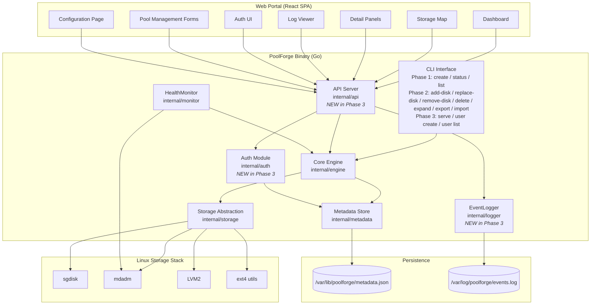
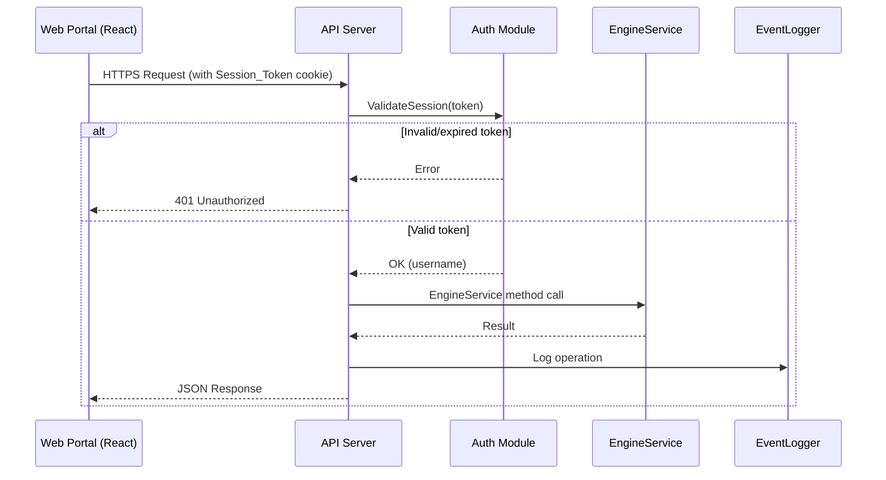
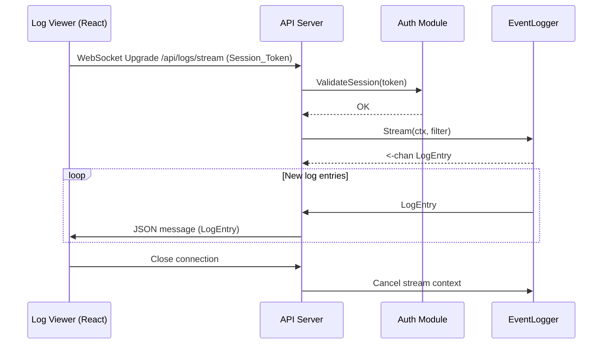
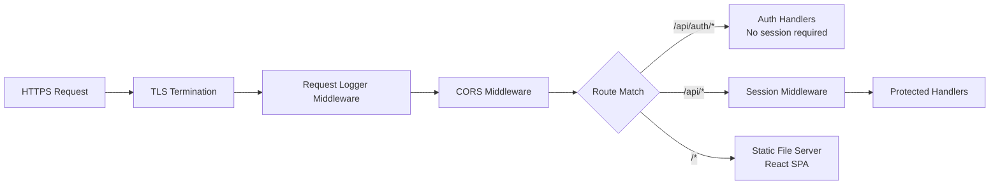
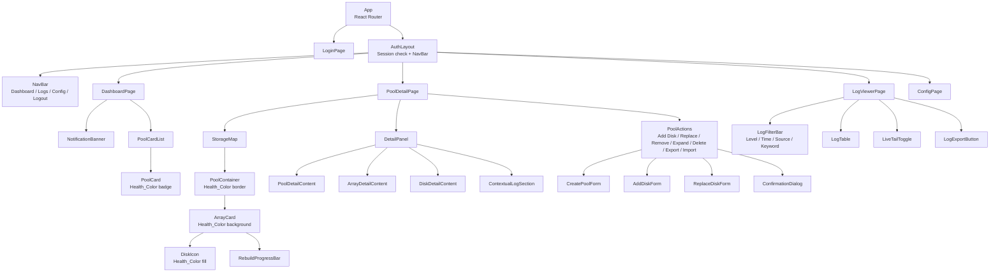

# Design Document — Phase 3: Web Portal, API Server, and Visualization

## Overview

Phase 3 of PoolForge delivers the web-based management interface layered on top of the existing Phase 1 + Phase 2 foundation. The core principle is that the API Server is a thin HTTP wrapper around the same `EngineService` interface that the CLI uses — no modifications to the engine, storage abstraction, or metadata store are required for pool operations.

The key additions are:

- **API Server** (`internal/api`): Go HTTPS server on a configurable port (default 8443) exposing REST endpoints for all EngineService operations, serving the React SPA as static assets, providing WebSocket support for live log streaming, and enforcing session-based authentication on all protected endpoints.
- **Web Portal** (`web/`): React SPA with Dashboard (pool summary cards with Health_Color), Storage_Map (interactive topology visualization), Detail_Panels (pool/array/disk drill-down), Log_Viewer (filter, search, Live_Tail), authentication UI (login/logout), pool management forms (create, add-disk, replace-disk, remove-disk, expand, delete, export/import), and a Configuration page.
- **EventLogger** (`internal/logger`): Structured logging component recording NDJSON log entries with component tagging, severity levels, query/filter support, and a streaming channel for WebSocket Live_Tail.
- **Authentication**: Local username/password authentication with bcrypt-hashed passwords, per-user salts, session tokens with expiration, and CLI commands for user management.
- **CLI `serve` command**: `poolforge serve --port 8443` starts the API Server.

Phase 3 MUST NOT modify the EngineService interface or any Phase 1/Phase 2 component. All existing CLI commands, metadata persistence, self-healing, and test infrastructure continue unchanged.

### Phase 3 Scope

| Included | Excluded (Phase 4) |
|----------|---------------------|
| API Server (REST + WebSocket + static assets) | SMART Monitor |
| React Web Portal (Dashboard, Storage_Map, Detail_Panels, Log_Viewer) | Atomic operations / rollback |
| EventLogger (NDJSON, query/filter, streaming) | SMART endpoints and UI |
| Authentication (bcrypt, sessions, user management) | Multi-interface locking |
| CLI: `serve`, `user create`, `user list` | |
| Pool management via Web Portal | |
| Configuration page | |

### Design Goals

- Provide a browser-based management experience equivalent to the CLI
- Deliver real-time health visualization with Health_Color coding at all hierarchy levels
- Enable log diagnosis without server CLI access via filterable Log_Viewer with Live_Tail
- Secure all API endpoints with session-based authentication
- Keep the API Server as a thin wrapper — all business logic stays in EngineService
- Design for Phase 4 extensibility (SMART endpoints, SMART UI indicators)

## Architecture

### High-Level Architecture (Phase 1 + Phase 2 + Phase 3)



### Request Flow: Web Portal → API Server → EngineService



### WebSocket Live_Tail Flow




## Components and Interfaces

### 1. API Server (`internal/api`)

The API Server is a Go HTTPS server that wraps the existing EngineService as REST endpoints. It serves the React SPA static assets, enforces session-based authentication, and provides a WebSocket endpoint for Live_Tail log streaming.

#### Server Structure

```go
// Server is the Phase 3 API server.
type Server struct {
    engine     engine.EngineService
    logger     logger.EventLogger
    auth       auth.AuthService
    router     *http.ServeMux
    port       int
    tlsCert    string
    tlsKey     string
}

// NewServer creates an API server wrapping the given EngineService.
func NewServer(engine engine.EngineService, logger logger.EventLogger, auth auth.AuthService, opts ServerOptions) *Server

// Start begins serving HTTPS on the configured port. Blocks until ctx is cancelled.
func (s *Server) Start(ctx context.Context) error

// ServerOptions configures the API server.
type ServerOptions struct {
    Port    int    // default 8443
    TLSCert string // path to TLS certificate
    TLSKey  string // path to TLS private key
    StaticDir string // path to React SPA build directory
}
```

#### Router and Middleware Stack



Middleware chain:
1. **TLS**: HTTPS termination (Go `tls.Config`)
2. **Request Logger**: Logs method, path, status, duration to EventLogger
3. **CORS**: Allows same-origin requests (SPA served from same host)
4. **Session Middleware**: Validates `Session_Token` cookie on all `/api/*` routes except `/api/auth/login`. Returns 401 on invalid/expired/missing token.
5. **Route Handler**: Dispatches to the appropriate handler

#### REST API Endpoint Table

| Method | Path | Description | Auth | Request Body | Response | Status Codes |
|--------|------|-------------|------|-------------|----------|-------------|
| POST | `/api/auth/login` | Authenticate user | No | `{"username":"...","password":"..."}` | `{"token":"...","expires_at":"..."}` | 200, 401 |
| POST | `/api/auth/logout` | Invalidate session | Yes | — | — | 204, 401 |
| POST | `/api/auth/users` | Create user account | Yes | `{"username":"...","password":"..."}` | `{"username":"...","created_at":"..."}` | 201, 400, 401 |
| GET | `/api/auth/users` | List user accounts | Yes | — | `{"users":[{"username":"...","created_at":"..."}]}` | 200, 401 |
| GET | `/api/pools` | List all pools | Yes | — | `{"pools":[PoolSummary...]}` | 200, 401 |
| POST | `/api/pools` | Create pool | Yes | `{"name":"...","parity_mode":"...","disks":["..."]}` | `Pool` | 201, 400, 401 |
| GET | `/api/pools/:id` | Get pool detail | Yes | — | `PoolDetail` | 200, 401, 404 |
| DELETE | `/api/pools/:id` | Delete pool | Yes | — | — | 204, 401, 404 |
| GET | `/api/pools/:id/status` | Get pool status | Yes | — | `PoolStatus` | 200, 401, 404 |
| POST | `/api/pools/:id/disks` | Add disk to pool | Yes | `{"disk":"..."}` | — | 200, 400, 401, 404 |
| DELETE | `/api/pools/:id/disks/:dev` | Remove disk from pool | Yes | — | — | 204, 400, 401, 404 |
| POST | `/api/pools/:id/replace-disk` | Replace disk | Yes | `{"old_disk":"...","new_disk":"..."}` | — | 200, 400, 401, 404 |
| POST | `/api/pools/:id/expand` | Expand pool | Yes | — | — | 200, 400, 401, 404 |
| GET | `/api/pools/:id/unallocated` | Detect unallocated capacity | Yes | — | `UnallocatedReport` | 200, 401, 404 |
| GET | `/api/pools/:id/export` | Export pool config | Yes | — | `PoolConfiguration` | 200, 401, 404 |
| POST | `/api/pools/import` | Import pool config | Yes | `PoolConfiguration` | — | 201, 400, 401 |
| GET | `/api/pools/:id/rebuild-progress/:arrayId` | Get rebuild progress | Yes | — | `RebuildProgress` | 200, 401, 404 |
| GET | `/api/pools/:id/arrays/:arrayId` | Get array detail | Yes | — | `ArrayStatus` | 200, 401, 404 |
| GET | `/api/pools/:id/disks/:dev` | Get disk detail | Yes | — | `DiskStatusInfo` | 200, 401, 404 |
| GET | `/api/logs` | Query log entries | Yes | Query params: `level`, `start`, `end`, `source`, `keyword` | `{"entries":[LogEntry...],"total":N}` | 200, 400, 401 |
| GET | `/api/logs/export` | Export filtered logs | Yes | Query params: same as `/api/logs` | NDJSON file download | 200, 400, 401 |
| GET | `/api/logs/stream` | WebSocket Live_Tail | Yes | Query params: `level`, `source`, `keyword` | WebSocket: JSON LogEntry messages | 101, 401 |
| GET | `/api/config` | Get configuration | Yes | — | `Config` | 200, 401 |
| PUT | `/api/config` | Update configuration | Yes | `Config` | `Config` | 200, 400, 401 |

#### Handler Implementation Pattern

Each handler follows the same pattern — translate HTTP to EngineService call, translate result to JSON:

```go
// Example: ListPools handler
func (s *Server) handleListPools(w http.ResponseWriter, r *http.Request) {
    pools, err := s.engine.ListPools(r.Context())
    if err != nil {
        s.writeError(w, http.StatusInternalServerError, err.Error())
        return
    }
    s.writeJSON(w, http.StatusOK, map[string]interface{}{"pools": pools})
}
```

#### WebSocket Protocol for Live_Tail

The WebSocket endpoint at `/api/logs/stream` uses the following protocol:

1. **Connection**: Client sends WebSocket upgrade request with `Session_Token` cookie and optional query params (`level`, `source`, `keyword`) for initial filter
2. **Server → Client messages**: JSON-encoded `LogEntry` objects, one per WebSocket text message
3. **Client → Server messages**: JSON-encoded filter update commands to change active filters without reconnecting
4. **Heartbeat**: Server sends a ping frame every 30 seconds; client responds with pong
5. **Close**: Either side can initiate close; server cancels the EventLogger stream context

```go
// WebSocket message types
type WSLogEntry struct {
    Type      string   `json:"type"`      // "log_entry"
    Timestamp string   `json:"timestamp"`
    Level     string   `json:"level"`
    Source    string   `json:"source"`
    Message   string   `json:"message"`
}

type WSFilterUpdate struct {
    Type    string   `json:"type"`    // "filter_update"
    Levels  []string `json:"levels,omitempty"`
    Source  *string  `json:"source,omitempty"`
    Keyword *string  `json:"keyword,omitempty"`
}
```

### 2. Authentication Module (`internal/auth`)

Handles user account management, credential verification, and session lifecycle.

```go
// AuthService defines the authentication interface.
type AuthService interface {
    // CreateUser creates a new user account with bcrypt-hashed password.
    CreateUser(ctx context.Context, username, password string) (*User, error)

    // ListUsers returns all user accounts (without password hashes).
    ListUsers(ctx context.Context) ([]UserSummary, error)

    // Login verifies credentials and creates a session.
    Login(ctx context.Context, username, password string) (*Session, error)

    // Logout invalidates a session.
    Logout(ctx context.Context, token string) error

    // ValidateSession checks if a session token is valid and not expired.
    ValidateSession(ctx context.Context, token string) (*Session, error)
}

// User represents a stored user account.
type User struct {
    Username     string    `json:"username"`
    PasswordHash string    `json:"password_hash"` // bcrypt hash
    Salt         string    `json:"salt"`           // per-user salt prepended to password before bcrypt
    CreatedAt    time.Time `json:"created_at"`
}

// UserSummary is the public view of a user (no password hash).
type UserSummary struct {
    Username  string    `json:"username"`
    CreatedAt time.Time `json:"created_at"`
}

// Session represents an authenticated session.
type Session struct {
    Token     string    `json:"token"`      // cryptographically random, 32 bytes hex-encoded
    Username  string    `json:"username"`
    CreatedAt time.Time `json:"created_at"`
    ExpiresAt time.Time `json:"expires_at"` // default: 24 hours from creation
}
```

#### Password Storage Design

1. Generate a 16-byte cryptographically random salt per user
2. Prepend salt to plaintext password: `salted = salt + password`
3. Hash with bcrypt (cost factor 12): `hash = bcrypt(salted)`
4. Store `{username, hash, salt, created_at}` in metadata store under `users` section

This ensures two users with identical passwords produce different stored hashes.

#### Session Store Design

Sessions are stored in-memory in a `sync.Map` keyed by token. This means sessions do not survive server restarts — users must re-login after a restart. This is acceptable for Phase 3; Phase 4 could persist sessions if needed.

- **Token generation**: 32 bytes from `crypto/rand`, hex-encoded (64 characters)
- **Expiration**: 24 hours from creation (configurable)
- **Delivery**: Set as `Set-Cookie: session_token=<token>; HttpOnly; Secure; SameSite=Strict; Path=/`
- **Validation**: Check token exists in session store and `ExpiresAt > now()`

### 3. EventLogger (`internal/logger`)

Structured logging component that records, queries, filters, and streams log entries.

```go
// EventLogger defines the structured logging interface.
type EventLogger interface {
    // Log records a new log entry and notifies all active stream subscribers.
    Log(entry LogEntry)

    // Query returns log entries matching the filter, sorted by timestamp descending.
    Query(filter LogFilter) ([]LogEntry, error)

    // Stream returns a channel that receives new log entries matching the filter in real time.
    // The channel is closed when ctx is cancelled.
    Stream(ctx context.Context, filter LogFilter) (<-chan LogEntry, error)

    // Export returns filtered log entries as an io.Reader in NDJSON format.
    Export(filter LogFilter) (io.Reader, error)
}

// LogEntry represents a single structured log record.
type LogEntry struct {
    Timestamp time.Time `json:"timestamp"`
    Level     LogLevel  `json:"level"`
    Source    string    `json:"source"`  // e.g., "pool:mypool", "array:md0", "disk:/dev/sdb", "api", "auth"
    Message   string    `json:"message"`
}

// LogLevel represents log severity.
type LogLevel string

const (
    LogDebug   LogLevel = "debug"
    LogInfo    LogLevel = "info"
    LogWarning LogLevel = "warning"
    LogError   LogLevel = "error"
)

// LogFilter specifies query/stream filter criteria. All non-nil fields are ANDed together.
type LogFilter struct {
    Levels    []LogLevel  // filter by one or more levels
    StartTime *time.Time  // inclusive start of time range
    EndTime   *time.Time  // inclusive end of time range
    Source    *string     // exact match on source component
    Keyword   *string     // substring match on message field
}
```

#### Persistence Design

- **Format**: Newline-delimited JSON (NDJSON), one `LogEntry` per line
- **Path**: `/var/log/poolforge/events.log`
- **Write**: Append-only. Each `Log()` call marshals the entry to JSON, appends a newline, and writes to the file with `O_APPEND`
- **Read**: For `Query()`, read the file line by line, parse each JSON line, apply filters, collect results, sort by timestamp descending
- **Rotation**: Out of scope for Phase 3. The file grows unbounded. Phase 4 or OS-level logrotate can handle rotation.

#### Streaming Design

The EventLogger maintains a list of active subscribers (channels). When `Log()` is called:

1. Write entry to NDJSON file
2. For each active subscriber:
   a. Apply the subscriber's filter to the entry
   b. If the entry matches, send it on the subscriber's channel (non-blocking with select + default to drop if subscriber is slow)

When a subscriber's context is cancelled, the subscriber is removed from the list and its channel is closed.

```go
// Internal subscriber tracking
type subscriber struct {
    filter LogFilter
    ch     chan LogEntry
    ctx    context.Context
}
```

### 4. Web Portal (`web/`)

React SPA built with standard tooling (Vite, React Router, CSS modules or Tailwind). Served as static assets by the API Server.

#### Component Hierarchy



#### Page Routes

| Route | Component | Description |
|-------|-----------|-------------|
| `/login` | LoginPage | Username/password form, redirects to `/` on success |
| `/` | DashboardPage | Pool summary cards with Health_Color, Notification_Banner |
| `/pools/:id` | PoolDetailPage | Storage_Map, Detail_Panel, pool management actions |
| `/logs` | LogViewerPage | Log table with filters, Live_Tail toggle, export |
| `/config` | ConfigPage | View/modify PoolForge settings |

#### Storage_Map Component Design

The Storage_Map renders the pool topology as a nested visual hierarchy:

```
┌─────────────────────────────────────────────────────┐
│ Pool: mypool                              [healthy]  │  ← PoolContainer (green border)
│                                                      │
│  ┌──────────────────────┐  ┌──────────────────────┐ │
│  │ Array: md0 (RAID 5)  │  │ Array: md1 (RAID 5)  │ │  ← ArrayCard (green bg)
│  │ Tier 0 · 1 TB slices │  │ Tier 1 · 1 TB slices │ │
│  │                       │  │                       │ │
│  │  ┌───┐ ┌───┐ ┌───┐  │  │  ┌───┐ ┌───┐ ┌───┐  │ │
│  │  │sdb│ │sdc│ │sdd│  │  │  │sdc│ │sdd│ │sde│  │ │  ← DiskIcon (green fill)
│  │  └───┘ └───┘ └───┘  │  │  └───┘ └───┘ └───┘  │ │
│  └──────────────────────┘  └──────────────────────┘ │
└─────────────────────────────────────────────────────┘
```

When a disk fails (e.g., `/dev/sdb`):

```
┌─────────────────────────────────────────────────────┐
│ Pool: mypool                             [degraded]  │  ← PoolContainer (amber border)
│                                                      │
│  ┌──────────────────────┐  ┌──────────────────────┐ │
│  │ Array: md0 (RAID 5)  │  │ Array: md1 (RAID 5)  │ │  ← md0: amber bg (degraded)
│  │ Tier 0 · DEGRADED    │  │ Tier 1 · healthy     │ │     md1: green bg (healthy)
│  │ ████████░░ 65% rebuild│  │                       │ │  ← RebuildProgressBar
│  │  ┌───┐ ┌───┐ ┌───┐  │  │  ┌───┐ ┌───┐ ┌───┐  │ │
│  │  │sdb│ │sdc│ │sdd│  │  │  │sdc│ │sdd│ │sde│  │ │  ← sdb: red fill (failed)
│  │  └───┘ └───┘ └───┘  │  │  └───┘ └───┘ └───┘  │ │
│  └──────────────────────┘  └──────────────────────┘ │
└─────────────────────────────────────────────────────┘
```

#### Health_Color Mapping

| Entity State | Color | CSS Class |
|-------------|-------|-----------|
| healthy | Green (`#22c55e`) | `health-green` |
| degraded | Amber (`#f59e0b`) | `health-amber` |
| rebuilding | Amber (`#f59e0b`) | `health-amber` |
| failed | Red (`#ef4444`) | `health-red` |

The mapping function is a pure function used by all components:

```typescript
type HealthState = 'healthy' | 'degraded' | 'rebuilding' | 'failed';
type HealthColor = 'green' | 'amber' | 'red';

function mapHealthColor(state: HealthState): HealthColor {
    switch (state) {
        case 'healthy': return 'green';
        case 'degraded':
        case 'rebuilding': return 'amber';
        case 'failed': return 'red';
    }
}
```

#### Detail_Panel Content

**Pool Detail_Panel** (when clicking a PoolContainer):
- Pool name, overall state, Parity_Mode
- Total capacity, used capacity
- List of all member RAID_Arrays with their states
- Contextual log section: recent log entries filtered to `source: "pool:<pool-name>"`

**Array Detail_Panel** (when clicking an ArrayCard):
- Sync state (clean, active, resyncing, recovering, degraded)
- RAID level, Capacity_Tier index
- Array capacity
- Member Disk_Descriptors with per-disk state
- Rebuild progress (if rebuilding)
- Contextual log section: recent log entries filtered to `source: "array:<array-device>"`

**Disk Detail_Panel** (when clicking a DiskIcon):
- Disk_Descriptor, health state (healthy, degraded, failed)
- Raw capacity
- List of all RAID_Arrays the disk contributes slices to
- Contextual log section: recent log entries filtered to `source: "disk:<device>"`

#### Log_Viewer Component Design

The Log_Viewer page provides:

1. **Filter Bar**: Controls for Log_Level (multi-select checkboxes), time range (start/end datetime pickers), source component (dropdown), keyword search (text input)
2. **Log Table**: Displays entries in reverse chronological order with columns: Timestamp, Level, Source, Message. Level column uses Health_Color-like styling (info=default, warning=amber, error=red)
3. **Live_Tail Toggle**: Button to enable/disable WebSocket streaming. When active, new entries appear at the top of the table. Active filters apply to streamed entries.
4. **Export Button**: Downloads the currently filtered entries as an NDJSON file

#### Confirmation_Dialog Design

Destructive operations (delete pool, remove disk) display a modal dialog:

```
┌──────────────────────────────────────────┐
│  ⚠ Confirm Delete Pool                   │
│                                          │
│  Are you sure you want to delete pool    │
│  "mypool"? All data will be destroyed.   │
│                                          │
│  [Cancel]                    [Delete]    │
└──────────────────────────────────────────┘
```

For remove-disk with RAID downgrade:

```
┌──────────────────────────────────────────┐
│  ⚠ Confirm Remove Disk                   │
│                                          │
│  Removing /dev/sdd from pool "mypool"    │
│  will cause the following changes:       │
│                                          │
│  • Array md0: RAID 5 → RAID 1           │
│  • Capacity reduction: 500 GB            │
│                                          │
│  [Cancel]                    [Remove]    │
└──────────────────────────────────────────┘
```

### 5. CLI Extensions (`cmd/poolforge`)

Phase 3 adds 3 new commands:

```
# Phase 3 additions
poolforge serve --port 8443
poolforge user create --username <name> --password <password>
poolforge user list
```

| Command | Description | Output |
|---------|-------------|--------|
| `serve` | Start API Server on HTTPS | Logs "Listening on https://0.0.0.0:8443" |
| `user create` | Create a user account | "User '<name>' created" |
| `user list` | List all user accounts | Table: username, created_at |

The `serve` command:
1. Initializes EngineService (same as CLI commands)
2. Initializes EventLogger (opens/creates log file)
3. Initializes AuthService (loads users from metadata)
4. Creates API Server with all dependencies
5. Starts HTTPS listener on configured port
6. Blocks until SIGINT/SIGTERM, then graceful shutdown


## Data Models

### Metadata Store Schema (Phase 3 — Version 1, Extended)

Phase 3 adds the `users` section to the existing Version 1 schema. The addition is backward-compatible — Phase 1/Phase 2 metadata files can be read by Phase 3 code (missing `users` section defaults to empty map).

```json
{
  "version": 1,
  "pools": {
    "...": "unchanged from Phase 2"
  },
  "users": {
    "admin": {
      "password_hash": "$2a$12$...",
      "salt": "a1b2c3d4e5f6a7b8c9d0e1f2a3b4c5d6",
      "created_at": "2025-01-15T10:00:00Z"
    }
  }
}
```

### Log Entry Format (NDJSON)

Each line in `/var/log/poolforge/events.log` is a JSON object:

```json
{"timestamp":"2025-01-15T10:00:00Z","level":"info","source":"api","message":"Server started on port 8443"}
{"timestamp":"2025-01-15T10:01:00Z","level":"info","source":"auth","message":"User 'admin' logged in"}
{"timestamp":"2025-01-15T10:02:00Z","level":"info","source":"pool:mypool","message":"Pool created with 4 disks, SHR-1 parity"}
{"timestamp":"2025-01-15T10:05:00Z","level":"warning","source":"disk:/dev/sdb","message":"Disk failure detected"}
{"timestamp":"2025-01-15T10:05:01Z","level":"error","source":"array:md0","message":"Array degraded: member /dev/sdb1 failed"}
{"timestamp":"2025-01-15T10:10:00Z","level":"warning","source":"auth","message":"Failed login attempt for user 'admin'"}
```

### REST API Response Models

#### Pool Summary (GET /api/pools)

```json
{
  "pools": [
    {
      "id": "uuid-1234",
      "name": "mypool",
      "state": "healthy",
      "total_capacity_bytes": 3000000000000,
      "used_capacity_bytes": 1200000000000,
      "disk_count": 4
    }
  ]
}
```

#### Pool Detail (GET /api/pools/:id)

```json
{
  "id": "uuid-1234",
  "name": "mypool",
  "state": "healthy",
  "parity_mode": "shr1",
  "total_capacity_bytes": 3000000000000,
  "used_capacity_bytes": 1200000000000,
  "mount_point": "/mnt/poolforge/mypool",
  "raid_arrays": [
    {
      "device": "/dev/md0",
      "raid_level": 5,
      "tier_index": 0,
      "state": "healthy",
      "sync_state": "clean",
      "capacity_bytes": 1500000000000,
      "members": [
        {"device": "/dev/sdb1", "state": "healthy"},
        {"device": "/dev/sdc1", "state": "healthy"},
        {"device": "/dev/sdd1", "state": "healthy"}
      ],
      "rebuild_progress": null
    }
  ],
  "disks": [
    {
      "device": "/dev/sdb",
      "state": "healthy",
      "capacity_bytes": 1000000000000,
      "arrays": ["/dev/md0", "/dev/md1"]
    }
  ]
}
```

#### Array Detail (GET /api/pools/:id/arrays/:arrayId)

```json
{
  "device": "/dev/md0",
  "raid_level": 5,
  "tier_index": 0,
  "state": "degraded",
  "sync_state": "recovering",
  "capacity_bytes": 1500000000000,
  "members": [
    {"device": "/dev/sdb1", "state": "failed"},
    {"device": "/dev/sdc1", "state": "healthy"},
    {"device": "/dev/sdd1", "state": "healthy"}
  ],
  "rebuild_progress": {
    "state": "rebuilding",
    "percent_complete": 45.2,
    "estimated_eta_seconds": 3600,
    "target_disk": "/dev/sde",
    "started_at": "2025-01-15T12:00:00Z",
    "updated_at": "2025-01-15T12:30:00Z"
  }
}
```

#### Disk Detail (GET /api/pools/:id/disks/:dev)

```json
{
  "device": "/dev/sdb",
  "state": "healthy",
  "capacity_bytes": 1000000000000,
  "arrays": ["/dev/md0", "/dev/md1"],
  "failed_at": null
}
```

#### Log Query (GET /api/logs)

```json
{
  "entries": [
    {
      "timestamp": "2025-01-15T10:05:01Z",
      "level": "error",
      "source": "array:md0",
      "message": "Array degraded: member /dev/sdb1 failed"
    },
    {
      "timestamp": "2025-01-15T10:05:00Z",
      "level": "warning",
      "source": "disk:/dev/sdb",
      "message": "Disk failure detected"
    }
  ],
  "total": 2
}
```

#### Auth Login (POST /api/auth/login)

Request:
```json
{"username": "admin", "password": "secret"}
```

Response:
```json
{
  "token": "a1b2c3d4e5f6...",
  "expires_at": "2025-01-16T10:00:00Z"
}
```

The token is also set as an HttpOnly Secure cookie for browser-based access.

#### Configuration (GET /api/config)

```json
{
  "https_port": 8443,
  "log_level": "info",
  "session_timeout_hours": 24,
  "metadata_path": "/var/lib/poolforge/metadata.json",
  "log_path": "/var/log/poolforge/events.log"
}
```


## Correctness Properties

*A property is a characteristic or behavior that should hold true across all valid executions of a system — essentially, a formal statement about what the system should do. Properties serve as the bridge between human-readable specifications and machine-verifiable correctness guarantees.*

Property numbering uses the master design document numbering (P21–P30) for properties that map to master properties, and Phase 3-specific properties use P51+ to avoid collision with Phase 1 (P1–P7, P10, P13, P35–P37), Phase 2 (P8–P9, P11–P12, P14–P20, P38–P50), and future phases.

### Property 21: Health_Color mapping is deterministic

*For any* element (pool, RAID array, or disk) with a given state from {healthy, degraded, rebuilding, failed}, the `mapHealthColor` function should deterministically return: healthy → green, degraded → amber, rebuilding → amber, failed → red. The mapping should be the same regardless of which hierarchy level the element belongs to.

**Validates: Requirements 2.2, 3.2, 3.3, 3.4**

### Property 22: Detail_Panel contains all required fields

*For any* pool, the Detail_Panel should display: pool name, overall state, Parity_Mode, total capacity, used capacity, and a list of all member RAID_Arrays with their states. *For any* RAID array, the Detail_Panel should display: sync state, RAID level, Capacity_Tier, array capacity, and member Disk_Descriptors with per-disk state. *For any* disk, the Detail_Panel should display: Disk_Descriptor, health state, raw capacity, and a list of all RAID_Arrays the disk contributes to.

**Validates: Requirements 4.1, 4.2, 4.3**

### Property 23: Failed disk cascading visual state

*For any* disk in a failed state within the Storage_Map, the disk icon should be highlighted red, and all RAID_Array cards that contain a slice from that failed disk should be highlighted amber (degraded). The cascading effect should be consistent: if a disk is red, every array it belongs to must be amber or red.

**Validates: Requirements 3.7**

### Property 24: Unauthenticated requests are rejected

*For any* API request to a protected endpoint (all `/api/*` endpoints except `/api/auth/login`) that lacks a valid session token (missing, expired, or invalid), the API Server should reject the request with HTTP 401 status and a JSON error body.

**Validates: Requirements 1.4, 1.9, 1.10, 6.4, 6.5**

### Property 25: Valid credentials produce session token

*For any* valid username/password pair (where the user exists and the password matches), the login endpoint should return a session token string and an expiration timestamp in the future. The returned token should be usable for subsequent authenticated requests.

**Validates: Requirements 6.2**

### Property 26: Invalid credentials are rejected

*For any* invalid username/password pair (wrong password or nonexistent username), the login endpoint should reject the attempt with HTTP 401 status, and a warning-level log entry should be created recording the failed attempt.

**Validates: Requirements 6.3**

### Property 27: Passwords are stored as salted hashes

*For any* user account created via the API or CLI, the stored password should be a bcrypt hash with a per-user salt. The stored hash should not equal the plaintext password. Two users created with the same password should have different stored hashes (due to different salts).

**Validates: Requirements 6.6**

### Property 28: Log entries are returned in reverse chronological order

*For any* set of log entries returned by the EventLogger `Query` method or the `/api/logs` endpoint, the entries should be sorted by timestamp in strictly descending order (newest first).

**Validates: Requirements 5.1**

### Property 29: Log filter composition is logical AND

*For any* combination of active log filters (level, time range, source, keyword) and any set of log entries, the result of applying all filters simultaneously should equal the intersection of applying each filter individually. An entry appears in the result if and only if it satisfies every active filter.

**Validates: Requirements 5.6, 5.8, 10.5**

### Property 30: Log export matches filtered display

*For any* set of active filters, the exported log file (from `/api/logs/export` or EventLogger `Export`) should contain exactly the same entries as the filtered query result, in the same order.

**Validates: Requirements 5.9, 10.6**

### Property 51: Dashboard renders all pools

*For any* set of pools managed by PoolForge, the Dashboard should render a summary card for every pool, and each card should display the pool name, state, total capacity, and used capacity. The count of rendered cards should equal the count of pools returned by `ListPools`.

**Validates: Requirements 2.1**

### Property 52: Storage_Map hierarchy rendering

*For any* pool with N RAID arrays and M total disk memberships across those arrays, the Storage_Map should render exactly one PoolContainer, exactly N ArrayCards inside it, and the correct number of DiskIcons inside each ArrayCard matching the array's member count.

**Validates: Requirements 3.1**

### Property 53: Rebuild progress bar rendering

*For any* RAID array in a rebuilding state with a non-null rebuild progress, the Storage_Map should render a progress bar on the ArrayCard showing the percentage. *For any* disk that is the target of an active rebuild, the DiskIcon should also display a progress indicator.

**Validates: Requirements 3.5, 3.6**

### Property 54: Notification_Banner on disk failure

*For any* pool containing at least one disk in a failed state, the Web_Portal should display a Notification_Banner identifying the failed Disk_Descriptor and the Pool name.

**Validates: Requirements 2.5**

### Property 55: Contextual log section in Detail_Panel

*For any* Detail_Panel opened for a pool, array, or disk, the panel should include a contextual log section displaying recent log entries filtered to that specific component's source identifier.

**Validates: Requirements 4.4**

### Property 56: EventLogger NDJSON persistence round-trip

*For any* valid log entry recorded via `EventLogger.Log()`, the entry should be persisted to the NDJSON file, and subsequently querying with a filter that matches that entry should return it with all fields (timestamp, level, source, message) preserved.

**Validates: Requirements 10.1, 10.4**

### Property 58: Confirmation_Dialog for destructive operations

*For any* destructive operation initiated through the Web_Portal (delete pool, remove disk), the system should display a Confirmation_Dialog requiring explicit approval before the request is submitted to the API Server.

**Validates: Requirements 7.8**

### Property 59: API error messages displayed to user

*For any* pool management operation submitted through the Web_Portal that fails (API returns 4xx or 5xx), the error message from the API response body should be displayed to the administrator in the Web_Portal.

**Validates: Requirements 7.10**

### Property 60: API returns JSON responses

*For any* API endpoint response (excluding static asset serving and WebSocket upgrade), the response Content-Type should be `application/json` and the body should be valid JSON.

**Validates: Requirements 1.12**

### Property 61: API returns correct HTTP status codes

*For any* API operation, the HTTP status code should follow the mapping: successful reads → 200, successful creates → 201, successful deletes → 204, invalid requests → 400, authentication errors → 401, not-found resources → 404, internal errors → 500.

**Validates: Requirements 1.11**


## Error Handling

### Authentication Errors

| Error Condition | HTTP Status | Response Body | Requirement |
|----------------|-------------|---------------|-------------|
| Invalid credentials (wrong password) | 401 | `{"error":"invalid credentials"}` | 6.3 |
| Invalid credentials (unknown user) | 401 | `{"error":"invalid credentials"}` | 6.3 |
| Missing session token on protected endpoint | 401 | `{"error":"authentication required"}` | 1.10 |
| Expired session token | 401 | `{"error":"session expired"}` | 1.9 |
| Invalid session token | 401 | `{"error":"invalid session"}` | 1.9 |
| Duplicate username on user create | 400 | `{"error":"user 'X' already exists"}` | 6.7 |
| Empty username or password | 400 | `{"error":"username and password are required"}` | 6.7 |

Note: Authentication error messages are intentionally generic (same message for wrong password and unknown user) to prevent user enumeration.

### API Request Errors

| Error Condition | HTTP Status | Response Body | Requirement |
|----------------|-------------|---------------|-------------|
| Pool not found | 404 | `{"error":"pool 'X' not found"}` | 1.11 |
| Array not found | 404 | `{"error":"array 'X' not found in pool 'Y'"}` | 1.11 |
| Disk not found in pool | 404 | `{"error":"disk 'X' not found in pool 'Y'"}` | 1.11 |
| Invalid JSON request body | 400 | `{"error":"invalid request body: <parse error>"}` | 1.11 |
| Missing required field | 400 | `{"error":"missing required field: X"}` | 1.11 |
| Invalid parity mode | 400 | `{"error":"invalid parity mode, use shr1 or shr2"}` | 1.11 |
| Fewer than 2 disks | 400 | `{"error":"minimum 2 disks required"}` | 1.11 |
| EngineService error | 500 | `{"error":"<engine error message>"}` | 1.11 |

### API Server Errors (Passthrough from EngineService)

The API Server passes through errors from EngineService operations with appropriate HTTP status codes:

| EngineService Error | HTTP Status | Rationale |
|--------------------|-------------|-----------|
| Pool not found | 404 | Resource does not exist |
| Disk already in pool | 400 | Client error (invalid request) |
| Disk not a valid block device | 400 | Client error |
| Arrays not healthy (pre-op check) | 400 | Precondition not met |
| Rebuild in progress | 400 | Precondition not met |
| Data loss risk (remove-disk) | 400 | Operation would be destructive |
| Any unexpected error | 500 | Internal server error |

### WebSocket Errors

| Error Condition | Behavior | Requirement |
|----------------|----------|-------------|
| Invalid session token on WebSocket upgrade | Reject upgrade with 401 | 1.4 |
| Client disconnects unexpectedly | Cancel stream context, clean up subscriber | 1.8 |
| EventLogger stream error | Send error message to client, close connection | 1.8 |
| Slow client (channel buffer full) | Drop log entries for that subscriber (non-blocking send) | — |

### CLI `serve` Command Errors

| Error Condition | Behavior | Requirement |
|----------------|----------|-------------|
| Port already in use | Print "Error: port 8443 is already in use", exit 1 | 9.4 |
| TLS certificate not found | Print "Error: TLS certificate not found at <path>", exit 1 | 9.4 |
| TLS key not found | Print "Error: TLS key not found at <path>", exit 1 | 9.4 |
| Invalid TLS certificate | Print "Error: invalid TLS certificate: <details>", exit 1 | 9.4 |
| Metadata store inaccessible | Print "Error: cannot access metadata store: <details>", exit 1 | 9.4 |
| Log directory not writable | Print "Error: cannot write to log directory: <details>", exit 1 | 9.4 |

### Web Portal Error Handling

| Error Condition | UI Behavior | Requirement |
|----------------|-------------|-------------|
| API returns 401 | Redirect to login page | 6.5 |
| API returns 400 | Display error message from response body in alert/toast | 7.10 |
| API returns 404 | Display "Resource not found" message | 7.10 |
| API returns 500 | Display "Server error" message with details | 7.10 |
| Network error (API unreachable) | Display "Connection lost" banner | — |
| WebSocket disconnection | Display "Live tail disconnected" indicator, offer reconnect | — |

## Testing Strategy

### Dual Testing Approach

Phase 3 continues the Phase 1/Phase 2 testing strategy with both unit tests and property-based tests:

- **Unit tests**: Verify specific examples, edge cases, error conditions, and integration points for all Phase 3 components
- **Property-based tests**: Verify universal properties across randomly generated inputs for all Phase 3 correctness properties
- Together they provide comprehensive coverage: unit tests catch concrete bugs, property tests verify general correctness

### Property-Based Testing Configuration

**Go (API Server, EventLogger, Auth)**:
- **Library**: [rapid](https://github.com/flyingmutant/rapid) for Go property-based testing
- **Minimum iterations**: 100 per property test
- **Tag format**: Each property test includes a comment referencing the design property:
  `// Feature: poolforge-phase3-web-portal, Property {N}: {title}`
- **Each correctness property is implemented by a single property-based test**

**React (Web Portal)**:
- **Library**: [fast-check](https://github.com/dubzzz/fast-check) for TypeScript/JavaScript property-based testing
- **Component testing**: [React Testing Library](https://testing-library.com/docs/react-testing-library/intro/) + [Vitest](https://vitest.dev/)
- **Minimum iterations**: 100 per property test
- **Tag format**: Each property test includes a comment:
  `// Feature: poolforge-phase3-web-portal, Property {N}: {title}`

### Unit Test Scope (Phase 3)

**API Server unit tests**:
- Route registration: verify all expected routes are registered
- Handler tests with mocked EngineService: create pool → 201, get pool → 200, delete pool → 204
- Session middleware: valid token → pass through, missing token → 401, expired token → 401
- JSON serialization: verify response models match expected structure
- Error mapping: EngineService errors → correct HTTP status codes
- WebSocket upgrade: valid session → upgrade, invalid session → 401

**Authentication unit tests**:
- CreateUser: valid input → user created with bcrypt hash, duplicate username → error
- Login: valid credentials → session token, wrong password → error, unknown user → error
- ValidateSession: valid token → OK, expired token → error, unknown token → error
- Logout: valid token → session removed, subsequent validate → error
- Password hashing: verify bcrypt cost factor, verify salt uniqueness

**EventLogger unit tests**:
- Log: entry written to file in NDJSON format
- Query: filter by level, time range, source, keyword — specific examples
- Query: empty filter returns all entries in reverse chronological order
- Stream: new entries delivered to subscriber channel
- Stream: filter applied to streamed entries
- Export: filtered entries returned as NDJSON reader
- Edge cases: empty log file, single entry, concurrent writes

**Web Portal component tests**:
- PoolCard: renders name, state, capacity, correct Health_Color class
- StorageMap: renders correct hierarchy from pool data
- DiskIcon: correct color for each state
- ArrayCard: correct color, rebuild progress bar when rebuilding
- DetailPanel: correct fields for pool/array/disk
- LogTable: entries in reverse chronological order
- LogFilterBar: filter controls present and functional
- ConfirmationDialog: appears for destructive operations, blocks submission until confirmed
- NotificationBanner: appears when pool has failed disk, dismissible
- LoginPage: form submission, error display

### Property Test Scope (Phase 3)

| Property | Category | What it tests | Language |
|----------|----------|---------------|---------|
| P21 | UI | Health_Color mapping determinism | TypeScript (fast-check) |
| P22 | UI | Detail_Panel field completeness | TypeScript (fast-check) |
| P23 | UI | Failed disk cascading visual state | TypeScript (fast-check) |
| P24 | API | Unauthenticated requests rejected | Go (rapid) |
| P25 | Auth | Valid credentials produce session token | Go (rapid) |
| P26 | Auth | Invalid credentials rejected | Go (rapid) |
| P27 | Auth | Passwords stored as salted hashes | Go (rapid) |
| P28 | Logging | Log entries in reverse chronological order | Go (rapid) |
| P29 | Logging | Log filter AND composition | Go (rapid) |
| P30 | Logging | Log export matches filtered display | Go (rapid) |
| P51 | UI | Dashboard renders all pools | TypeScript (fast-check) |
| P52 | UI | Storage_Map hierarchy rendering | TypeScript (fast-check) |
| P53 | UI | Rebuild progress bar rendering | TypeScript (fast-check) |
| P54 | UI | Notification_Banner on disk failure | TypeScript (fast-check) |
| P55 | UI | Contextual log section in Detail_Panel | TypeScript (fast-check) |
| P56 | Logging | EventLogger NDJSON persistence round-trip | Go (rapid) |
| P58 | UI | Confirmation_Dialog for destructive ops | TypeScript (fast-check) |
| P59 | UI | API error messages displayed to user | TypeScript (fast-check) |
| P60 | API | API returns JSON responses | Go (rapid) |
| P61 | API | API returns correct HTTP status codes | Go (rapid) |

### Integration Test Scope (Phase 3)

Integration tests run against the cloud Test_Environment (EC2 + EBS) and validate:

1. **API Server startup**: `poolforge serve` starts HTTPS on configured port, serves SPA at `/`
2. **Authentication flow**: Create user via CLI → login via API → use session token → logout → verify token invalid
3. **Pool CRUD via API**: Create pool via POST → GET pool → GET status → DELETE pool (all via REST API with auth)
4. **Disk operations via API**: Add disk via POST → replace disk via POST → remove disk via DELETE (all via REST API)
5. **Log query via API**: Perform operations → query logs with various filters → verify entries match
6. **WebSocket Live_Tail**: Connect WebSocket → perform operation → verify log entry received in real time
7. **Export/Import via API**: Export pool config via GET → import via POST → verify pool recreated
8. **Phase 1 + Phase 2 regression**: All existing CLI-based integration tests continue to pass

### End-to-End Test Scope (Phase 3)

E2E tests use a browser automation tool (Playwright or Cypress) against the running Web Portal:

1. **Login workflow**: Navigate to `/` → redirected to `/login` → enter credentials → redirected to Dashboard
2. **Dashboard**: Verify all pools displayed with correct Health_Color
3. **Pool creation**: Click create → fill form → submit → verify pool appears on Dashboard
4. **Storage_Map drill-down**: Click pool card → view Storage_Map → click array → view Detail_Panel → click disk → view Detail_Panel
5. **Disk operations**: Add disk via form → replace disk via form → remove disk with confirmation dialog
6. **Delete pool**: Click delete → confirmation dialog → confirm → pool removed from Dashboard
7. **Log Viewer**: Navigate to `/logs` → apply filters → verify filtered results → enable Live_Tail → verify streaming
8. **Log export**: Apply filters → click export → verify downloaded file matches displayed entries
9. **Logout**: Click logout → redirected to login → verify protected pages inaccessible

### Test File Organization (Phase 3 additions)

```
internal/api/
    server_test.go              # Unit tests for API server routing and handlers
    server_prop_test.go         # Property tests P24, P60, P61
    middleware_test.go          # Unit tests for session middleware
    websocket_test.go           # Unit tests for WebSocket handler
internal/auth/
    auth_test.go                # Unit tests for auth service
    auth_prop_test.go           # Property tests P25, P26, P27
internal/logger/
    logger_test.go              # Unit tests for EventLogger
    logger_prop_test.go         # Property tests P28, P29, P30, P56
web/src/components/
    StorageMap.test.tsx          # Component tests for StorageMap
    StorageMap.prop.test.tsx     # Property tests P21, P23, P52, P53
    DetailPanel.test.tsx         # Component tests for DetailPanel
    DetailPanel.prop.test.tsx    # Property tests P22, P55
    Dashboard.test.tsx           # Component tests for Dashboard
    Dashboard.prop.test.tsx      # Property tests P51, P54
    LogViewer.test.tsx           # Component tests for LogViewer
    ConfirmationDialog.test.tsx  # Component tests for ConfirmationDialog
    ConfirmationDialog.prop.test.tsx # Property test P58
    ErrorDisplay.prop.test.tsx   # Property test P59
test/integration/
    api_auth_test.go            # Integration: auth flow via API
    api_pool_test.go            # Integration: pool CRUD via API
    api_disk_test.go            # Integration: disk operations via API
    api_log_test.go             # Integration: log query and WebSocket
    api_export_import_test.go   # Integration: export/import via API
test/e2e/
    login.spec.ts               # E2E: login/logout workflow
    dashboard.spec.ts           # E2E: dashboard and pool cards
    storage_map.spec.ts         # E2E: Storage_Map drill-down
    pool_management.spec.ts     # E2E: create/add/replace/remove/delete
    log_viewer.spec.ts          # E2E: log filtering, Live_Tail, export
```

## Extensibility Notes

Phase 3 is designed for Phase 4 extension:

- **API Server**: Phase 4 adds SMART-related endpoints (`GET /api/smart/:disk`, `PUT /api/smart/thresholds`, `GET /api/smart/:disk/history`) and configuration endpoints for SMART thresholds. The router and middleware are extensible — new routes are added without modifying existing handlers.
- **EventLogger**: Phase 4 integrates SMART_Events into the same logging pipeline. The `LogEntry` source field already supports arbitrary component identifiers (e.g., `"smart:/dev/sdb"`).
- **Authentication**: Future phases could extend to support additional authentication methods (LDAP, API keys). The `AuthService` interface is designed for this.
- **Web Portal**: Phase 4 adds SMART health indicators on disk icons in the Storage_Map, SMART data display in disk Detail_Panels, and SMART threshold configuration in the Configuration page. The component hierarchy supports adding new data to existing components.
- **EngineService**: No modifications in Phase 3. The API Server consumes the existing interface as-is. Phase 4 wraps operations with atomic/rollback semantics.
- **MetadataStore**: Phase 3 adds user account storage (`users` section). Schema remains version 1 with backward-compatible additions. Phase 4 adds `smart_data` and `smart_thresholds` sections.

