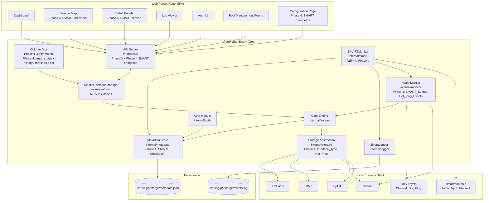
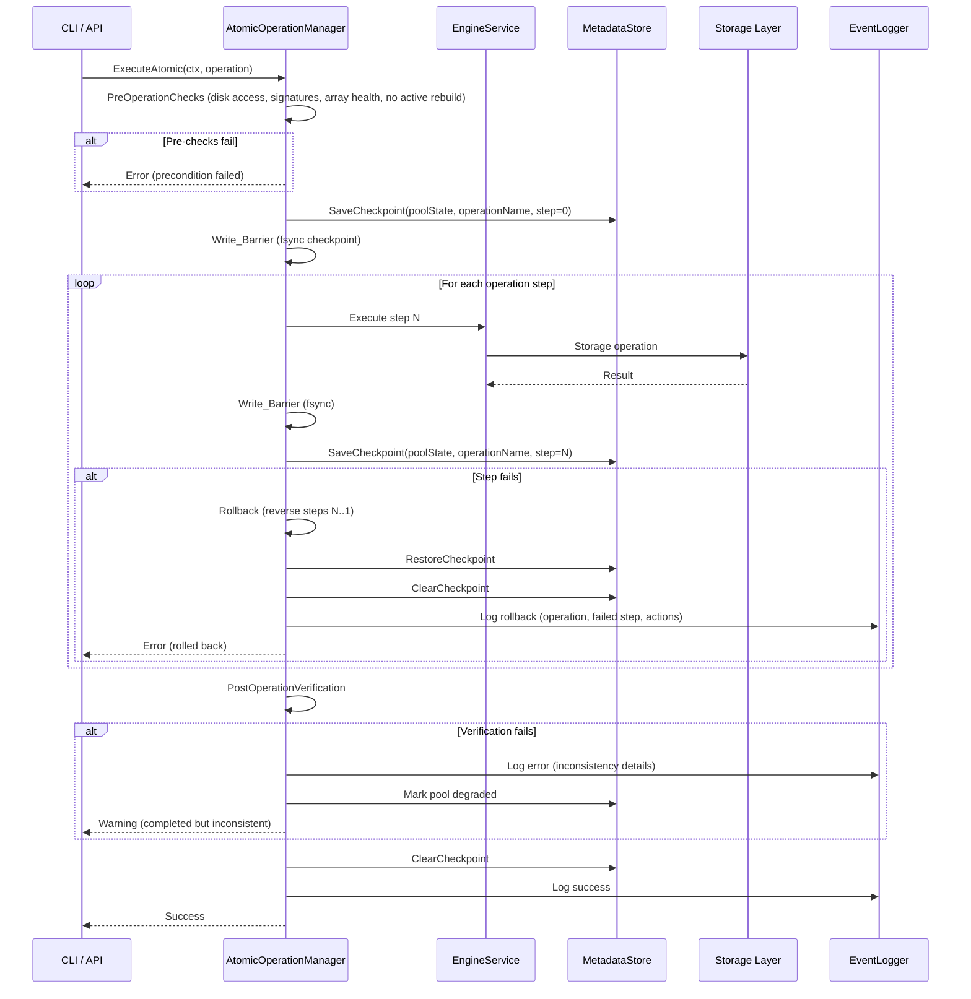
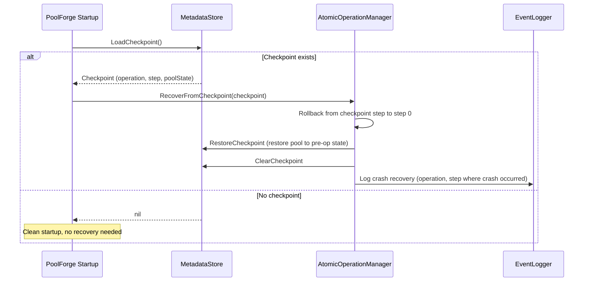
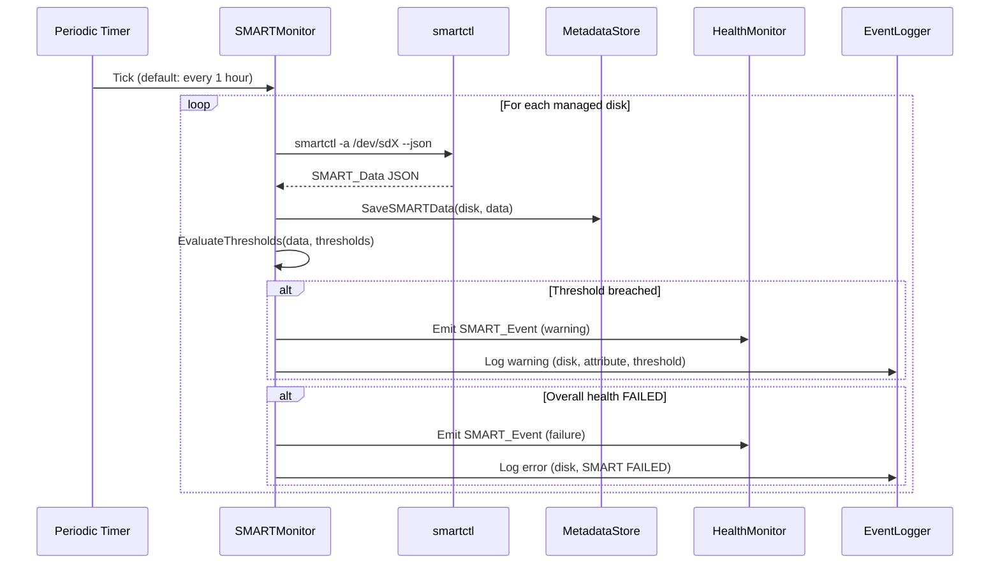
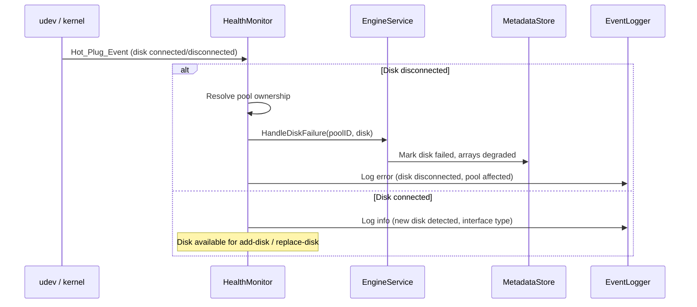
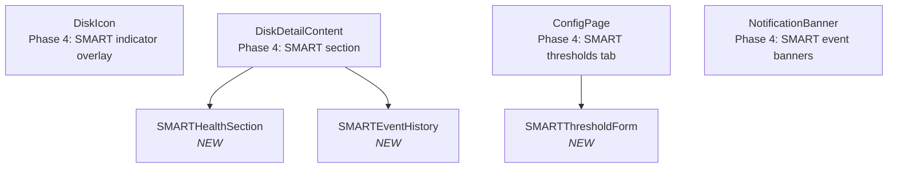

# Design Document — Phase 4: Safety Hardening

## Overview

Phase 4 is the final phase of PoolForge. It hardens the system for production safety by wrapping all existing storage operations with atomic checkpoint/rollback semantics, adding multi-interface disk support (SATA, eSATA, USB 3.0+, DAS), integrating SMART disk health monitoring into the existing HealthMonitor pipeline, and extending the Web Portal with SMART indicators and configuration.

The key additions are:

- **AtomicOperationManager** (`internal/atomic`): Wraps every pool-modifying operation (CreatePool, AddDisk, ReplaceDisk, RemoveDisk, DeletePool, ExpandPool) with checkpoint → execute → rollback-on-failure → post-verification semantics. Persists checkpoint and current step to the MetadataStore so that a process crash mid-operation triggers rollback on next startup.
- **Write_Barrier**: Forced `fsync`/`sync` calls after each critical step within an atomic operation to ensure data durability before proceeding.
- **Post_Operation_Verification**: After successful completion, verifies mdadm array consistency, LVM metadata consistency, and ext4 filesystem mountability.
- **Multi-Interface Disk Detection** (`internal/storage`): Extends DiskManager to detect Interface_Type (SATA, eSATA, USB, DAS) via udev/sysfs, handle Hot_Plug_Events for eSATA and USB, and trigger disk failure workflows on disconnection.
- **SMARTMonitor** (`internal/smart`): Periodic SMART data collection via `smartctl`, threshold evaluation, SMART_Event generation, and integration into the HealthMonitor event pipeline.
- **Mock_SMART_Provider** (`internal/smart/mock`): Simulates SMART data responses for EBS volumes in the test environment.
- **MetadataStore Extensions**: Adds `SaveSMARTData`, `LoadSMARTData`, `SaveSMARTThresholds`, `LoadSMARTThresholds`, `SaveCheckpoint`, `LoadCheckpoint`, `ClearCheckpoint`.
- **API Server Extensions**: Adds `GET /api/smart/:disk`, `PUT /api/smart/thresholds`, `GET /api/smart/:disk/history`.
- **CLI Extensions**: Adds `smart status <disk>`, `smart history <disk>`, `smart thresholds set`.
- **Web Portal Extensions**: SMART health indicators on disk icons, SMART data in disk Detail_Panels, SMART threshold configuration page, SMART Notification_Banners.

Phase 4 does NOT introduce new pool management operations. It wraps existing Phase 2 operations with safety semantics and adds SMART monitoring as a new observability layer.

Phase 4 MUST NOT break any Phase 1, Phase 2, or Phase 3 functionality. All existing CLI commands, API endpoints, Web Portal pages, metadata persistence, self-healing, and test infrastructure continue unchanged.

### Phase 4 Scope

| Included | Not in scope |
|----------|-------------|
| Atomic operations with checkpoint/rollback | New pool management operations |
| Write barriers (fsync/sync) during critical ops | Notification channels (email, webhook, Slack) |
| Post-operation verification (mdadm, LVM, ext4) | Session persistence across restarts |
| Multi-interface disk detection (SATA, eSATA, USB, DAS) | Network-attached storage (NAS/SAN) |
| Hot-plug event handling (eSATA, USB) | Log rotation |
| SMART monitoring (smartctl, periodic checks, thresholds) | |
| Mock_SMART_Provider for EBS testing | |
| SMART CLI commands, API endpoints, Web Portal integration | |
| Crash recovery (detect incomplete ops on startup, rollback) | |

### Design Goals

- Guarantee zero data loss: every pool-modifying operation either completes fully or rolls back entirely
- Detect and recover from process crashes mid-operation via persisted checkpoints
- Support any directly-attached disk regardless of connection interface
- Provide predictive disk failure detection via SMART monitoring
- Maintain backward compatibility with all Phase 1, 2, and 3 functionality


## Architecture

### High-Level Architecture (Phase 1 + Phase 2 + Phase 3 + Phase 4)



### Phase 4 Component Additions and Extensions

| Component | Prior Phases | Phase 4 Changes |
|-----------|-------------|-----------------|
| AtomicOperationManager | — | NEW: Checkpoint, Execute, Rollback, PostVerify, Write_Barrier, crash recovery |
| EngineService | CreatePool, AddDisk, ReplaceDisk, RemoveDisk, DeletePool, ExpandPool, ... | Unchanged interface — AtomicOperationManager wraps calls to EngineService |
| DiskManager | GetDiskInfo, CreateGPTPartitionTable, CreatePartition, ... | Extended: GetInterfaceType, ListAllDisks (multi-interface enumeration) |
| HealthMonitor | Start, Stop, OnDiskFailure, OnRebuildComplete | Extended: OnHotPlug, OnSMARTEvent — unified event pipeline |
| SMARTMonitor | — | NEW: Start, Stop, GetSMARTData, GetSMARTHistory, SetThresholds, SetCheckInterval |
| MetadataStore | SavePool, LoadPool, ListPools, DeletePool | Extended: SaveSMARTData, LoadSMARTData, SaveSMARTThresholds, LoadSMARTThresholds, SaveCheckpoint, LoadCheckpoint, ClearCheckpoint |
| API Server | All Phase 3 endpoints | Extended: GET /api/smart/:disk, PUT /api/smart/thresholds, GET /api/smart/:disk/history |
| CLI | Phase 1-3 commands | Extended: smart status, smart history, smart thresholds set |
| Web Portal | Dashboard, StorageMap, DetailPanel, LogViewer, Config | Extended: SMART indicators on DiskIcon, SMART section in DiskDetailContent, SMART threshold config page |

### Atomic Operation Flow



### Crash Recovery Flow



### SMART Monitoring Flow



### Hot-Plug Event Flow




## Components and Interfaces

### 1. AtomicOperationManager (`internal/atomic`)

The AtomicOperationManager wraps all pool-modifying EngineService operations with checkpoint/rollback semantics. It does not modify the EngineService interface — it sits between the caller (CLI/API) and the engine, intercepting operations and adding safety guarantees.

```go
// AtomicOperationManager provides checkpoint/rollback semantics for pool operations.
type AtomicOperationManager struct {
    engine    engine.EngineService
    metadata  metadata.MetadataStore
    logger    logger.EventLogger
    verifier  *PostOperationVerifier
    barrier   *WriteBarrier
}

// NewAtomicOperationManager creates an AOM wrapping the given EngineService.
func NewAtomicOperationManager(
    engine engine.EngineService,
    metadata metadata.MetadataStore,
    logger logger.EventLogger,
) *AtomicOperationManager

// OperationStep represents a single reversible step within an atomic operation.
type OperationStep struct {
    Name        string                          // human-readable step name
    Execute     func(ctx context.Context) error // forward execution
    Rollback    func(ctx context.Context) error // reverse execution
}

// AtomicOperation defines a multi-step operation with rollback capability.
type AtomicOperation struct {
    Name    string           // e.g., "CreatePool", "AddDisk"
    PoolID  string           // target pool (empty for CreatePool)
    Steps   []OperationStep  // ordered steps
}

// ExecuteAtomic runs an operation with full checkpoint/rollback semantics.
//
// 1. Run PreOperationChecks
// 2. Create Checkpoint (save pool state + operation metadata)
// 3. Write_Barrier (fsync checkpoint)
// 4. Execute steps sequentially, with Write_Barrier after each
// 5. On step failure: Rollback completed steps in reverse, restore checkpoint, log
// 6. On success: PostOperationVerification, then ClearCheckpoint
func (aom *AtomicOperationManager) ExecuteAtomic(ctx context.Context, op AtomicOperation) error

// RecoverFromCheckpoint detects and rolls back incomplete operations after a crash.
// Called during PoolForge startup.
func (aom *AtomicOperationManager) RecoverFromCheckpoint(ctx context.Context) error

// Checkpoint represents the saved state before an atomic operation.
type Checkpoint struct {
    ID            string          `json:"id"`             // unique checkpoint ID
    OperationName string          `json:"operation_name"` // e.g., "CreatePool"
    PoolID        string          `json:"pool_id"`        // target pool
    PoolSnapshot  json.RawMessage `json:"pool_snapshot"`  // serialized Pool state
    CurrentStep   int             `json:"current_step"`   // last completed step index (-1 = none)
    StepNames     []string        `json:"step_names"`     // ordered step names for logging
    CreatedAt     time.Time       `json:"created_at"`
    UpdatedAt     time.Time       `json:"updated_at"`
}
```

#### Wrapped Operations

The AOM provides wrapper methods that decompose each EngineService operation into reversible steps:

```go
// CreatePoolAtomic wraps CreatePool with atomic semantics.
// Steps: PartitionDisks → CreateArrays → CreatePVs → CreateVG → CreateLV → CreateFS → SaveMetadata
func (aom *AtomicOperationManager) CreatePoolAtomic(ctx context.Context, req engine.CreatePoolRequest) (*engine.Pool, error)

// AddDiskAtomic wraps AddDisk with atomic semantics.
// Steps: PartitionNewDisk → AddMembers → ReshapeArrays → CreateNewTiers → ExtendLV → ResizeFS → SaveMetadata
func (aom *AtomicOperationManager) AddDiskAtomic(ctx context.Context, poolID string, disk string) error

// ReplaceDiskAtomic wraps ReplaceDisk with atomic semantics.
// Steps: PartitionReplacement → AddMembers → SaveMetadata
func (aom *AtomicOperationManager) ReplaceDiskAtomic(ctx context.Context, poolID string, oldDisk string, newDisk string) error

// RemoveDiskAtomic wraps RemoveDisk with atomic semantics.
// Steps: RemoveMembers → ReshapeArrays → ReduceLV → ResizeFS → WipeDisk → SaveMetadata
func (aom *AtomicOperationManager) RemoveDiskAtomic(ctx context.Context, poolID string, disk string) error

// DeletePoolAtomic wraps DeletePool with atomic semantics.
// Steps: Unmount → RemoveLV → RemoveVG → RemovePVs → StopArrays → WipeDisks → DeleteMetadata
func (aom *AtomicOperationManager) DeletePoolAtomic(ctx context.Context, poolID string) error

// ExpandPoolAtomic wraps ExpandPool with atomic semantics.
// Steps: CreateNewArrays → CreatePVs → ExtendVG → ExtendLV → ResizeFS → SaveMetadata
func (aom *AtomicOperationManager) ExpandPoolAtomic(ctx context.Context, poolID string) error
```

### 2. Write_Barrier (`internal/atomic`)

Write barriers ensure data durability at critical points during atomic operations.

```go
// WriteBarrier provides fsync/sync guarantees for critical operations.
type WriteBarrier struct{}

// Sync issues a system-wide sync to flush all pending writes to stable storage.
func (wb *WriteBarrier) Sync() error

// FsyncFile forces a specific file's data and metadata to stable storage.
func (wb *WriteBarrier) FsyncFile(path string) error

// FsyncDevice forces a block device's write cache to flush to stable storage.
// Uses ioctl BLKFLSBUF or hdparm -F equivalent.
func (wb *WriteBarrier) FsyncDevice(device string) error
```

### 3. PostOperationVerifier (`internal/atomic`)

Verifies system consistency after a successful atomic operation.

```go
// PostOperationVerifier checks system consistency after an atomic operation completes.
type PostOperationVerifier struct {
    raid RAIDManager
    lvm  LVMManager
    fs   FilesystemManager
}

// VerifyResult contains the outcome of post-operation verification.
type VerifyResult struct {
    Consistent bool
    Issues     []VerifyIssue
}

type VerifyIssue struct {
    Component string // "mdadm", "lvm", "ext4"
    Device    string // affected device
    Message   string // description of inconsistency
}

// Verify checks all affected components for consistency.
//
// 1. For each RAID array: mdadm --detail → verify state is clean/active
// 2. For VG: vgck → verify LVM metadata consistency
// 3. For LV: lvs → verify LV is active
// 4. For filesystem: e2fsck -n (read-only check) → verify ext4 consistency
func (v *PostOperationVerifier) Verify(ctx context.Context, pool *engine.Pool) (*VerifyResult, error)
```

### 4. Multi-Interface Disk Detection (`internal/storage`)

Phase 4 extends DiskManager to detect interface types and handle hot-plug events.

```go
// InterfaceType represents the physical connection type of a disk.
type InterfaceType string

const (
    InterfaceSATA  InterfaceType = "SATA"
    InterfaceESATA InterfaceType = "eSATA"
    InterfaceUSB   InterfaceType = "USB"
    InterfaceDAS   InterfaceType = "DAS"   // other direct-attached (SAS, etc.)
)

// DiskWithInterface extends DiskInfo with interface type.
type DiskWithInterface struct {
    DiskInfo
    InterfaceType InterfaceType `json:"interface_type"`
}

// HotPlugEvent represents a disk connection or disconnection event.
type HotPlugEvent struct {
    Device        string        `json:"device"`
    InterfaceType InterfaceType `json:"interface_type"`
    Action        HotPlugAction `json:"action"`
    Timestamp     time.Time     `json:"timestamp"`
}

type HotPlugAction string

const (
    HotPlugConnect    HotPlugAction = "connect"
    HotPlugDisconnect HotPlugAction = "disconnect"
)

// DiskManager — Phase 4 additions to existing interface
type DiskManager interface {
    // --- Phase 1 + Phase 2 (unchanged) ---
    GetDiskInfo(device string) (*DiskInfo, error)
    CreateGPTPartitionTable(device string) error
    CreatePartition(device string, start, size uint64) (*Partition, error)
    ListPartitions(device string) ([]Partition, error)
    WipePartitionTable(device string) error
    WritePoolForgeSignature(device string, poolID string) error
    ReadPoolForgeSignature(device string) (string, error)
    HasExistingData(device string) (bool, error)

    // --- Phase 4 ---
    // GetInterfaceType determines the connection interface of a disk
    // by reading sysfs attributes (transport, removable, usb path).
    GetInterfaceType(device string) (InterfaceType, error)

    // ListAllDisks enumerates all block devices across all interfaces
    // (SATA, eSATA, USB, DAS) and returns them with interface type metadata.
    ListAllDisks() ([]DiskWithInterface, error)
}

// HotPlugListener monitors udev events for disk connect/disconnect.
type HotPlugListener struct {
    events chan HotPlugEvent
}

// Start begins listening for udev block device events.
func (h *HotPlugListener) Start(ctx context.Context) error

// Events returns the channel of hot-plug events.
func (h *HotPlugListener) Events() <-chan HotPlugEvent
```

#### Interface Detection Logic

Interface type is determined by reading sysfs attributes for the block device:

```
/sys/block/<device>/device/transport  → "sata" | "sas" | ...
/sys/block/<device>/device/../../../driver → contains "usb-storage" → USB
/sys/block/<device>/removable         → "1" for eSATA/USB external
```

Decision tree:
1. If sysfs driver path contains `usb-storage` → `USB`
2. If transport is `sata` and removable is `1` → `eSATA`
3. If transport is `sata` and removable is `0` → `SATA`
4. Otherwise → `DAS`

### 5. HealthMonitor Extensions (`internal/monitor`)

Phase 4 extends the HealthMonitor to process SMART_Events and Hot_Plug_Events alongside existing mdadm events.

```go
// HealthMonitor — Phase 4 extensions to existing interface
type HealthMonitor interface {
    // --- Phase 2 (unchanged) ---
    Start(ctx context.Context) error
    Stop() error
    OnDiskFailure(handler func(DiskFailureEvent))
    OnRebuildComplete(handler func(RebuildCompleteEvent))

    // --- Phase 4 ---
    // OnHotPlug registers a handler for disk connect/disconnect events.
    OnHotPlug(handler func(HotPlugEvent))

    // OnSMARTEvent registers a handler for SMART warning/failure events.
    OnSMARTEvent(handler func(SMARTEvent))
}

// SMARTEvent represents a SMART threshold breach or failure detection.
type SMARTEvent struct {
    Disk          string        `json:"disk"`
    EventType     SMARTEventType `json:"event_type"`     // "warning" or "failure"
    Attribute     string        `json:"attribute"`       // e.g., "reallocated_sectors"
    Value         int           `json:"value"`           // current attribute value
    Threshold     int           `json:"threshold"`       // configured threshold
    Timestamp     time.Time     `json:"timestamp"`
}

type SMARTEventType string

const (
    SMARTWarning SMARTEventType = "warning"
    SMARTFailure SMARTEventType = "failure"
)
```

### 6. SMARTMonitor (`internal/smart`)

Periodic SMART data collection, threshold evaluation, and event generation.

```go
// SMARTProvider abstracts SMART data retrieval for testability.
// Production uses SmartctlProvider; tests use MockSMARTProvider.
type SMARTProvider interface {
    GetSMARTData(device string) (*SMARTData, error)
}

// SMARTMonitor performs periodic SMART checks on all managed disks.
type SMARTMonitor struct {
    provider   SMARTProvider
    metadata   metadata.MetadataStore
    logger     logger.EventLogger
    interval   time.Duration          // default: 1 hour
    thresholds SMARTThresholds
    eventCh    chan SMARTEvent
}

// NewSMARTMonitor creates a SMART monitor with the given provider.
func NewSMARTMonitor(
    provider SMARTProvider,
    metadata metadata.MetadataStore,
    logger logger.EventLogger,
) *SMARTMonitor

// Start begins periodic SMART checks. Blocks until ctx is cancelled.
func (sm *SMARTMonitor) Start(ctx context.Context) error

// Stop gracefully shuts down the monitor.
func (sm *SMARTMonitor) Stop() error

// SetCheckInterval updates the SMART check interval without restart.
func (sm *SMARTMonitor) SetCheckInterval(interval time.Duration)

// GetSMARTData retrieves the latest SMART data for a disk from the metadata store.
func (sm *SMARTMonitor) GetSMARTData(disk string) (*SMARTData, error)

// GetSMARTHistory retrieves the SMART event history for a disk.
func (sm *SMARTMonitor) GetSMARTHistory(disk string) ([]SMARTEvent, error)

// SetThresholds updates the SMART thresholds and persists them.
func (sm *SMARTMonitor) SetThresholds(thresholds SMARTThresholds) error

// Events returns the channel of SMART events for HealthMonitor integration.
func (sm *SMARTMonitor) Events() <-chan SMARTEvent

// SMARTData represents the health data retrieved from a disk.
type SMARTData struct {
    Disk                string    `json:"disk"`
    OverallHealth       string    `json:"overall_health"`       // "PASSED" or "FAILED"
    TemperatureCelsius  int       `json:"temperature_celsius"`
    ReallocatedSectors  int       `json:"reallocated_sectors"`
    PendingSectors      int       `json:"pending_sectors"`
    UncorrectableErrors int       `json:"uncorrectable_errors"`
    PowerOnHours        int       `json:"power_on_hours"`
    CollectedAt         time.Time `json:"collected_at"`
}

// SMARTThresholds defines configurable warning thresholds.
type SMARTThresholds struct {
    ReallocatedSectors  int `json:"reallocated_sectors"`  // default: 100
    PendingSectors      int `json:"pending_sectors"`      // default: 50
    UncorrectableErrors int `json:"uncorrectable_errors"` // default: 10
}

// DefaultSMARTThresholds returns the default threshold values.
func DefaultSMARTThresholds() SMARTThresholds {
    return SMARTThresholds{
        ReallocatedSectors:  100,
        PendingSectors:      50,
        UncorrectableErrors: 10,
    }
}
```

#### SmartctlProvider (Production)

```go
// SmartctlProvider retrieves SMART data by executing smartctl.
type SmartctlProvider struct{}

// GetSMARTData runs `smartctl -a <device> --json` and parses the JSON output.
func (p *SmartctlProvider) GetSMARTData(device string) (*SMARTData, error)

// IsAvailable checks if smartmontools is installed.
func (p *SmartctlProvider) IsAvailable() bool
```

#### MockSMARTProvider (Testing)

```go
// MockSMARTProvider simulates SMART data for EBS volumes in the test environment.
type MockSMARTProvider struct {
    mu       sync.RWMutex
    diskData map[string]*SMARTData // configurable per-disk data
}

// NewMockSMARTProvider creates a mock provider with default healthy data.
func NewMockSMARTProvider() *MockSMARTProvider

// SetDiskData configures the SMART data returned for a specific disk.
func (m *MockSMARTProvider) SetDiskData(device string, data *SMARTData)

// SimulateThresholdBreach sets a disk's attribute to exceed the given threshold.
func (m *MockSMARTProvider) SimulateThresholdBreach(device string, attribute string, value int)

// SimulateFailure sets a disk's overall health to "FAILED".
func (m *MockSMARTProvider) SimulateFailure(device string)

// GetSMARTData returns the configured data for the given device.
func (m *MockSMARTProvider) GetSMARTData(device string) (*SMARTData, error)
```

### 7. MetadataStore Extensions (`internal/metadata`)

```go
// MetadataStore — Phase 4 additions to existing interface
type MetadataStore interface {
    // --- Phase 1 + Phase 2 + Phase 3 (unchanged) ---
    SavePool(pool *Pool) error
    LoadPool(poolID string) (*Pool, error)
    ListPools() ([]PoolSummary, error)
    DeletePool(poolID string) error

    // --- Phase 4: SMART Data ---
    // SaveSMARTData persists the latest SMART check result for a disk.
    SaveSMARTData(disk string, data *smart.SMARTData) error

    // LoadSMARTData retrieves the latest SMART data for a disk.
    LoadSMARTData(disk string) (*smart.SMARTData, error)

    // --- Phase 4: SMART Thresholds ---
    // SaveSMARTThresholds persists the configured SMART thresholds.
    SaveSMARTThresholds(thresholds *smart.SMARTThresholds) error

    // LoadSMARTThresholds retrieves the configured SMART thresholds.
    // Returns default thresholds if none are configured.
    LoadSMARTThresholds() (*smart.SMARTThresholds, error)

    // --- Phase 4: Checkpoint ---
    // SaveCheckpoint persists the current checkpoint for crash recovery.
    SaveCheckpoint(checkpoint *atomic.Checkpoint) error

    // LoadCheckpoint retrieves the current checkpoint, or nil if none exists.
    LoadCheckpoint() (*atomic.Checkpoint, error)

    // ClearCheckpoint removes the current checkpoint after successful completion or rollback.
    ClearCheckpoint() error
}
```

### 8. API Server Extensions (`internal/api`)

Phase 4 adds three SMART-related endpoints to the existing API Server. All require a valid session token.

```go
// Phase 4 endpoint additions
// GET  /api/smart/:disk          → handleGetSMARTData
// PUT  /api/smart/thresholds     → handleSetSMARTThresholds
// GET  /api/smart/:disk/history  → handleGetSMARTHistory
```

| Method | Path | Description | Auth | Request Body | Response | Status Codes |
|--------|------|-------------|------|-------------|----------|-------------|
| GET | `/api/smart/:disk` | Get current SMART data for disk | Yes | — | `SMARTDataResponse` | 200, 401, 404 |
| PUT | `/api/smart/thresholds` | Update SMART thresholds | Yes | `SMARTThresholdsRequest` | `SMARTThresholdsResponse` | 200, 400, 401 |
| GET | `/api/smart/:disk/history` | Get SMART event history for disk | Yes | — | `SMARTHistoryResponse` | 200, 401, 404 |

### 9. CLI Extensions (`cmd/poolforge`)

Phase 4 adds three SMART commands:

```
poolforge smart status <disk>
poolforge smart history <disk>
poolforge smart thresholds set [--reallocated-sectors <N>] [--pending-sectors <N>] [--uncorrectable-errors <N>]
```

| Command | Description | Output | Exit Code |
|---------|-------------|--------|-----------|
| `smart status <disk>` | Display current SMART data | Overall health, temp, reallocated, pending, uncorrectable, power-on hours, last check time | 0 on success, 1 on error |
| `smart history <disk>` | Display SMART event history | Table: timestamp, attribute, threshold breached | 0 on success, 1 on error |
| `smart thresholds set` | Update SMART thresholds | "Thresholds updated" | 0 on success, 1 on error |

### 10. Web Portal Extensions (`web/`)

#### SMART Health Indicators on DiskIcon

The existing `DiskIcon` component is extended to show SMART status. The Health_Color mapping is extended:

```typescript
type SMARTStatus = 'healthy' | 'warning' | 'failure' | 'unavailable';

// Extended Health_Color mapping for disks (Phase 4)
function mapDiskHealthColor(
    diskState: HealthState,
    smartStatus: SMARTStatus
): HealthColor {
    // Disk hardware state takes priority
    if (diskState === 'failed') return 'red';
    // SMART failure overrides healthy disk state
    if (smartStatus === 'failure') return 'red';
    // SMART warning shows amber
    if (smartStatus === 'warning') return 'amber';
    // Degraded disk state
    if (diskState === 'degraded' || diskState === 'rebuilding') return 'amber';
    // Healthy disk, healthy or unavailable SMART
    return 'green';
}
```

#### SMART Section in Disk Detail_Panel

When the administrator clicks a disk in the Storage_Map, the Detail_Panel now includes a SMART section:

```
┌─────────────────────────────────────────────┐
│ Disk: /dev/sdb                    [healthy] │
│ Interface: SATA                             │
│ Capacity: 1 TB                              │
│ Arrays: md0, md1                            │
│                                             │
│ ── SMART Health ──────────────────────────  │
│ Overall: PASSED          Last Check: 10m ago│
│ Temperature: 35°C                           │
│ Reallocated Sectors: 2 / 100 (threshold)    │
│ Pending Sectors: 0 / 50                     │
│ Uncorrectable Errors: 0 / 10               │
│ Power-On Hours: 12,500                      │
│                                             │
│ ── SMART Events ──────────────────────────  │
│ (no events)                                 │
│                                             │
│ ── Recent Logs ───────────────────────────  │
│ ...                                         │
└─────────────────────────────────────────────┘
```

#### SMART Threshold Configuration Page

Accessible from the Configuration navigation. Allows viewing and modifying SMART thresholds:

```
┌─────────────────────────────────────────────┐
│ SMART Threshold Configuration               │
│                                             │
│ Reallocated Sectors:  [100    ]             │
│ Pending Sectors:      [50     ]             │
│ Uncorrectable Errors: [10     ]             │
│                                             │
│ [Save]                          [Reset]     │
└─────────────────────────────────────────────┘
```

The Save button calls `PUT /api/smart/thresholds`. Reset restores default values.

#### SMART Notification_Banner

When a SMART_Event is generated, the Web Portal displays a Notification_Banner:

```
┌──────────────────────────────────────────────────────────────┐
│ ⚠ SMART Warning: /dev/sdb — reallocated sectors (105)       │
│   exceeds threshold (100)                              [✕]  │
└──────────────────────────────────────────────────────────────┘
```

#### Updated Component Hierarchy (Phase 4 additions)




## Data Models

### Metadata Store Schema (Phase 4 — Version 1, Extended)

Phase 4 adds `smart_data`, `smart_thresholds`, and `checkpoint` sections to the existing Version 1 schema. All additions are backward-compatible — Phase 1/2/3 metadata files can be read by Phase 4 code (missing sections default to empty/default values).

```json
{
  "version": 1,
  "pools": {
    "...": "unchanged from Phase 3"
  },
  "users": {
    "...": "unchanged from Phase 3"
  },
  "smart_data": {
    "/dev/sdb": {
      "disk": "/dev/sdb",
      "overall_health": "PASSED",
      "temperature_celsius": 35,
      "reallocated_sectors": 2,
      "pending_sectors": 0,
      "uncorrectable_errors": 0,
      "power_on_hours": 12500,
      "collected_at": "2025-02-01T12:00:00Z"
    },
    "/dev/sdc": {
      "disk": "/dev/sdc",
      "overall_health": "PASSED",
      "temperature_celsius": 38,
      "reallocated_sectors": 0,
      "pending_sectors": 0,
      "uncorrectable_errors": 0,
      "power_on_hours": 8200,
      "collected_at": "2025-02-01T12:00:00Z"
    }
  },
  "smart_thresholds": {
    "reallocated_sectors": 100,
    "pending_sectors": 50,
    "uncorrectable_errors": 10
  },
  "checkpoint": null
}
```

### Checkpoint Schema

When an atomic operation is in progress, the `checkpoint` field contains:

```json
{
  "checkpoint": {
    "id": "ckpt-uuid-1234",
    "operation_name": "AddDisk",
    "pool_id": "pool-uuid-5678",
    "pool_snapshot": {
      "id": "pool-uuid-5678",
      "name": "mypool",
      "parity_mode": "shr1",
      "state": "healthy",
      "disks": ["...full pool state..."],
      "capacity_tiers": ["..."],
      "raid_arrays": ["..."],
      "volume_group": "vg_poolforge_pool-uuid-5678",
      "logical_volume": "lv_poolforge_pool-uuid-5678",
      "mount_point": "/mnt/poolforge/mypool",
      "created_at": "2025-01-01T00:00:00Z",
      "updated_at": "2025-02-01T10:00:00Z"
    },
    "current_step": 2,
    "step_names": [
      "PartitionNewDisk",
      "AddMemberToMd0",
      "ReshapeMd0",
      "ExtendLV",
      "ResizeFS",
      "SaveMetadata"
    ],
    "created_at": "2025-02-01T10:05:00Z",
    "updated_at": "2025-02-01T10:05:03Z"
  }
}
```

When no operation is in progress, `checkpoint` is `null`. On startup, if `checkpoint` is non-null, the AtomicOperationManager triggers rollback recovery.

### Disk Metadata Extension (Interface_Type)

The `disks` array within each pool entry is extended with `interface_type`:

```json
{
  "device": "/dev/sdb",
  "capacity_bytes": 1000000000000,
  "state": "healthy",
  "interface_type": "SATA",
  "slices": ["..."]
}
```

### SMART Event Log Entries

SMART events are logged via the EventLogger as standard log entries with `source: "smart:<device>"`:

```json
{"timestamp":"2025-02-01T12:00:00Z","level":"warning","source":"smart:/dev/sdb","message":"SMART warning: reallocated sectors count 105 exceeds threshold 100"}
{"timestamp":"2025-02-01T12:00:00Z","level":"error","source":"smart:/dev/sdc","message":"SMART overall health status: FAILED"}
{"timestamp":"2025-02-01T12:00:00Z","level":"info","source":"smart:/dev/sdd","message":"SMART data unavailable: disk does not support SMART"}
```

### REST API Response Models (Phase 4 Additions)

#### SMART Data (GET /api/smart/:disk)

```json
{
  "disk": "/dev/sdb",
  "overall_health": "PASSED",
  "temperature_celsius": 35,
  "reallocated_sectors": 2,
  "pending_sectors": 0,
  "uncorrectable_errors": 0,
  "power_on_hours": 12500,
  "collected_at": "2025-02-01T12:00:00Z",
  "smart_status": "healthy"
}
```

#### SMART Thresholds (PUT /api/smart/thresholds)

Request:
```json
{
  "reallocated_sectors": 150,
  "pending_sectors": 75,
  "uncorrectable_errors": 20
}
```

Response:
```json
{
  "reallocated_sectors": 150,
  "pending_sectors": 75,
  "uncorrectable_errors": 20,
  "updated_at": "2025-02-01T12:05:00Z"
}
```

#### SMART History (GET /api/smart/:disk/history)

```json
{
  "disk": "/dev/sdb",
  "events": [
    {
      "event_type": "warning",
      "attribute": "reallocated_sectors",
      "value": 105,
      "threshold": 100,
      "timestamp": "2025-02-01T12:00:00Z"
    }
  ]
}
```

#### Pool Detail Extension (GET /api/pools/:id)

The existing pool detail response is extended with `interface_type` and `smart_summary` per disk:

```json
{
  "disks": [
    {
      "device": "/dev/sdb",
      "state": "healthy",
      "capacity_bytes": 1000000000000,
      "interface_type": "SATA",
      "smart_summary": {
        "overall_health": "PASSED",
        "temperature_celsius": 35,
        "smart_status": "healthy"
      },
      "arrays": ["/dev/md0", "/dev/md1"]
    }
  ]
}
```


## Correctness Properties

*A property is a characteristic or behavior that should hold true across all valid executions of a system — essentially, a formal statement about what the system should do. Properties serve as the bridge between human-readable specifications and machine-verifiable correctness guarantees.*

Property numbering uses the master design document numbering (P31–P34) for properties that map to master properties, and Phase 4-specific properties use P62+ to avoid collision with Phase 1 (P1–P7, P10, P13, P35–P37), Phase 2 (P8–P9, P11–P12, P14–P20, P38–P50), and Phase 3 (P21–P30, P51–P61).

### Property 31: SMART data persistence round-trip

*For any* valid SMARTData struct (with arbitrary disk identifier, overall health in {"PASSED","FAILED"}, non-negative integer attributes, and a valid timestamp), saving it to the MetadataStore via `SaveSMARTData` and then loading it back via `LoadSMARTData` should produce an equivalent SMARTData with all fields preserved (disk, overall_health, temperature_celsius, reallocated_sectors, pending_sectors, uncorrectable_errors, power_on_hours, collected_at).

**Validates: Requirements 3.2, 9.9**

### Property 32: SMART threshold breach generates warning event and log

*For any* SMARTData where at least one attribute (reallocated_sectors, pending_sectors, or uncorrectable_errors) exceeds its corresponding configured SMARTThreshold, the threshold evaluation should produce a SMART_Event with event_type "warning" and a warning-level log entry identifying the disk, the breached attribute name, and the threshold value.

**Validates: Requirements 3.3**

### Property 33: SMART overall failure generates error event and log

*For any* SMARTData where overall_health is "FAILED", the threshold evaluation should produce a SMART_Event with event_type "failure" and an error-level log entry identifying the disk, regardless of individual attribute values.

**Validates: Requirements 3.4**

### Property 34: SMART threshold configuration round-trip

*For any* valid SMARTThresholds struct (with non-negative integer values for reallocated_sectors, pending_sectors, and uncorrectable_errors), saving the thresholds via `SaveSMARTThresholds` (or `PUT /api/smart/thresholds` or `smart thresholds set` CLI) and then loading them back via `LoadSMARTThresholds` (or `GET` or CLI) should return the same threshold values. Furthermore, subsequent SMART checks should evaluate against the updated thresholds without requiring a service restart.

**Validates: Requirements 4.2, 4.3, 4.6, 9.9**

### Property 62: Checkpoint/Rollback state equivalence

*For any* pool in a healthy state and any pool-modifying operation (CreatePool, AddDisk, ReplaceDisk, RemoveDisk, DeletePool, ExpandPool) that fails at any step N (where 0 ≤ N < total steps), after rollback completes, the pool state in the MetadataStore should be equivalent to the checkpoint's pool_snapshot. Equivalence means: same pool ID, name, parity mode, state, disk list, capacity tiers, RAID arrays, volume group, logical volume, and mount point.

**Validates: Requirements 1.1, 1.3, 9.9**

### Property 63: Checkpoint persistence round-trip for crash recovery

*For any* valid Checkpoint struct (with arbitrary operation name, pool ID, pool snapshot, step index, and step names), saving it to the MetadataStore via `SaveCheckpoint` and then loading it back via `LoadCheckpoint` should produce an equivalent Checkpoint with all fields preserved. This ensures that a process crash mid-operation leaves sufficient information for rollback on next startup.

**Validates: Requirements 1.9**

### Property 64: Pre-operation check enforcement

*For any* pool-modifying operation where at least one precondition is violated (disk inaccessible, PoolForge_Signature mismatch, RAID array not healthy, active rebuild in progress), the AtomicOperationManager should reject the operation before creating any checkpoint. After rejection, `LoadCheckpoint` should return nil (no checkpoint was created).

**Validates: Requirements 1.7**

### Property 65: Atomic operation all-or-nothing guarantee

*For any* pool-modifying operation, the outcome should be exactly one of: (a) the operation completes successfully and the pool state reflects all changes, or (b) the operation fails and the pool state is identical to the pre-operation state. There should be no intermediate state observable after the operation returns.

**Validates: Requirements 1.1, 1.2, 1.3**

### Property 66: Write barrier ordering

*For any* atomic operation with N steps, a write barrier (fsync/sync) should be issued after the checkpoint is saved and after each step completes. The total number of write barrier calls should be at least N + 1 (one for checkpoint + one per step).

**Validates: Requirements 1.6**

### Property 67: Multi-interface detection completeness

*For any* set of block devices present on the system with known sysfs attributes, `ListAllDisks` should return every block device, and `GetInterfaceType` should classify each device into exactly one of {SATA, eSATA, USB, DAS} based on the sysfs decision tree: USB driver → USB, SATA transport + removable → eSATA, SATA transport + non-removable → SATA, otherwise → DAS.

**Validates: Requirements 2.1, 2.2**

### Property 68: Interface type does not affect operation behavior

*For any* pool operation (create, add-disk, replace-disk, remove-disk, delete, expand) and any set of disks with varying interface types, the operation result (success/failure, resulting pool state) should be identical to the result with the same disks all classified as SATA. Interface type is metadata-only and does not change operation logic.

**Validates: Requirements 2.7**

### Property 69: Hot-plug disconnection triggers disk failure workflow

*For any* disk that is a member of a pool and receives a Hot_Plug_Event with action "disconnect", the HealthMonitor should invoke the same HandleDiskFailure workflow as for an mdadm-reported failure: the disk should be marked failed in metadata, affected arrays marked degraded, and self-healing initiated if a spare is available.

**Validates: Requirements 2.5**

### Property 70: Disk display includes interface type

*For any* disk in a pool, the CLI status output, API pool detail response, and Web Portal Detail_Panel should include the disk's Interface_Type field. This extends the existing P22 (Detail_Panel completeness) to include the interface_type field.

**Validates: Requirements 2.8**

### Property 71: SMART health indicator color mapping

*For any* disk with a given hardware state (healthy, degraded, failed) and SMART status (healthy, warning, failure, unavailable), the `mapDiskHealthColor` function should deterministically return: failed disk → red, SMART failure → red, SMART warning → amber, degraded/rebuilding disk → amber, otherwise → green. Hardware failure takes priority over SMART status.

**Validates: Requirements 3.5, 7.1**

### Property 72: SMART Detail_Panel completeness

*For any* disk with SMART data, the Detail_Panel SMART section should display: overall health, temperature, reallocated sectors (with threshold), pending sectors (with threshold), uncorrectable errors (with threshold), power-on hours, last check time, and SMART event history. All fields from the SMARTData struct should be present.

**Validates: Requirements 3.6, 7.2**

### Property 73: SMART Notification_Banner on event

*For any* SMART_Event generated for a disk (warning or failure), the Web Portal should display a Notification_Banner containing the affected disk identifier, the SMART attribute name, and the threshold value that was breached.

**Validates: Requirements 7.4**

### Property 74: SMART API returns 404 for unmanaged disks

*For any* disk identifier that is not a member of any pool managed by PoolForge, the SMART API endpoints (`GET /api/smart/:disk` and `GET /api/smart/:disk/history`) should return HTTP 404 with a JSON body identifying the unknown disk.

**Validates: Requirements 6.5**

### Property 75: CLI exit code correctness for SMART commands

*For any* SMART CLI command (`smart status`, `smart history`, `smart thresholds set`) that completes successfully, the exit code should be 0. *For any* SMART CLI command that encounters an error (disk not found, SMART unavailable, invalid arguments), the exit code should be non-zero and a descriptive error message should be displayed.

**Validates: Requirements 5.4, 5.5**

### Property 76: Rollback failure marks pool as failed

*For any* atomic operation where rollback itself fails (a reverse step cannot be executed), the pool state should be marked as "failed" in the MetadataStore, and a critical-level log entry should be created identifying the partially rolled-back state and the specific step that failed to reverse.

**Validates: Requirements 1.8**


## Error Handling

### Atomic Operation Errors

| Error Condition | Response | Log Level | Requirement |
|----------------|----------|-----------|-------------|
| Pre-operation check fails (disk inaccessible) | Reject operation, no checkpoint created | warning | 1.7 |
| Pre-operation check fails (signature mismatch) | Reject operation, no checkpoint created | warning | 1.7 |
| Pre-operation check fails (array not healthy) | Reject operation, no checkpoint created | warning | 1.7 |
| Pre-operation check fails (rebuild in progress) | Reject operation, no checkpoint created | warning | 1.7 |
| Operation step fails (partitioning) | Rollback all completed steps, restore checkpoint | error | 1.3 |
| Operation step fails (mdadm creation) | Rollback all completed steps, restore checkpoint | error | 1.3 |
| Operation step fails (LVM operation) | Rollback all completed steps, restore checkpoint | error | 1.3 |
| Operation step fails (filesystem operation) | Rollback all completed steps, restore checkpoint | error | 1.3 |
| Rollback step fails | Mark pool as failed, log critical with partial state details | critical | 1.8 |
| Post-operation verification detects inconsistency | Mark pool as degraded, log error with inconsistency details | error | 1.5 |
| Checkpoint save fails (disk full, permissions) | Abort operation before any modifications, report error | error | 1.9 |
| Crash recovery: checkpoint found on startup | Execute rollback from checkpoint, log recovery actions | warning | 1.9 |

### Write Barrier Errors

| Error Condition | Response | Log Level |
|----------------|----------|-----------|
| fsync fails on checkpoint file | Abort operation, report error | error |
| fsync fails on device after step | Log warning, continue (best-effort durability) | warning |
| sync system call fails | Log warning, continue (best-effort durability) | warning |

### Multi-Interface Disk Errors

| Error Condition | Response | Log Level | Requirement |
|----------------|----------|-----------|-------------|
| Cannot determine interface type (sysfs unreadable) | Default to DAS, log info | info | 2.2 |
| USB disk selected for pool operation | Allow operation, log warning about connection instability | warning | 2.3 |
| Hot-plug disconnection of pool member disk | Trigger HandleDiskFailure, log error | error | 2.5 |
| Hot-plug connection of new disk | Log info with device and interface type | info | 2.6 |
| udev listener fails to start | Log error, disable hot-plug detection, continue without it | error | — |

### SMART Monitoring Errors

| Error Condition | Response | Log Level | Requirement |
|----------------|----------|-----------|-------------|
| smartmontools not installed | Disable SMART monitoring, mark all disks "unavailable" | warning | 8.2, 8.3 |
| smartctl command fails for a disk | Mark disk SMART status "unavailable", log info | info | 3.7 |
| smartctl command times out | Mark disk SMART status "unavailable", log info | info | 3.7 |
| Disk does not support SMART | Mark disk SMART status "unavailable", log info | info | 3.7 |
| SMART threshold breach detected | Generate SMART_Event, log warning with disk/attribute/threshold | warning | 3.3 |
| SMART overall health FAILED | Generate SMART_Event, log error with disk identifier | error | 3.4 |
| SMART data save fails | Log error, continue monitoring (data loss for this check only) | error | — |

### SMART API Errors

| Error Condition | HTTP Status | Response Body | Requirement |
|----------------|-------------|---------------|-------------|
| Disk not managed by any pool | 404 | `{"error":"disk '/dev/sdX' is not managed by any pool"}` | 6.5 |
| Invalid threshold values (negative) | 400 | `{"error":"threshold values must be non-negative integers"}` | — |
| Missing session token | 401 | `{"error":"authentication required"}` | 6.4 |
| SMART data unavailable for disk | 200 | `{"disk":"/dev/sdX","smart_status":"unavailable",...}` | 3.7 |

### SMART CLI Errors

| Error Condition | Exit Code | Output | Requirement |
|----------------|-----------|--------|-------------|
| Disk not found | 1 | "Error: disk '/dev/sdX' not found in any pool" | 5.4 |
| SMART unavailable for disk | 0 | "SMART status: unavailable" (not an error, just info) | 5.5 |
| Invalid threshold flag value | 1 | "Error: invalid value for --reallocated-sectors: must be a non-negative integer" | 5.4 |
| No flags provided to thresholds set | 1 | "Error: at least one threshold flag required" | 5.4 |


## Testing Strategy

### Dual Testing Approach

Phase 4 continues the established testing strategy with both unit tests and property-based tests:

- **Unit tests**: Verify specific examples, edge cases, error conditions, and integration points for all Phase 4 components
- **Property-based tests**: Verify universal properties across randomly generated inputs for all Phase 4 correctness properties
- Together they provide comprehensive coverage: unit tests catch concrete bugs, property tests verify general correctness

### Property-Based Testing Configuration

**Go (AtomicOperationManager, SMARTMonitor, MetadataStore, API Server)**:
- **Library**: [rapid](https://github.com/flyingmutant/rapid) for Go property-based testing
- **Minimum iterations**: 100 per property test
- **Tag format**: Each property test includes a comment referencing the design property:
  `// Feature: poolforge-phase4-safety, Property {N}: {title}`
- **Each correctness property is implemented by a single property-based test**

**React (Web Portal SMART extensions)**:
- **Library**: [fast-check](https://github.com/dubzzz/fast-check) for TypeScript/JavaScript property-based testing
- **Component testing**: React Testing Library + Vitest
- **Minimum iterations**: 100 per property test
- **Tag format**: Each property test includes a comment:
  `// Feature: poolforge-phase4-safety, Property {N}: {title}`

### Unit Test Scope (Phase 4)

**AtomicOperationManager unit tests**:
- Checkpoint creation: verify checkpoint saved before first step executes
- Step execution: verify steps execute in order with write barriers between them
- Rollback on failure: inject failure at step 2 of 5, verify steps 2 and 1 are rolled back in reverse order
- Crash recovery: save checkpoint to metadata, call RecoverFromCheckpoint, verify rollback executes
- Post-operation verification: mock mdadm/LVM/ext4 check results, verify correct VerifyResult
- Pre-operation check rejection: verify no checkpoint created when preconditions fail
- Rollback failure handling: simulate rollback step failure, verify pool marked as failed

**Write_Barrier unit tests**:
- Sync: verify system sync is called
- FsyncFile: verify file descriptor fsync is called
- FsyncDevice: verify device flush is called

**Multi-interface detection unit tests**:
- SATA detection: mock sysfs with transport=sata, removable=0 → SATA
- eSATA detection: mock sysfs with transport=sata, removable=1 → eSATA
- USB detection: mock sysfs with usb-storage driver → USB
- DAS detection: mock sysfs with SAS transport → DAS
- Unknown sysfs: missing attributes → default to DAS
- ListAllDisks: mock multiple devices with different interfaces, verify all returned

**Hot-plug event handling unit tests**:
- Disk disconnection: emit disconnect event for pool member, verify HandleDiskFailure called
- Disk connection: emit connect event, verify info log with device and interface type
- Non-pool disk disconnection: emit disconnect for unmanaged disk, verify no failure workflow

**SMARTMonitor unit tests**:
- Periodic check: verify GetSMARTData called for each managed disk on tick
- Threshold evaluation: specific examples of breach/no-breach for each attribute
- SMART failure detection: overall_health="FAILED" → error event
- SMART unavailable: provider returns error → status "unavailable", info log
- Threshold update: set new thresholds, verify next check uses them
- MockSMARTProvider: SetDiskData, SimulateThresholdBreach, SimulateFailure

**SMART API endpoint unit tests**:
- GET /api/smart/:disk: valid disk → 200 with SMART data, unknown disk → 404
- PUT /api/smart/thresholds: valid body → 200, invalid body → 400, no auth → 401
- GET /api/smart/:disk/history: valid disk → 200 with events, unknown disk → 404

**SMART CLI unit tests**:
- smart status: valid disk → output with all fields, exit 0; unknown disk → error, exit 1
- smart history: valid disk with events → table output; no events → empty table
- smart thresholds set: valid flags → success; no flags → error; invalid values → error

**Web Portal SMART component tests**:
- DiskIcon with SMART indicator: correct color for each SMART status
- SMARTHealthSection: renders all SMART data fields
- SMARTEventHistory: renders event list with timestamps
- SMARTThresholdForm: renders form with current values, save calls API
- NotificationBanner for SMART events: renders with disk, attribute, threshold

### Property Test Scope (Phase 4)

| Property | Category | What it tests | Language |
|----------|----------|---------------|---------|
| P31 | Persistence | SMART data save/load round-trip | Go (rapid) |
| P32 | SMART | Threshold breach → warning event + log | Go (rapid) |
| P33 | SMART | Overall FAILED → error event + log | Go (rapid) |
| P34 | Persistence | SMART threshold save/load round-trip | Go (rapid) |
| P62 | Atomic | Checkpoint/Rollback state equivalence | Go (rapid) |
| P63 | Persistence | Checkpoint save/load round-trip | Go (rapid) |
| P64 | Atomic | Pre-operation check enforcement (no checkpoint on failure) | Go (rapid) |
| P65 | Atomic | All-or-nothing operation guarantee | Go (rapid) |
| P66 | Atomic | Write barrier ordering (N+1 barriers per N-step operation) | Go (rapid) |
| P67 | Multi-Interface | Detection completeness (sysfs → interface type mapping) | Go (rapid) |
| P68 | Multi-Interface | Interface type does not affect operation result | Go (rapid) |
| P69 | Hot-Plug | Disconnection triggers disk failure workflow | Go (rapid) |
| P70 | Display | Disk display includes interface type | Go (rapid) + TypeScript (fast-check) |
| P71 | UI | SMART health indicator color mapping | TypeScript (fast-check) |
| P72 | UI | SMART Detail_Panel field completeness | TypeScript (fast-check) |
| P73 | UI | SMART Notification_Banner on event | TypeScript (fast-check) |
| P74 | API | SMART 404 for unmanaged disks | Go (rapid) |
| P75 | CLI | SMART CLI exit code correctness | Go (rapid) |
| P76 | Atomic | Rollback failure marks pool as failed | Go (rapid) |

### Integration Test Scope (Phase 4)

Integration tests run against the cloud Test_Environment (EC2 + EBS) and validate:

1. **Failure injection — CreatePool**: Create pool with 4 EBS volumes, inject failure after mdadm creation but before LVM, verify rollback restores clean state (no orphaned arrays)
2. **Failure injection — AddDisk**: Add disk to existing pool, inject failure after reshape but before LV extend, verify rollback restores original pool state
3. **Failure injection — DeletePool**: Delete pool, inject failure after LV removal but before array stop, verify rollback restores pool
4. **Crash recovery**: Create checkpoint in metadata, kill PoolForge process, restart, verify rollback executes automatically
5. **Post-operation verification**: Create pool successfully, verify mdadm/LVM/ext4 consistency checks pass
6. **Multi-interface detection**: Attach EBS volumes (simulating SATA), verify interface type detection and enumeration
7. **SMART monitoring with MockSMARTProvider**: Configure mock data, trigger periodic check, verify SMART data persisted
8. **SMART threshold breach**: Configure mock to exceed threshold, verify SMART_Event generated and logged
9. **SMART failure**: Configure mock with overall_health="FAILED", verify error event and log
10. **SMART API endpoints**: GET/PUT/GET round-trip for SMART data and thresholds via REST API
11. **Full safety scenario**: Create pool → inject failure → verify rollback → retry successfully → verify post-op → run SMART check → trigger threshold breach → verify event logged and displayed

### Regression Test Scope

Phase 4 MUST NOT break any prior phase functionality. The following regression tests are required:

- **Phase 1**: Pool creation, status, list, metadata persistence, tier computation — all via CLI
- **Phase 2**: Add-disk, replace-disk, remove-disk, delete-pool, self-healing rebuild, expansion, export/import — all via CLI
- **Phase 3**: API endpoints (pool CRUD, auth, logs), WebSocket Live_Tail, Web Portal rendering, authentication flow

### Test File Organization (Phase 4 additions)

```
internal/atomic/
    atomic_test.go              # Unit tests for AtomicOperationManager
    atomic_prop_test.go         # Property tests P62, P63, P64, P65, P66, P76
    barrier_test.go             # Unit tests for WriteBarrier
    verifier_test.go            # Unit tests for PostOperationVerifier
internal/storage/
    interface_test.go           # Unit tests for multi-interface detection
    interface_prop_test.go      # Property tests P67, P68
    hotplug_test.go             # Unit tests for HotPlugListener
    hotplug_prop_test.go        # Property test P69
internal/smart/
    smart_test.go               # Unit tests for SMARTMonitor
    smart_prop_test.go          # Property tests P31, P32, P33, P34
    mock_test.go                # Unit tests for MockSMARTProvider
internal/monitor/
    monitor_phase4_test.go      # Unit tests for HealthMonitor Phase 4 extensions
internal/api/
    smart_handler_test.go       # Unit tests for SMART API endpoints
    smart_handler_prop_test.go  # Property tests P74
internal/metadata/
    metadata_phase4_test.go     # Unit tests for Phase 4 metadata extensions
    metadata_phase4_prop_test.go # Property test P63 (checkpoint round-trip)
cmd/poolforge/
    smart_cmd_test.go           # Unit tests for SMART CLI commands
    smart_cmd_prop_test.go      # Property test P75
web/src/components/
    DiskIcon.phase4.test.tsx            # Component tests for SMART indicators
    DiskIcon.phase4.prop.test.tsx       # Property test P71
    SMARTHealthSection.test.tsx         # Component tests for SMART section
    SMARTHealthSection.prop.test.tsx    # Property test P72
    SMARTThresholdForm.test.tsx         # Component tests for threshold config
    NotificationBanner.phase4.test.tsx  # Component tests for SMART banners
    NotificationBanner.phase4.prop.test.tsx # Property test P73
    DiskDetailContent.phase4.prop.test.tsx  # Property test P70
test/integration/
    atomic_create_test.go       # Integration: atomic CreatePool with failure injection
    atomic_adddisk_test.go      # Integration: atomic AddDisk with failure injection
    atomic_delete_test.go       # Integration: atomic DeletePool with failure injection
    crash_recovery_test.go      # Integration: crash recovery from checkpoint
    post_verify_test.go         # Integration: post-operation verification
    interface_detect_test.go    # Integration: multi-interface detection on EBS
    smart_monitor_test.go       # Integration: SMART monitoring with mock provider
    smart_api_test.go           # Integration: SMART API endpoint round-trips
    safety_scenario_test.go     # Integration: full safety scenario end-to-end
    regression_phase1_test.go   # Regression: Phase 1 functionality
    regression_phase2_test.go   # Regression: Phase 2 functionality
    regression_phase3_test.go   # Regression: Phase 3 functionality
```

### Test Infrastructure Extensions (Phase 4)

#### Mock_SMART_Provider Deployment

The Mock_SMART_Provider is deployed as part of the PoolForge binary in test mode. It replaces the SmartctlProvider when the `--mock-smart` flag is passed:

```
poolforge serve --port 8443 --mock-smart
```

In test mode, the SMARTMonitor uses MockSMARTProvider instead of SmartctlProvider. The Test_Runner configures mock data via a JSON file:

```json
{
  "mock_smart_data": {
    "/dev/xvdb": {
      "overall_health": "PASSED",
      "temperature_celsius": 35,
      "reallocated_sectors": 0,
      "pending_sectors": 0,
      "uncorrectable_errors": 0,
      "power_on_hours": 100
    }
  }
}
```

#### Failure Injection Mechanism

Failure injection is implemented via a test hook in the AtomicOperationManager:

```go
// FailureInjector is a test-only hook that can force a step to fail.
// Set via AtomicOperationManager.SetFailureInjector in test code.
type FailureInjector struct {
    FailAtStep int    // step index to fail at (-1 = no injection)
    FailError  error  // error to return
}
```

The Test_Runner configures failure injection via environment variables:

```bash
POOLFORGE_FAIL_AT_STEP=2 POOLFORGE_FAIL_ERROR="simulated disk error" poolforge pool create ...
```

#### IaC Template Extensions

The Terraform template is extended to provision the Mock_SMART_Provider configuration:

```hcl
# Phase 4 addition to test/infra/main.tf
resource "null_resource" "mock_smart_setup" {
  depends_on = [null_resource.poolforge_install]

  provisioner "remote-exec" {
    inline = [
      "echo '${jsonencode(var.mock_smart_config)}' > /etc/poolforge/mock_smart.json"
    ]
  }
}
```

#### Test_Runner Extensions

The Test_Runner script is extended to:
1. Deploy Mock_SMART_Provider configuration to EC2 instance
2. Run failure injection test scenarios (create with failure at each step)
3. Run crash recovery test (kill process mid-operation, restart, verify rollback)
4. Run SMART monitoring tests (configure mock data, trigger checks, verify events)
5. Collect rollback logs, post-verification results, and SMART monitoring logs
6. Run Phase 1, 2, and 3 regression tests

