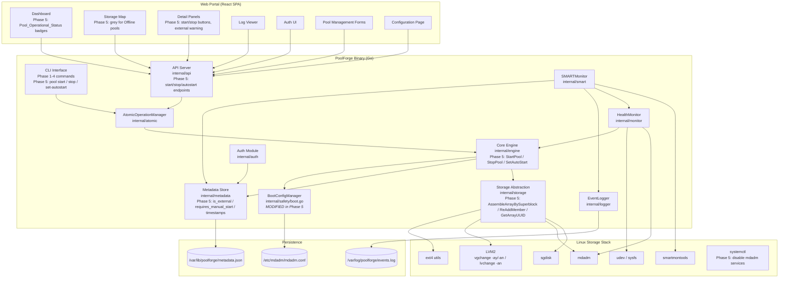
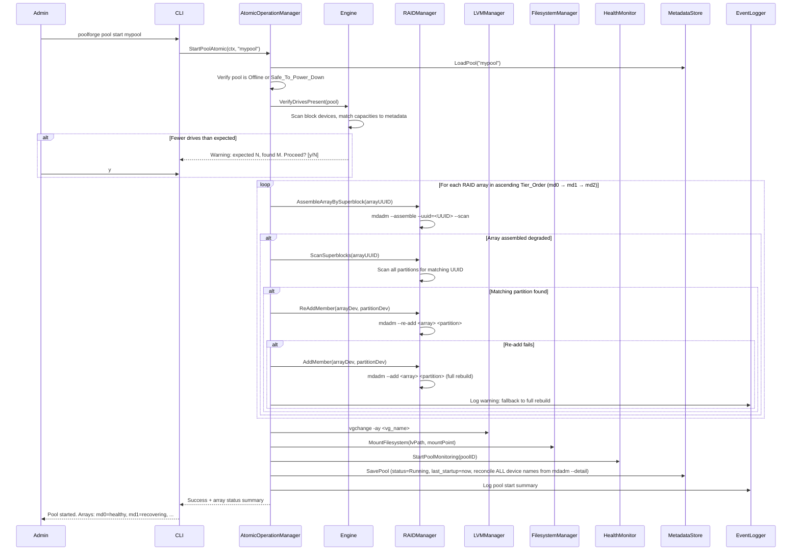
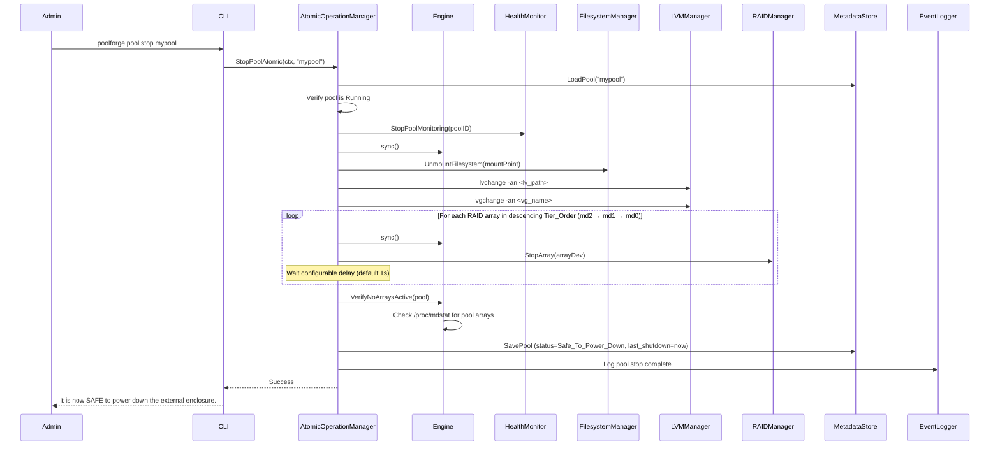
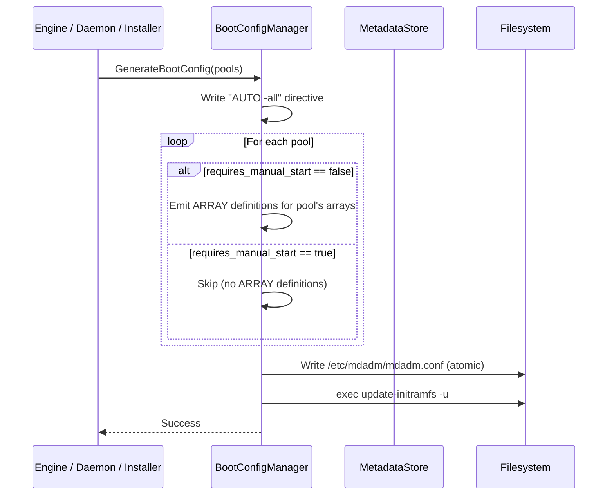
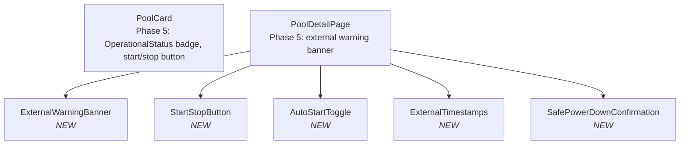

# Design Document — Phase 5: External Enclosure Support

## Overview

Phase 5 of PoolForge adds external enclosure awareness to the storage management stack. It solves five real-world problems that arise when PoolForge manages drives in eSATA, USB, or other DAS enclosures that can be powered off independently from the host:

1. **Boot-time degraded arrays**: mdadm auto-assembles arrays before external drives are detected, causing unnecessary full rebuilds.
2. **Device name instability**: After power cycles, device names change (e.g., `/dev/sdf` → `/dev/sdj`), breaking path-based operations.
3. **Incorrect mdadm.conf generation**: The current `GenerateMdadmConf` in `internal/safety/boot.go` emits ARRAY definitions for all pools without an `AUTO -all` directive, causing auto-assembly even for external pools.
4. **No safe shutdown/startup sequence**: There is no ordered procedure to stop or start a pool's storage stack (arrays, LVM, filesystem, monitoring).
5. **Full rebuilds instead of fast re-add**: Temporarily absent drives trigger `mdadm --add` (full rebuild) instead of `mdadm --re-add` (bitmap-based fast recovery).

Phase 5 introduces:

- **BootConfigManager** (`internal/safety/boot.go`): Replaces the current `GenerateMdadmConf` with pool-aware generation that includes `AUTO -all` and conditionally emits ARRAY definitions based on per-pool `requires_manual_start` metadata.
- **Pool Start/Stop orchestration** (`internal/engine`): `StartPool` and `StopPool` methods on `EngineService` with correct tier ordering, UUID-based superblock assembly, and automatic degraded array repair via `mdadm --re-add`.
- **Auto-start configuration**: `SetAutoStart` method and `pool set-autostart` CLI command for per-pool boot behavior control.
- **RAIDManager extensions** (`internal/storage`): `AssembleArrayBySuperblock` (UUID-based assembly), `ReAddMember` (fast re-add), `GetArrayUUID` (UUID extraction from mdadm detail).
- **Pool metadata extensions**: `is_external`, `requires_manual_start`, `operational_status`, `last_shutdown`, `last_startup` fields.
- **API Server extensions** (`internal/api`): `POST /api/pools/:name/start`, `POST /api/pools/:name/stop`, `PUT /api/pools/:name/autostart`.
- **Web Portal extensions** (`web/`): Start/stop buttons, Pool_Operational_Status indicators, external enclosure warnings, auto-start toggle.
- **Installer updates**: mdadm systemd service disablement (mdmonitor, mdadm, mdadm-waitidle).

Phase 5 MUST NOT break any Phase 1–4 functionality. Internal pools that auto-start at boot continue working exactly as before. All existing CLI commands, API endpoints, Web Portal pages, metadata persistence, self-healing, atomic operations, rollback, SMART monitoring, and test infrastructure remain unchanged.

### Phase 5 Scope

| Included | Not in scope |
|----------|-------------|
| BootConfigManager with AUTO -all and conditional ARRAY definitions | Container orchestration hooks |
| Pool start command with tier-ordered superblock assembly | Scheduled power-on/off automation |
| Pool stop command with tier-ordered shutdown | Multi-enclosure grouping |
| Degraded array auto-repair via UUID matching + mdadm --re-add | Network-attached storage |
| Per-pool auto-start configuration (set-autostart) | Hot-swap enclosure detection |
| Pool metadata extensions (is_external, requires_manual_start, timestamps) | |
| API endpoints for start/stop/autostart | |
| Web Portal start/stop controls and status indicators | |
| Installer mdadm systemd service disablement | |
| Boot behavior preservation for internal pools | |

### Design Goals

- Guarantee zero data loss during pool stop/start cycles
- Handle device name changes transparently via UUID-based superblock matching
- Prefer fast bitmap-based re-add over full rebuild whenever possible
- Preserve existing boot behavior for all pre-Phase 5 pools (backward compatible)
- Maintain the PoolForge daemon as the always-running orchestrator — only the pool's storage stack starts/stops


## Architecture

### High-Level Architecture (Phase 1–5)



### Phase 5 Component Changes Summary

| Component | Prior Phases | Phase 5 Changes |
|-----------|-------------|-----------------|
| EngineService | CreatePool, AddDisk, ReplaceDisk, RemoveDisk, DeletePool, HandleDiskFailure, GetRebuildProgress, ImportPool, GetPool, ListPools, GetPoolStatus | Extended: `StartPool`, `StopPool`, `SetAutoStart` |
| RAIDManager | CreateArray, GetArrayDetail, AssembleArray, StopArray, AddMember, RemoveMember, ReshapeArray, GetSyncStatus | Extended: `AssembleArrayBySuperblock`, `ReAddMember`, `GetArrayUUID`, `ScanSuperblocks` |
| MetadataStore | SavePool, LoadPool, ListPools, DeletePool | Unchanged interface — Pool struct extended with new fields |
| BootConfigManager (`internal/safety/boot.go`) | `GenerateMdadmConf(arrays []string)` — emits ARRAY defs for all arrays | Replaced: `GenerateBootConfig(pools []PoolBootInfo)` — conditional ARRAY defs + AUTO -all |
| API Server | All Phase 3 + Phase 4 endpoints | Extended: POST /api/pools/:name/start, POST /api/pools/:name/stop, PUT /api/pools/:name/autostart |
| CLI | Phase 1-4 commands | Extended: `pool start`, `pool stop`, `pool set-autostart` |
| Web Portal | Dashboard, StorageMap, DetailPanel, LogViewer, Config, SMART | Extended: start/stop buttons, Pool_Operational_Status, external warning, auto-start toggle |
| Installer (`install.sh`) | Install PoolForge + dependencies | Extended: disable mdadm systemd services |
| Daemon (`internal/safety/daemon.go`) | Runs SMART, scrub, backup, boot config | Modified: `updateBootConfig` calls new `GenerateBootConfig`, pool-aware HealthMonitor start/stop |

### Pool Start Sequence Diagram



### Pool Stop Sequence Diagram



### Boot Config Generation Flow




## Components and Interfaces

### 1. Core Engine Extensions (`internal/engine`)

Phase 5 extends the `EngineService` interface with three new methods. All Phase 1–4 methods retain their signatures unchanged.

```go
// EngineService — Phase 5 additions to existing interface.
//
// Phase 1: CreatePool, GetPool, ListPools, GetPoolStatus
// Phase 2: AddDisk, ReplaceDisk, RemoveDisk, DeletePool, HandleDiskFailure, GetRebuildProgress, ImportPool
// Phase 5 additions below.
type EngineService interface {
    // --- Phase 1 + Phase 2 (unchanged) ---
    CreatePool(ctx context.Context, req CreatePoolRequest) (*Pool, error)
    GetPool(ctx context.Context, poolID string) (*Pool, error)
    ListPools(ctx context.Context) ([]PoolSummary, error)
    GetPoolStatus(ctx context.Context, poolID string) (*PoolStatus, error)
    AddDisk(ctx context.Context, poolID string, disk string) error
    ReplaceDisk(ctx context.Context, poolID string, oldDisk string, newDisk string) error
    RemoveDisk(ctx context.Context, poolID string, disk string) error
    DeletePool(ctx context.Context, poolID string) error
    HandleDiskFailure(ctx context.Context, poolID string, disk string) error
    GetRebuildProgress(ctx context.Context, poolID string, arrayDevice string) (*RebuildProgress, error)
    ImportPool() (*ImportResult, error)

    // --- Phase 5: Pool Start/Stop ---

    // StartPool brings an Offline or Safe_To_Power_Down pool to Running status.
    // Sequence: verify drives → assemble arrays (ascending tier order, UUID-based) →
    //   auto-repair degraded arrays (re-add) → activate VG → mount FS → start HealthMonitor.
    // Returns StartPoolResult with per-array status.
    StartPool(ctx context.Context, poolName string, force bool) (*StartPoolResult, error)

    // StopPool brings a Running pool to Safe_To_Power_Down status.
    // Sequence: stop HealthMonitor → sync → unmount FS → deactivate LV/VG →
    //   stop arrays (descending tier order) → verify no arrays remain.
    StopPool(ctx context.Context, poolName string) error

    // SetAutoStart configures whether a pool auto-starts at boot.
    // When autoStart=true: requires_manual_start=false, ARRAY defs included in mdadm.conf.
    // When autoStart=false: requires_manual_start=true, ARRAY defs excluded from mdadm.conf.
    // Regenerates Boot_Config and updates initramfs.
    SetAutoStart(ctx context.Context, poolName string, autoStart bool) error
}
```

#### New Data Types (Phase 5)

```go
// PoolOperationalStatus represents the runtime state of a pool.
type PoolOperationalStatus string

const (
    PoolRunning        PoolOperationalStatus = "running"
    PoolOffline        PoolOperationalStatus = "offline"
    PoolSafeToShutdown PoolOperationalStatus = "safe_to_power_down"
)

// StartPoolResult contains the outcome of a pool start operation.
type StartPoolResult struct {
    PoolName     string
    MountPoint   string
    ArrayResults []ArrayStartResult
    Warnings     []string // e.g., "fewer drives detected than expected"
}

// ArrayStartResult describes the post-start state of a single RAID array.
type ArrayStartResult struct {
    Device       string     // e.g., "/dev/md0"
    TierIndex    int
    State        ArrayState // healthy, degraded, rebuilding
    ReAddedParts []string   // partitions that were re-added (fast recovery)
    FullRebuilds []string   // partitions that fell back to full rebuild
}

// Phase 5 additions to Pool struct (backward-compatible)
// These fields are added to the existing Pool struct in types.go:
//
//   IsExternal          bool                  // true if pool is on external enclosure
//   RequiresManualStart bool                  // true if pool should not auto-start at boot
//   OperationalStatus   PoolOperationalStatus // running, offline, safe_to_power_down
//   LastShutdown        *time.Time            // timestamp of last successful pool stop
//   LastStartup         *time.Time            // timestamp of last successful pool start
```

#### Pool Start Algorithm

```
Input:  poolName — name of the pool to start
        force    — if true, skip drive count confirmation prompt

Pre-conditions:
  - Pool exists in metadata
  - Pool OperationalStatus is Offline or Safe_To_Power_Down
  - PoolForge daemon is running (it is the orchestrator)

Algorithm:

1. Load pool metadata by name
2. Verify OperationalStatus ∈ {Offline, Safe_To_Power_Down}
   If Running → return error "pool is already running"

3. DRIVE VERIFICATION:
   a. Scan all block devices on the system
   b. For each pool member disk, match by capacity against detected devices
   c. If detected count < expected count AND force == false:
      → Return warning with expected/detected counts
      → Caller decides whether to proceed (CLI prompts, API returns warning)
   d. If detected count < expected count AND force == true:
      → Log warning, proceed anyway

4. ARRAY ASSEMBLY (ascending tier order: md0 → md1 → md2):
   For each RAID array sorted by TierIndex ascending:
     a. Retrieve Array_UUID from pool metadata
     b. Call AssembleArrayBySuperblock(arrayUUID)
        → mdadm scans all partitions for matching superblock UUID
        → Assembles array regardless of current device names
     c. If assembly fails (no matching superblocks found):
        → Log error, abort entire start operation
        → Set OperationalStatus = Offline, return error
     d. Check array state via GetArrayDetail(arrayDev)
     e. If array is degraded:
        → Call ScanSuperblocks(arrayUUID) to find unattached matching partitions
        → For each matching partition not already in the array:
           i.  Try ReAddMember(arrayDev, partitionDev)
               → mdadm --re-add (fast bitmap recovery)
           ii. If re-add fails, fall back to AddMember(arrayDev, partitionDev)
               → mdadm --add (full rebuild)
               → Log warning about fallback
        → Record re-added and full-rebuild partitions in ArrayStartResult

5. LVM ACTIVATION:
   a. vgchange -ay <vg_name>
   b. If VG activation fails → abort, stop assembled arrays in reverse, return error

6. FILESYSTEM MOUNT:
   a. MountFilesystem(lvPath, mountPoint)
   b. If mount fails → deactivate VG, stop arrays in reverse, return error

7. HEALTH MONITOR:
   a. Start HealthMonitor for this pool (SMART, mdadm events, hot-plug)

8. METADATA UPDATE (FULL DEVICE NAME RECONCILIATION):
   a. For each assembled RAID array, query mdadm --detail to get current member device paths
   b. Compare current member paths against stored Disk_Descriptors and partition devices in metadata
   c. Update ALL Disk_Descriptors and partition device paths to match current assignments
      (not just re-added drives — any drive whose name changed during assembly)
   d. This ensures metadata, API responses, Web Portal Storage_Map, and Detail_Panel
      all display current device names (e.g., /dev/sdj1 instead of stale /dev/sdb1)
   e. Set OperationalStatus = Running
   f. Set LastStartup = now()
   d. SavePool(updatedPool)

9. BOOT CONFIG:
   a. Regenerate mdadm.conf (in case device names changed)

10. Return StartPoolResult with per-array status summary
```

#### Pool Stop Algorithm

```
Input:  poolName — name of the pool to stop

Pre-conditions:
  - Pool exists in metadata
  - Pool OperationalStatus is Running

Algorithm:

1. Load pool metadata by name
2. Verify OperationalStatus == Running
   If Offline or Safe_To_Power_Down → return error "pool is not running"

3. STOP HEALTH MONITOR:
   a. Stop HealthMonitor for this pool (cease SMART, mdadm, hot-plug monitoring)

4. SYNC:
   a. Call sync() system call to flush all pending writes

5. UNMOUNT FILESYSTEM:
   a. UnmountFilesystem(mountPoint)
   b. If unmount fails (busy) → return error, re-start HealthMonitor

6. DEACTIVATE LVM:
   a. lvchange -an <lv_path>
   b. vgchange -an <vg_name>

7. STOP ARRAYS (descending tier order: md2 → md1 → md0):
   For each RAID array sorted by TierIndex descending:
     a. sync() — flush before each array stop
     b. StopArray(arrayDev) — mdadm --stop
     c. Wait configurable delay (default 1 second) before next array
     d. If stop fails:
        → Log error, attempt to force-stop remaining arrays
        → Continue with remaining arrays

8. VERIFY NO ARRAYS REMAIN:
   a. Read /proc/mdstat
   b. Confirm none of the pool's arrays are listed
   c. If any remain → log error, report failure

9. BOOT CONFIG VERIFICATION:
   a. Read /etc/mdadm/mdadm.conf
   b. Verify AUTO -all directive is present
   c. If missing → log warning

10. METADATA UPDATE:
    a. Set OperationalStatus = Safe_To_Power_Down
    b. Set LastShutdown = now()
    c. SavePool(updatedPool)

11. Display: "It is now SAFE to power down the external enclosure."
```

### 2. RAIDManager Extensions (`internal/storage`)

Phase 5 adds four methods to the existing RAIDManager interface. All Phase 1–4 methods are unchanged.

```go
// RAIDManager — Phase 5 additions to existing interface
type RAIDManager interface {
    // --- Phase 1 + Phase 2 (unchanged) ---
    CreateArray(opts RAIDCreateOpts) (*RAIDArrayInfo, error)
    GetArrayDetail(device string) (*RAIDArrayDetail, error)
    AssembleArray(device string, members []string) error
    StopArray(device string) error
    AddMember(device string, member string) error
    RemoveMember(device string, member string) error
    ReshapeArray(device string, newCount int, newLevel int) error
    GetSyncStatus(device string) (*SyncStatus, error)

    // --- Phase 5 ---

    // GetArrayUUID retrieves the UUID from an assembled array's mdadm detail.
    // Wraps: mdadm --detail <device> | grep UUID
    GetArrayUUID(device string) (string, error)

    // AssembleArrayBySuperblock assembles an array by scanning all partitions
    // for superblocks matching the given UUID.
    // Wraps: mdadm --assemble --uuid=<uuid> --scan
    // Handles device name changes transparently.
    AssembleArrayBySuperblock(uuid string) (*RAIDArrayInfo, error)

    // ReAddMember re-adds a partition to a degraded array using fast bitmap recovery.
    // Wraps: mdadm --re-add <array-device> <partition-device>
    // Returns error if bitmap recovery is not possible (e.g., too many changes).
    ReAddMember(arrayDevice string, member string) error

    // ScanSuperblocks scans all partitions on large-capacity drives and returns
    // those whose mdadm superblock UUID matches the given array UUID.
    // Used to find partitions that belong to a degraded array after device name changes.
    // Wraps: mdadm --examine <partition> for each candidate partition.
    ScanSuperblocks(arrayUUID string) ([]SuperblockMatch, error)
}

// SuperblockMatch represents a partition whose superblock matches a target array UUID.
type SuperblockMatch struct {
    PartitionDevice string // current device path, e.g., "/dev/sdj1"
    ArrayUUID       string // the UUID found in the superblock
    PreviousDevice  string // device path stored in superblock (may differ from current)
}

// RAIDArrayDetail — Phase 5 extension (backward-compatible)
// The existing RAIDArrayDetail struct is extended with:
//
//   UUID string // Array UUID from mdadm superblock
```

### 3. BootConfigManager (`internal/safety/boot.go`)

Phase 5 replaces the existing `GenerateMdadmConf(arrays []string)` function with a pool-aware `GenerateBootConfig` that conditionally emits ARRAY definitions based on per-pool auto-start settings.

```go
// PoolBootInfo contains the information needed to generate Boot_Config entries for a pool.
type PoolBootInfo struct {
    PoolName            string
    RequiresManualStart bool
    Arrays              []ArrayBootInfo
}

// ArrayBootInfo contains the information needed for a single ARRAY definition.
type ArrayBootInfo struct {
    Device string // e.g., "/dev/md0"
    UUID   string // Array UUID from mdadm superblock
}

// GenerateBootConfig writes /etc/mdadm/mdadm.conf with:
// 1. AUTO -all directive (disables auto-assembly of unlisted arrays)
// 2. ARRAY definitions ONLY for pools where RequiresManualStart == false
//
// This replaces the prior GenerateMdadmConf which emitted ARRAY defs for all arrays.
//
// After writing, executes update-initramfs -u to propagate to initramfs.
func GenerateBootConfig(pools []PoolBootInfo) error {
    // Implementation:
    // 1. Build content:
    //    "# Auto-generated by PoolForge"
    //    "MAILADDR root"
    //    "AUTO -all"
    //    ""
    //    For each pool where RequiresManualStart == false:
    //      For each array in pool:
    //        "ARRAY <device> metadata=1.2 UUID=<uuid>"
    // 2. Atomic write to /etc/mdadm/mdadm.conf
    // 3. exec update-initramfs -u
    return nil
}

// GenerateBootConfigFromMetadata is a convenience function that loads all pools
// from the MetadataStore and calls GenerateBootConfig.
func GenerateBootConfigFromMetadata(store engine.MetadataStore) error {
    // 1. ListPools()
    // 2. For each pool: LoadPool(), extract PoolBootInfo
    // 3. Call GenerateBootConfig(poolBootInfos)
    return nil
}
```

**Generated mdadm.conf example** (2 pools: "internal-pool" auto-start, "external-pool" manual-start):

```
# Auto-generated by PoolForge
MAILADDR root
AUTO -all

# Pool: internal-pool (auto-start)
ARRAY /dev/md0 metadata=1.2 UUID=12345678:abcdef01:23456789:abcdef02
ARRAY /dev/md1 metadata=1.2 UUID=12345678:abcdef03:23456789:abcdef04

# Pool: external-pool (manual-start) — ARRAY definitions omitted
```

### 4. Pool Metadata Extensions (`internal/engine/types.go`)

The existing `Pool` struct is extended with Phase 5 fields. These are backward-compatible additions — existing metadata files without these fields default to safe values.

```go
// Phase 5 additions to the existing Pool struct:
type Pool struct {
    // --- Phase 1 + Phase 2 fields (unchanged) ---
    ID            string
    Name          string
    ParityMode    ParityMode
    State         PoolState
    Disks         []DiskInfo
    CapacityTiers []CapacityTier
    RAIDArrays    []RAIDArray
    VolumeGroup   string
    LogicalVolume string
    MountPoint    string
    CreatedAt     time.Time
    UpdatedAt     time.Time

    // --- Phase 5 additions ---
    IsExternal          bool                  `json:"is_external"`           // default: false
    RequiresManualStart bool                  `json:"requires_manual_start"` // default: false
    OperationalStatus   PoolOperationalStatus `json:"operational_status"`    // default: "running"
    LastShutdown        *time.Time            `json:"last_shutdown"`         // nil until first stop
    LastStartup         *time.Time            `json:"last_startup"`          // nil until first start
}

// Phase 5 addition to RAIDArray struct:
type RAIDArray struct {
    // --- Existing fields (unchanged) ---
    Device        string
    RAIDLevel     int
    TierIndex     int
    State         ArrayState
    Members       []string
    CapacityBytes uint64

    // --- Phase 5 addition ---
    UUID string `json:"uuid"` // Array UUID from mdadm superblock
}
```

**Default values for backward compatibility:**
- `IsExternal`: `false` — existing pools are treated as internal
- `RequiresManualStart`: `false` — existing pools continue to auto-start
- `OperationalStatus`: `"running"` — existing pools are assumed running
- `LastShutdown`: `nil` — no stop history
- `LastStartup`: `nil` — no start history
- `UUID`: `""` — populated on first boot config generation or pool start

### 5. CreatePool Extension

The existing `CreatePool` method is extended to accept an `--external` flag:

```go
// CreatePoolRequest — Phase 5 extension
type CreatePoolRequest struct {
    Name       string     // Phase 1
    Disks      []string   // Phase 1
    ParityMode ParityMode // Phase 1
    External   bool       // Phase 5: if true, sets IsExternal=true, RequiresManualStart=true
}
```

When `External == true`:
- `Pool.IsExternal = true`
- `Pool.RequiresManualStart = true`
- `Pool.OperationalStatus = PoolRunning` (pool is running after creation)
- Boot_Config is regenerated (pool's arrays are excluded from ARRAY definitions)

When `External == false` (default, backward compatible):
- `Pool.IsExternal = false`
- `Pool.RequiresManualStart = false`
- `Pool.OperationalStatus = PoolRunning`
- Boot_Config is regenerated (pool's arrays are included in ARRAY definitions)

### 6. Daemon Modifications (`internal/safety/daemon.go`)

The existing `updateBootConfig` method in the Daemon is modified to call the new `GenerateBootConfigFromMetadata` instead of the old `GenerateMdadmConf`:

```go
// Before (Phase 4):
func (d *Daemon) updateBootConfig() {
    arrays := d.getArrayDevices()
    if len(arrays) > 0 {
        if err := GenerateMdadmConf(arrays); err != nil { ... }
    }
}

// After (Phase 5):
func (d *Daemon) updateBootConfig() {
    if err := GenerateBootConfigFromMetadata(d.cfg.MetadataStore); err != nil {
        d.logs.Warn("mdadm.conf update failed: %v", err)
    } else {
        d.logs.Info("mdadm.conf updated (pool-aware)")
        d.mu.Lock()
        d.lastBootConfig = time.Now()
        d.mu.Unlock()
    }
}
```

The Daemon's boot sequence is also extended to handle per-pool auto-start and first-run upgrade detection:

```go
// Phase 5: Boot sequence in Daemon.Run()
func (d *Daemon) bootPools() {
    pools, _ := d.cfg.MetadataStore.ListPools()

    // Detect first run after upgrade: check if any pool is missing Phase 5 fields
    needsMigration := false
    for _, ps := range pools {
        pool, err := d.cfg.MetadataStore.LoadPool(ps.ID)
        if err != nil {
            continue
        }
        if pool.OperationalStatus == "" {
            needsMigration = true
            break
        }
    }

    if needsMigration {
        d.logs.Info("PoolForge upgraded to Phase 5. Performing one-time metadata migration.")
        d.migrateToPhase5(pools)
    }

    for _, ps := range pools {
        pool, err := d.cfg.MetadataStore.LoadPool(ps.ID)
        if err != nil {
            d.logs.Error("failed to load pool %s: %v", ps.Name, err)
            continue
        }
        if pool.RequiresManualStart {
            pool.OperationalStatus = PoolOffline
            d.cfg.MetadataStore.SavePool(pool)
            d.logs.Info("pool %s: skipped (manual start required)", pool.Name)
        } else {
            // Auto-start: assemble arrays, activate LVM, mount, start monitor
            result, err := d.cfg.Engine.StartPool(context.Background(), pool.Name, true)
            if err != nil {
                d.logs.Error("pool %s: auto-start failed: %v", pool.Name, err)
            } else {
                d.logs.Info("pool %s: auto-started (%d arrays)", pool.Name, len(result.ArrayResults))
            }
        }
    }
}

// migrateToPhase5 performs one-time migration for pools created by Phase 1-4 builds.
// - Applies Phase 5 default values to all pools
// - Populates Array UUIDs from mdadm --detail for each assembled array
// - Regenerates Boot_Config with AUTO -all
// - Logs migration summary
func (d *Daemon) migrateToPhase5(pools []PoolSummary) {
    for _, ps := range pools {
        pool, err := d.cfg.MetadataStore.LoadPool(ps.ID)
        if err != nil {
            d.logs.Error("migration: failed to load pool %s: %v", ps.Name, err)
            continue
        }

        // Apply Phase 5 defaults (backward-compatible)
        pool.IsExternal = false
        pool.RequiresManualStart = false
        pool.OperationalStatus = PoolRunning // existing pools are assumed running

        // Populate Array UUIDs from live mdadm --detail
        for i, arr := range pool.RAIDArrays {
            if arr.UUID == "" {
                uuid, err := d.cfg.Storage.GetArrayUUID(arr.Device)
                if err != nil {
                    d.logs.Warn("migration: could not get UUID for %s: %v", arr.Device, err)
                } else {
                    pool.RAIDArrays[i].UUID = uuid
                }
            }
        }

        if err := d.cfg.MetadataStore.SavePool(pool); err != nil {
            d.logs.Error("migration: failed to save pool %s: %v", ps.Name, err)
        } else {
            d.logs.Info("migration: pool %s migrated to Phase 5", pool.Name)
        }
    }

    // Regenerate Boot_Config with AUTO -all and conditional ARRAY definitions
    if err := GenerateBootConfigFromMetadata(d.cfg.MetadataStore); err != nil {
        d.logs.Error("migration: failed to regenerate Boot_Config: %v", err)
    } else {
        d.logs.Info("migration: Boot_Config regenerated with AUTO -all")
    }

    d.logs.Info("PoolForge upgraded to Phase 5. Metadata migrated. Boot config updated.")
}
```

### 7. API Server Extensions (`internal/api`)

Phase 5 adds three endpoints. All existing Phase 3 + Phase 4 endpoints are unchanged.

```go
// Phase 5 endpoint additions
// POST /api/pools/:name/start     → handleStartPool
// POST /api/pools/:name/stop      → handleStopPool
// PUT  /api/pools/:name/autostart → handleSetAutoStart
```

| Method | Path | Description | Auth | Request Body | Response | Status Codes |
|--------|------|-------------|------|-------------|----------|-------------|
| POST | `/api/pools/:name/start` | Start a stopped pool | Yes | — | `StartPoolResponse` | 200, 401, 404, 409 |
| POST | `/api/pools/:name/stop` | Stop a running pool | Yes | — | `StopPoolResponse` | 200, 401, 404, 409 |
| PUT | `/api/pools/:name/autostart` | Set auto-start config | Yes | `{"auto_start": true\|false}` | `AutoStartResponse` | 200, 400, 401, 404 |

#### Response Models

```go
// StartPoolResponse — POST /api/pools/:name/start
type StartPoolResponse struct {
    PoolName     string             `json:"pool_name"`
    Status       string             `json:"status"`       // "running"
    MountPoint   string             `json:"mount_point"`
    ArrayResults []ArrayResultJSON  `json:"array_results"`
    Warnings     []string           `json:"warnings,omitempty"`
}

type ArrayResultJSON struct {
    Device       string   `json:"device"`
    TierIndex    int      `json:"tier_index"`
    State        string   `json:"state"`        // "healthy", "recovering"
    ReAddedParts []string `json:"readded_parts,omitempty"`
    FullRebuilds []string `json:"full_rebuilds,omitempty"`
}

// StopPoolResponse — POST /api/pools/:name/stop
type StopPoolResponse struct {
    PoolName string `json:"pool_name"`
    Status   string `json:"status"` // "safe_to_power_down"
    Message  string `json:"message"` // "It is now SAFE to power down the external enclosure."
}

// AutoStartResponse — PUT /api/pools/:name/autostart
type AutoStartResponse struct {
    PoolName  string `json:"pool_name"`
    AutoStart bool   `json:"auto_start"`
    Message   string `json:"message"` // "Auto-start set to true for pool 'mypool'"
}

// AutoStartRequest — PUT /api/pools/:name/autostart request body
type AutoStartRequest struct {
    AutoStart bool `json:"auto_start"`
}
```

#### Conflict Handling

- `POST /api/pools/:name/start` on a Running pool → HTTP 409: `{"error": "pool 'mypool' is already running"}`
- `POST /api/pools/:name/stop` on an Offline/Safe_To_Power_Down pool → HTTP 409: `{"error": "pool 'mypool' is not running"}`
- `POST /api/pools/:name/start` with fewer drives detected → HTTP 200 with `warnings` field populated, allowing the client to decide whether to proceed or abort. A subsequent request with `?force=true` query parameter proceeds without confirmation.

### 8. CLI Extensions (`cmd/poolforge`)

Phase 5 adds three commands:

```
poolforge pool start <pool-name> [--force]
poolforge pool stop <pool-name>
poolforge pool set-autostart <pool-name> <true|false>
```

| Command | Description | Output | Exit Code |
|---------|-------------|--------|-----------|
| `pool start <name>` | Start a stopped pool | Array status summary, mount point | 0 on success, 1 on error |
| `pool start <name> --force` | Start without drive count confirmation | Same as above | 0 on success, 1 on error |
| `pool stop <name>` | Stop a running pool | "It is now SAFE to power down the external enclosure." | 0 on success, 1 on error |
| `pool set-autostart <name> true` | Enable auto-start at boot | "Auto-start enabled for pool 'name'" | 0 on success, 1 on error |
| `pool set-autostart <name> false` | Disable auto-start at boot | "Auto-start disabled for pool 'name'. Manual start required." | 0 on success, 1 on error |

#### CLI Output Examples

**pool start** (successful, one array recovering):
```
Starting pool 'external-pool'...
  Verifying drives: 4/4 detected
  Assembling md0 (tier 0): healthy
  Assembling md1 (tier 1): degraded → re-added /dev/sdj2 (was /dev/sdf2)
  Activating volume group: vg_poolforge_abc123
  Mounting filesystem: /mnt/poolforge/external-pool
  Starting health monitor

Pool 'external-pool' is now RUNNING.
  md0: healthy (4/4 members)
  md1: recovering (3/3 members, bitmap sync in progress)
  Mount: /mnt/poolforge/external-pool
```

**pool stop** (successful):
```
Stopping pool 'external-pool'...
  Stopping health monitor
  Syncing data
  Unmounting /mnt/poolforge/external-pool
  Deactivating LVM
  Stopping md1 (tier 1)
  Stopping md0 (tier 0)
  Verifying arrays stopped

It is now SAFE to power down the external enclosure.
```

### 9. Web Portal Extensions (`web/`)

#### Pool_Operational_Status Indicators

The Dashboard PoolCard and PoolDetailPage are extended with operational status:

```typescript
type PoolOperationalStatus = 'running' | 'offline' | 'safe_to_power_down';

// Status badge color mapping
function mapOperationalStatusColor(status: PoolOperationalStatus): string {
    switch (status) {
        case 'running': return '#22c55e';          // green
        case 'offline': return '#9ca3af';           // grey
        case 'safe_to_power_down': return '#3b82f6'; // blue
    }
}

// Status badge label
function mapOperationalStatusLabel(status: PoolOperationalStatus): string {
    switch (status) {
        case 'running': return 'Running';
        case 'offline': return 'Offline';
        case 'safe_to_power_down': return 'Safe to Power Down';
    }
}
```

#### Start/Stop Buttons

```
┌─────────────────────────────────────────────────────┐
│ Pool: external-pool                       [Offline] │  ← grey badge
│ ⚠ External Enclosure — requires manual start/stop   │  ← warning banner
│                                                      │
│ [▶ Start Pool]                                       │  ← shown when Offline/Safe_To_Power_Down
│                                                      │
│ Last started: 2025-01-15 10:00:00                   │
│ Last stopped: 2025-01-15 18:00:00                   │
│                                                      │
│ Auto-start at boot: [OFF ○━━] toggle                │  ← auto-start toggle
└─────────────────────────────────────────────────────┘
```

When Running:
```
┌─────────────────────────────────────────────────────┐
│ Pool: external-pool                      [Running]  │  ← green badge
│ ⚠ External Enclosure — requires manual start/stop   │  ← warning banner
│                                                      │
│ [■ Stop Pool]                                        │  ← shown when Running
│                                                      │
│ Storage Map: ...                                     │
└─────────────────────────────────────────────────────┘
```

After successful stop:
```
┌──────────────────────────────────────────────────────────────┐
│ ✓ Safe to Power Down                                         │
│   Pool 'external-pool' has been safely stopped.              │
│   You may now power down the external enclosure.       [✕]  │
└──────────────────────────────────────────────────────────────┘
```

#### Storage_Map Health_Color Extension

Offline pools use grey in the Storage_Map:

```typescript
// Extended Health_Color mapping (Phase 5)
type HealthState = 'healthy' | 'degraded' | 'rebuilding' | 'failed' | 'offline';
type HealthColor = 'green' | 'amber' | 'red' | 'grey';

function mapHealthColor(state: HealthState): HealthColor {
    switch (state) {
        case 'healthy': return 'green';
        case 'degraded':
        case 'rebuilding': return 'amber';
        case 'failed': return 'red';
        case 'offline': return 'grey';
    }
}
```

| Entity State | Color | CSS Class |
|-------------|-------|-----------|
| healthy / running | Green (`#22c55e`) | `health-green` |
| degraded / rebuilding | Amber (`#f59e0b`) | `health-amber` |
| failed | Red (`#ef4444`) | `health-red` |
| offline / safe_to_power_down | Grey (`#9ca3af`) | `health-grey` |

#### Updated Component Hierarchy (Phase 5 additions)



### 10. Installer Updates (`install.sh`)

The existing `install.sh` is extended with mdadm systemd service disablement:

```bash
# Phase 5: Disable mdadm systemd services
MDADM_SERVICES="mdmonitor.service mdadm.service mdadm-waitidle.service"
for svc in $MDADM_SERVICES; do
    if systemctl list-unit-files "$svc" &>/dev/null; then
        systemctl stop "$svc" 2>/dev/null || true
        systemctl disable "$svc" 2>/dev/null || true
        systemctl mask "$svc" 2>/dev/null || true
        echo "Disabled mdadm service: $svc"
    else
        echo "mdadm service not found (skipped): $svc"
    fi
done

# Ensure Boot_Config has AUTO -all and update initramfs
poolforge boot-config regenerate
echo "mdadm auto-assembly disabled. PoolForge will manage all array assembly."
```


## Data Models

### Metadata Store Schema (Phase 5 — Version 1, Extended)

Phase 5 adds fields to the pool entries within the existing Version 1 schema. All additions are backward-compatible — Phase 1–4 metadata files can be read by Phase 5 code (missing fields default to safe values).

```json
{
  "version": 1,
  "pools": {
    "<pool-id>": {
      "id": "<uuid>",
      "name": "<pool-name>",
      "parity_mode": "parity1|parity2",
      "state": "healthy|degraded|failed",
      "is_external": false,
      "requires_manual_start": false,
      "operational_status": "running|offline|safe_to_power_down",
      "last_shutdown": null,
      "last_startup": null,
      "disks": [
        {
          "device": "/dev/sdb",
          "capacity_bytes": 1000000000000,
          "state": "healthy|failed",
          "interface_type": "SATA|eSATA|USB|DAS",
          "slices": [
            {
              "tier_index": 0,
              "partition_number": 1,
              "partition_device": "/dev/sdb1",
              "size_bytes": 500000000000
            }
          ]
        }
      ],
      "capacity_tiers": [
        {
          "index": 0,
          "slice_size_bytes": 500000000000,
          "eligible_disk_count": 4,
          "raid_array": "/dev/md0"
        }
      ],
      "raid_arrays": [
        {
          "device": "/dev/md0",
          "raid_level": 5,
          "tier_index": 0,
          "state": "healthy|degraded|rebuilding|failed",
          "members": ["/dev/sdb1", "/dev/sdc1", "/dev/sdd1", "/dev/sde1"],
          "capacity_bytes": 1500000000000,
          "uuid": "12345678:abcdef01:23456789:abcdef02"
        }
      ],
      "volume_group": "vg_poolforge_<pool-id>",
      "logical_volume": "lv_poolforge_<pool-id>",
      "mount_point": "/mnt/poolforge/<pool-name>",
      "created_at": "2025-01-01T00:00:00Z",
      "updated_at": "2025-01-01T00:00:00Z"
    }
  },
  "users": {
    "...": "unchanged from Phase 3"
  },
  "smart_data": {
    "...": "unchanged from Phase 4"
  },
  "smart_thresholds": {
    "...": "unchanged from Phase 4"
  },
  "checkpoint": null
}
```

**Phase 5 field defaults for backward compatibility:**

| Field | Default | Rationale |
|-------|---------|-----------|
| `is_external` | `false` | Existing pools are internal |
| `requires_manual_start` | `false` | Existing pools auto-start (preserves Phase 1 behavior) |
| `operational_status` | `"running"` | Existing pools are assumed running |
| `last_shutdown` | `null` | No stop history |
| `last_startup` | `null` | No start history |
| `uuid` (on RAIDArray) | `""` | Populated on first boot config generation or pool start |

### Boot_Config File Format (`/etc/mdadm/mdadm.conf`)

```
# Auto-generated by PoolForge
MAILADDR root
AUTO -all

# Pool: internal-pool (auto-start)
ARRAY /dev/md0 metadata=1.2 UUID=12345678:abcdef01:23456789:abcdef02
ARRAY /dev/md1 metadata=1.2 UUID=12345678:abcdef03:23456789:abcdef04

# Pool: external-pool (manual-start) — ARRAY definitions omitted
```

### REST API Response Models (Phase 5 Additions)

#### Start Pool (POST /api/pools/:name/start)

Success (200):
```json
{
  "pool_name": "external-pool",
  "status": "running",
  "mount_point": "/mnt/poolforge/external-pool",
  "array_results": [
    {
      "device": "/dev/md0",
      "tier_index": 0,
      "state": "healthy",
      "readded_parts": [],
      "full_rebuilds": []
    },
    {
      "device": "/dev/md1",
      "tier_index": 1,
      "state": "recovering",
      "readded_parts": ["/dev/sdj2"],
      "full_rebuilds": []
    }
  ],
  "warnings": []
}
```

Warning — fewer drives (200):
```json
{
  "pool_name": "external-pool",
  "status": "pending_confirmation",
  "warnings": ["Expected 4 drives, detected 3. Use ?force=true to proceed."],
  "array_results": []
}
```

Conflict (409):
```json
{
  "error": "pool 'external-pool' is already running"
}
```

#### Stop Pool (POST /api/pools/:name/stop)

Success (200):
```json
{
  "pool_name": "external-pool",
  "status": "safe_to_power_down",
  "message": "It is now SAFE to power down the external enclosure."
}
```

#### Set Auto-Start (PUT /api/pools/:name/autostart)

Request:
```json
{
  "auto_start": false
}
```

Response (200):
```json
{
  "pool_name": "external-pool",
  "auto_start": false,
  "message": "Auto-start disabled for pool 'external-pool'. Manual start required."
}
```

#### Pool Detail Extension (GET /api/pools/:id)

The existing pool detail response is extended with Phase 5 fields:

```json
{
  "id": "uuid-1234",
  "name": "external-pool",
  "state": "healthy",
  "parity_mode": "parity1",
  "is_external": true,
  "requires_manual_start": true,
  "operational_status": "running",
  "last_startup": "2025-02-01T10:00:00Z",
  "last_shutdown": "2025-01-31T18:00:00Z",
  "total_capacity_bytes": 3000000000000,
  "used_capacity_bytes": 1200000000000,
  "mount_point": "/mnt/poolforge/external-pool",
  "raid_arrays": [
    {
      "device": "/dev/md0",
      "raid_level": 5,
      "tier_index": 0,
      "state": "healthy",
      "uuid": "12345678:abcdef01:23456789:abcdef02",
      "capacity_bytes": 1500000000000,
      "members": [
        {"device": "/dev/sdb1", "state": "healthy"},
        {"device": "/dev/sdc1", "state": "healthy"},
        {"device": "/dev/sdd1", "state": "healthy"}
      ]
    }
  ],
  "disks": [
    {
      "device": "/dev/sdb",
      "state": "healthy",
      "capacity_bytes": 1000000000000,
      "interface_type": "eSATA",
      "arrays": ["/dev/md0", "/dev/md1"]
    }
  ]
}
```

#### Pool Summary Extension (GET /api/pools)

```json
{
  "pools": [
    {
      "id": "uuid-1234",
      "name": "external-pool",
      "state": "healthy",
      "operational_status": "running",
      "is_external": true,
      "total_capacity_bytes": 3000000000000,
      "used_capacity_bytes": 1200000000000,
      "disk_count": 4
    }
  ]
}
```


## Correctness Properties

*A property is a characteristic or behavior that should hold true across all valid executions of a system — essentially, a formal statement about what the system should do. Properties serve as the bridge between human-readable specifications and machine-verifiable correctness guarantees.*

Property numbering uses P77+ to avoid collision with Phase 1 (P1–P7, P10, P13, P35–P37), Phase 2 (P8–P9, P11–P12, P14–P20, P38–P50), Phase 3 (P21–P30, P51–P61), and Phase 4 (P31–P34, P62–P76).

### Property 77: Boot_Config ARRAY definitions match auto-start pools only

*For any* set of pools with arbitrary `requires_manual_start` flags, the generated Boot_Config file should contain ARRAY definitions if and only if the pool's `requires_manual_start` is `false`. The file should always begin with the `AUTO -all` directive before any ARRAY definitions. Pools with `requires_manual_start == true` should have zero ARRAY definitions in the output.

**Validates: Requirements 1.1, 1.2, 1.3**

### Property 78: Boot_Config generation is idempotent

*For any* set of pools, generating the Boot_Config twice with the same pool configuration should produce identical file content. The output should be a pure function of the pool metadata.

**Validates: Requirements 1.5, 1.6, 1.7, 11.10**

### Property 79: Boot_Config consistency after mutation

*For any* pool metadata mutation (create pool, delete pool, set-autostart), the Boot_Config should be regenerated such that its ARRAY definitions are consistent with the current metadata state. Specifically: after `SetAutoStart(pool, false)`, the pool's arrays should not appear in Boot_Config; after `SetAutoStart(pool, true)`, they should appear; after `DeletePool`, they should not appear; after `CreatePool`, they should appear if and only if `requires_manual_start == false`.

**Validates: Requirements 1.5, 1.6, 1.7, 4.2, 4.3**

### Property 80: Pool start/stop tier ordering

*For any* pool with N RAID arrays across M capacity tiers, the start operation should assemble arrays in ascending tier index order (tier 0 first, tier N-1 last), and the stop operation should stop arrays in descending tier index order (tier N-1 first, tier 0 last). The two sequences should be exact mirrors of each other.

**Validates: Requirements 2.5, 3.6**

### Property 81: UUID-based assembly handles device name changes

*For any* RAID array with a known UUID and any set of partitions where device names have changed from their original values, `AssembleArrayBySuperblock(uuid)` should successfully assemble the array by matching superblock UUIDs regardless of current device paths. The assembled array should contain the same member data as before the device name change.

**Validates: Requirements 2.4, 6.7**

### Property 82: Re-add preference over full rebuild

*For any* degraded RAID array during pool start where a matching partition (by UUID) is found, the system should first attempt `ReAddMember` (fast bitmap recovery). Only if `ReAddMember` fails should the system fall back to `AddMember` (full rebuild). The `ArrayStartResult` should correctly categorize each partition as either re-added or full-rebuild.

**Validates: Requirements 2.7, 6.3, 6.5**

### Property 83: Pool operational status state machine

*For any* pool, the operational status transitions should follow the state machine: `Offline → Running` (via StartPool), `Running → Safe_To_Power_Down` (via StopPool), `Safe_To_Power_Down → Running` (via StartPool). Starting an already-Running pool should be rejected. Stopping a non-Running pool should be rejected. These guards should hold at both the engine level and the API level (HTTP 409).

**Validates: Requirements 2.13, 3.12, 9.5, 9.6**

### Property 84: Pool metadata round-trip with Phase 5 fields

*For any* valid Pool struct with arbitrary Phase 5 field values (`is_external`, `requires_manual_start`, `operational_status`, `last_shutdown`, `last_startup`, and `uuid` on each RAIDArray), saving it to the MetadataStore via `SavePool` and loading it back via `LoadPool` should produce an equivalent Pool with all Phase 5 fields preserved.

**Validates: Requirements 5.1, 5.2, 5.3, 5.4, 5.7**

### Property 85: Backward-compatible metadata defaults

*For any* pool metadata file created by Phase 1–4 (without Phase 5 fields), loading it in Phase 5 code should produce a Pool with `is_external == false`, `requires_manual_start == false`, `operational_status == "running"`, `last_shutdown == nil`, and `last_startup == nil`. This ensures zero behavioral change for pre-existing installations.

**Validates: Requirements 5.5, 10.5**

### Property 86: Drive verification accuracy

*For any* pool configuration with N expected member drives and any set of M detected block devices on the system, the drive verification step during pool start should correctly report the expected count N and the detected count M. If M < N, a warning should be generated.

**Validates: Requirements 2.2, 2.3**

### Property 87: Full device name reconciliation in metadata after pool start

*For any* pool start operation where one or more drives have different device names than what is stored in the metadata (regardless of whether they were re-added or assembled normally), the Pool metadata should be updated so that ALL `Disk_Descriptor` values and ALL `PartitionDevice` references reflect the current device names as reported by `mdadm --detail` for each assembled array. This ensures the API responses, Web Portal Storage_Map, and Detail_Panel display current device paths, not stale ones.

**Validates: Requirements 6.8, 6.9**

### Property 88: Superblock scan completeness

*For any* target array UUID and any set of partitions on the system where some partitions have superblocks matching that UUID, `ScanSuperblocks(uuid)` should return all matching partitions and no non-matching partitions. The result should include the current device path and the previous device path stored in the superblock.

**Validates: Requirements 6.2**

### Property 89: Pool start metadata update

*For any* successful pool start operation, the pool metadata should have `operational_status == "running"` and `last_startup` set to a timestamp within the operation's time window. *For any* successful pool stop operation, the pool metadata should have `operational_status == "safe_to_power_down"` and `last_shutdown` set to a timestamp within the operation's time window.

**Validates: Requirements 2.11, 3.10**

### Property 90: Post-stop array verification

*For any* successful pool stop operation, after all arrays are stopped, none of the pool's array devices should appear in `/proc/mdstat`. This verifies complete teardown.

**Validates: Requirements 3.8**

### Property 91: Auto-start default for new pools

*For any* newly created pool without the `--external` flag, `requires_manual_start` should be `false` and `is_external` should be `false`. *For any* newly created pool with the `--external` flag, `requires_manual_start` should be `true` and `is_external` should be `true`.

**Validates: Requirements 4.5, 4.6**

### Property 92: Boot behavior — auto-start pools start, manual-start pools skip

*For any* set of pools during boot, pools with `requires_manual_start == false` should be started (arrays assembled, LVM activated, filesystem mounted, monitor started), and pools with `requires_manual_start == true` should be skipped with `operational_status` set to `Offline`. A failure to start one pool should not prevent other pools from starting.

**Validates: Requirements 10.1, 10.2, 10.3**

### Property 93: API authentication enforcement on Phase 5 endpoints

*For any* request to POST /api/pools/:name/start, POST /api/pools/:name/stop, or PUT /api/pools/:name/autostart without a valid Session_Token, the API should return HTTP 401 Unauthorized.

**Validates: Requirements 9.4**

### Property 94: API 404 for non-existent pools

*For any* pool name that does not exist in the metadata store, requests to POST /api/pools/:name/start, POST /api/pools/:name/stop, and PUT /api/pools/:name/autostart should return HTTP 404 with a JSON body identifying the unknown pool.

**Validates: Requirements 9.7**

### Property 95: Operational status color mapping

*For any* pool operational status value, the Web Portal should map it to the correct color: `running` → green (`#22c55e`), `offline` → grey (`#9ca3af`), `safe_to_power_down` → blue (`#3b82f6`). The Health_Color mapping should map `offline` state to grey in the Storage_Map and Dashboard.

**Validates: Requirements 8.6, 8.10**

### Property 96: Start/Stop button visibility

*For any* pool, the Web Portal should display a "Start Pool" button if and only if the pool's operational status is `offline` or `safe_to_power_down`, and a "Stop Pool" button if and only if the operational status is `running`. Both buttons should never be visible simultaneously.

**Validates: Requirements 8.2, 8.3**

### Property 97: External pool UI indicators

*For any* pool with `is_external == true`, the Web Portal should display: (a) a warning banner indicating external enclosure, (b) `last_startup` and `last_shutdown` timestamps in the Detail_Panel, and (c) an auto-start toggle control. *For any* pool with `is_external == false`, the warning banner should not be displayed.

**Validates: Requirements 8.1, 8.7, 8.8**

### Property 98: Safe software upgrade preserves data and configuration

*For any* metadata file created by Phase 1–4 builds, loading it with the Phase 5 build should produce valid Pool structs with all Phase 5 fields set to their backward-compatible defaults. After the Phase 5 migration runs, all existing pools should have `is_external == false`, `requires_manual_start == false`, `operational_status == "running"`, and populated `uuid` fields on each RAID array. All pre-existing metadata fields (pool name, disks, capacity tiers, RAID arrays, volume group, logical volume, mount point, timestamps) should be preserved exactly. No RAID arrays, LVM volumes, or filesystems should be modified during the upgrade. The Boot_Config should be regenerated with `AUTO -all` and ARRAY definitions for all existing pools.

**Validates: Requirements 13.1, 13.2, 13.3, 13.4, 13.6, 13.7**


## Error Handling

### Pool Start Errors

| Error Condition | Response | Log Level | Requirement |
|----------------|----------|-----------|-------------|
| Pool not found | Reject with error: "pool 'X' not found" | warning | 9.7 |
| Pool already running | Reject with error: "pool 'X' is already running" (HTTP 409) | info | 2.13, 9.5 |
| Fewer drives detected than expected (no --force) | Return warning with expected/detected counts, prompt for confirmation | warning | 2.2, 2.3 |
| Array assembly fails (no superblock matches) | Abort start, log error identifying failed array, pool remains Offline | error | 2.14 |
| VG activation fails | Abort start, stop assembled arrays in reverse order, pool remains Offline | error | — |
| Filesystem mount fails | Abort start, deactivate VG, stop arrays in reverse, pool remains Offline | error | — |
| Re-add fails (bitmap recovery not possible) | Fall back to full rebuild via `mdadm --add`, log warning | warning | 6.5 |
| Full rebuild also fails | Log error, continue with remaining arrays (array stays degraded) | error | — |
| HealthMonitor start fails | Log warning, pool is Running but unmonitored | warning | — |

### Pool Stop Errors

| Error Condition | Response | Log Level | Requirement |
|----------------|----------|-----------|-------------|
| Pool not found | Reject with error: "pool 'X' not found" | warning | 9.7 |
| Pool not running | Reject with error: "pool 'X' is not running" (HTTP 409) | info | 3.12, 9.6 |
| Filesystem unmount fails (busy) | Reject stop, re-start HealthMonitor, pool remains Running | error | — |
| LV deactivation fails | Log error, attempt to continue with VG deactivation | error | — |
| VG deactivation fails | Log error, attempt to continue with array stops | error | — |
| Array stop fails | Log error, attempt force-stop, continue with remaining arrays | error | 3.9 |
| Arrays remain in /proc/mdstat after stop | Log error, report partial failure | error | 3.8 |
| AUTO -all missing from mdadm.conf during verification | Log warning (non-fatal) | warning | 3.13 |

### Boot Config Errors

| Error Condition | Response | Log Level | Requirement |
|----------------|----------|-----------|-------------|
| mdadm.conf directory does not exist | Create /etc/mdadm/ directory | info | 1.8 |
| mdadm.conf write fails (permissions) | Log error, report to caller | error | — |
| update-initramfs -u fails | Log warning (non-fatal, boot config still written) | warning | 1.4 |
| mdadm --detail fails for an array (UUID extraction) | Skip array in Boot_Config, log warning | warning | — |

### Auto-Start Configuration Errors

| Error Condition | Response | Log Level | Requirement |
|----------------|----------|-----------|-------------|
| Pool not found | Reject with error: "pool 'X' not found" | warning | 4.7 |
| Invalid auto-start value | Reject with error: "auto-start must be true or false" | warning | — |
| Boot_Config regeneration fails | Log error, metadata is updated but Boot_Config may be stale | error | — |

### API Server Errors (Phase 5 Endpoints)

| Error Condition | HTTP Status | Response Body | Requirement |
|----------------|-------------|---------------|-------------|
| Missing session token | 401 | `{"error": "authentication required"}` | 9.4 |
| Invalid session token | 401 | `{"error": "invalid or expired session"}` | 9.4 |
| Pool not found | 404 | `{"error": "pool 'X' not found"}` | 9.7 |
| Pool already running (start) | 409 | `{"error": "pool 'X' is already running"}` | 9.5 |
| Pool not running (stop) | 409 | `{"error": "pool 'X' is not running"}` | 9.6 |
| Fewer drives detected (start) | 200 | `{"status": "pending_confirmation", "warnings": [...]}` | 9.9 |
| Invalid autostart request body | 400 | `{"error": "request body must contain 'auto_start' boolean"}` | — |
| Internal engine error | 500 | `{"error": "internal error: <details>"}` | — |

### Installer Errors

| Error Condition | Response | Requirement |
|----------------|----------|-------------|
| mdadm systemd service does not exist | Skip service, log info message | 7.4 |
| systemctl disable fails | Log warning, continue with remaining services | — |
| Boot_Config generation fails during install | Log error, continue installation | — |

### Upgrade Errors

| Error Condition | Response | Log Level | Requirement |
|----------------|----------|-----------|-------------|
| Metadata file unreadable after upgrade | Log error, abort migration for that pool, continue with others | error | 13.1 |
| mdadm --detail fails during UUID population | Skip UUID for that array, log warning, continue | warning | 13.3 |
| Boot_Config regeneration fails during migration | Log error, migration continues (metadata is updated, Boot_Config may be stale) | error | 13.4 |
| Metadata backup file already exists | Skip backup (do not overwrite), log info | info | 13.9 |
| Metadata write fails during migration | Log error, pool retains pre-migration state, continue with others | error | 13.6 |

## Testing Strategy

### Dual Testing Approach

Phase 5 continues the established testing strategy with both unit tests and property-based tests:

- **Unit tests**: Verify specific examples, edge cases, error conditions, and integration points for all Phase 5 components
- **Property-based tests**: Verify universal properties across randomly generated inputs for all Phase 5 correctness properties
- Together they provide comprehensive coverage: unit tests catch concrete bugs, property tests verify general correctness

### Property-Based Testing Configuration

**Go (EngineService, RAIDManager, BootConfigManager, MetadataStore, API Server)**:
- **Library**: [rapid](https://github.com/flyingmutant/rapid) for Go property-based testing
- **Minimum iterations**: 100 per property test
- **Tag format**: Each property test includes a comment referencing the design property:
  `// Feature: poolforge-phase5-enclosure-support, Property {N}: {title}`
- **Each correctness property is implemented by a single property-based test**

**React (Web Portal Phase 5 extensions)**:
- **Library**: [fast-check](https://github.com/dubzzz/fast-check) for TypeScript/JavaScript property-based testing
- **Component testing**: React Testing Library + Vitest
- **Minimum iterations**: 100 per property test
- **Tag format**: Each property test includes a comment:
  `// Feature: poolforge-phase5-enclosure-support, Property {N}: {title}`

### Unit Test Scope (Phase 5)

**BootConfigManager unit tests**:
- Generate with zero pools → file contains only AUTO -all and MAILADDR
- Generate with one auto-start pool → file contains AUTO -all + ARRAY definitions
- Generate with one manual-start pool → file contains AUTO -all, no ARRAY definitions
- Generate with mixed pools → only auto-start pool arrays appear
- Boot_Config file does not exist → created successfully
- mdadm --detail fails for one array → array skipped, others included
- update-initramfs -u failure → warning logged, function succeeds

**Pool Start unit tests**:
- Start an Offline pool with all drives present → Running, all arrays healthy
- Start a Safe_To_Power_Down pool → Running
- Start an already Running pool → error "already running"
- Start with fewer drives detected, no --force → warning returned
- Start with fewer drives detected, --force → proceeds
- Start with degraded array, matching partition found → re-add attempted
- Start with degraded array, re-add fails → fallback to full rebuild
- Start with assembly failure → abort, pool remains Offline
- Verify ascending tier order (mock RAIDManager, check call order)

**Pool Stop unit tests**:
- Stop a Running pool → Safe_To_Power_Down, confirmation message
- Stop an Offline pool → error "not running"
- Stop a Safe_To_Power_Down pool → error "not running"
- Verify descending tier order (mock RAIDManager, check call order)
- Unmount failure → stop aborted, pool remains Running
- Array stop failure → force-stop attempted, error logged
- /proc/mdstat verification after stop

**SetAutoStart unit tests**:
- Set auto-start false → requires_manual_start=true, Boot_Config regenerated
- Set auto-start true → requires_manual_start=false, Boot_Config regenerated
- Unknown pool name → error

**Metadata extension unit tests**:
- Save/load pool with all Phase 5 fields → round-trip preserved
- Load Phase 4 metadata (no Phase 5 fields) → defaults applied
- Pool status output for external pool includes all Phase 5 fields

**RAIDManager extension unit tests**:
- GetArrayUUID → parses UUID from mdadm --detail output
- AssembleArrayBySuperblock → calls mdadm --assemble --uuid=...
- ReAddMember → calls mdadm --re-add
- ScanSuperblocks → examines partitions, returns matches

**API endpoint unit tests**:
- POST /api/pools/:name/start: valid pool → 200, running pool → 409, unknown → 404, no auth → 401
- POST /api/pools/:name/stop: valid pool → 200, not running → 409, unknown → 404, no auth → 401
- PUT /api/pools/:name/autostart: valid body → 200, invalid body → 400, unknown → 404, no auth → 401

**Web Portal component tests**:
- PoolCard with operational status badge: correct color for each status
- StartStopButton: shows Start when offline, Stop when running
- ExternalWarningBanner: renders for external pools, hidden for internal
- AutoStartToggle: renders with current value, calls API on change
- SafePowerDownConfirmation: renders after successful stop
- ExternalTimestamps: renders last_startup and last_shutdown
- Storage_Map: grey color for offline pools

**Installer unit tests**:
- All three mdadm services exist → all disabled
- One service missing → skipped without error, others disabled
- All services missing → all skipped, no errors

**Upgrade / migration unit tests**:
- Load Phase 4 metadata (no Phase 5 fields) → defaults applied correctly
- Migration detects missing `operational_status` → triggers one-time migration
- Migration populates Array UUIDs from mdadm --detail
- Migration preserves all existing metadata fields (name, disks, tiers, arrays, VG, LV, mount point)
- Migration regenerates Boot_Config with AUTO -all
- Migration logs informational message
- Already-migrated metadata (Phase 5 fields present) → migration skipped
- mdadm --detail fails for one array during migration → UUID skipped, others populated
- Metadata backup created during install → file exists at expected path
- Metadata backup already exists → not overwritten

### Property Test Scope (Phase 5)

| Property | Category | What it tests | Language |
|----------|----------|---------------|---------|
| P77 | Boot Config | ARRAY definitions match auto-start pools only | Go (rapid) |
| P78 | Boot Config | Generation idempotence | Go (rapid) |
| P79 | Boot Config | Consistency after mutation (create/delete/set-autostart) | Go (rapid) |
| P80 | Start/Stop | Tier ordering (ascending start, descending stop) | Go (rapid) |
| P81 | Start | UUID-based assembly handles device name changes | Go (rapid) |
| P82 | Start | Re-add preference over full rebuild | Go (rapid) |
| P83 | State Machine | Operational status transitions and guards | Go (rapid) |
| P84 | Persistence | Pool metadata round-trip with Phase 5 fields | Go (rapid) |
| P85 | Persistence | Backward-compatible metadata defaults | Go (rapid) |
| P86 | Start | Drive verification accuracy | Go (rapid) |
| P87 | Start | Full device name reconciliation in metadata after pool start | Go (rapid) |
| P88 | Start | Superblock scan completeness | Go (rapid) |
| P89 | Start/Stop | Metadata timestamp and status update | Go (rapid) |
| P90 | Stop | Post-stop array verification | Go (rapid) |
| P91 | Create | Auto-start default for new pools (--external flag) | Go (rapid) |
| P92 | Boot | Auto-start pools start, manual-start pools skip | Go (rapid) |
| P93 | API | Authentication enforcement on Phase 5 endpoints | Go (rapid) |
| P94 | API | 404 for non-existent pools | Go (rapid) |
| P95 | UI | Operational status color mapping | TypeScript (fast-check) |
| P96 | UI | Start/Stop button visibility | TypeScript (fast-check) |
| P97 | UI | External pool UI indicators | TypeScript (fast-check) |
| P98 | Upgrade | Safe software upgrade preserves data and configuration | Go (rapid) |

### Integration Test Scope (Phase 5)

Integration tests run against the cloud Test_Environment (EC2 + EBS) and validate:

1. **Pool start/stop sequencing**: Create pool → stop pool → verify arrays stopped → start pool → verify arrays assembled in correct tier order → verify data integrity
2. **Device name change handling**: Create pool → stop pool → detach EBS volumes → reattach to different device slots → start pool → verify UUID-based assembly succeeds → verify metadata device names updated
3. **Degraded array repair**: Create pool → detach one EBS volume → start pool → verify degraded array detected → reattach volume → verify re-add attempted (not full rebuild) → verify recovery
4. **Full power cycle simulation**: Create pool → write data → stop pool → detach all EBS volumes → reattach with different device names → start pool → verify data integrity → verify no full rebuild triggered
5. **Auto-start configuration**: Create pool → set-autostart false → verify Boot_Config excludes pool → set-autostart true → verify Boot_Config includes pool
6. **mdadm.conf generation**: Create two pools (one auto-start, one manual-start) → verify Boot_Config contains AUTO -all → verify only auto-start pool has ARRAY definitions
7. **API endpoint integration**: POST /api/pools/:name/start → verify 200 → POST /api/pools/:name/stop → verify 200 → verify 409 on duplicate start/stop → verify 404 on unknown pool → verify 401 without auth
8. **Boot behavior preservation**: Create auto-start pool → simulate reboot (stop daemon, restart) → verify pool auto-started → create manual-start pool → simulate reboot → verify manual-start pool is Offline
9. **Safe software upgrade**: Install Phase 4 build → create pools with data → upgrade to Phase 5 build → verify all pools remain running → verify all data intact → verify metadata contains Phase 5 defaults with correct UUIDs → verify Boot_Config regenerated with AUTO -all → verify no RAID arrays were modified during upgrade

### Regression Test Scope

Phase 5 MUST NOT break any prior phase functionality. The following regression tests are required:

- **Phase 1**: Pool creation, status, list, metadata persistence, tier computation, RAID level selection
- **Phase 2**: Add-disk, replace-disk, remove-disk, delete-pool, self-healing rebuild, expansion, export/import
- **Phase 3**: API endpoints (all existing), Web Portal (Dashboard, StorageMap, DetailPanel, LogViewer), authentication
- **Phase 4**: Atomic operations, rollback, crash recovery, multi-interface detection, SMART monitoring, SMART API/CLI

### Test File Organization

```
internal/engine/
    start_stop_test.go          # Unit tests for StartPool, StopPool, SetAutoStart
    start_stop_prop_test.go     # Property tests P80, P81, P82, P83, P86, P87, P89, P91, P92
internal/safety/
    boot_test.go                # Unit tests for BootConfigManager
    boot_prop_test.go           # Property tests P77, P78, P79
    migration_test.go           # Unit tests for Phase 5 upgrade migration
    migration_prop_test.go      # Property test P98
internal/metadata/
    metadata_phase5_test.go     # Unit tests for Phase 5 metadata extensions
    metadata_phase5_prop_test.go # Property tests P84, P85
internal/storage/
    raid_phase5_test.go         # Unit tests for RAIDManager Phase 5 extensions
    raid_phase5_prop_test.go    # Property test P88
internal/api/
    phase5_handlers_test.go     # Unit tests for Phase 5 API endpoints
    phase5_handlers_prop_test.go # Property tests P93, P94
web/src/components/
    PoolCard.test.tsx            # Phase 5 UI component tests
    StartStopButton.test.tsx
    ExternalWarningBanner.test.tsx
    AutoStartToggle.test.tsx
    phase5_prop.test.tsx         # Property tests P95, P96, P97
test/integration/
    pool_start_stop_test.go     # Integration: start/stop sequencing
    device_name_change_test.go  # Integration: UUID-based assembly after name change
    degraded_repair_test.go     # Integration: re-add recovery
    power_cycle_test.go         # Integration: full power cycle simulation
    boot_config_test.go         # Integration: mdadm.conf generation
    phase5_api_test.go          # Integration: Phase 5 API endpoints
    regression_test.go          # Regression: Phase 1-4 functionality
    upgrade_test.go             # Integration: Phase 4 → Phase 5 safe upgrade
```

